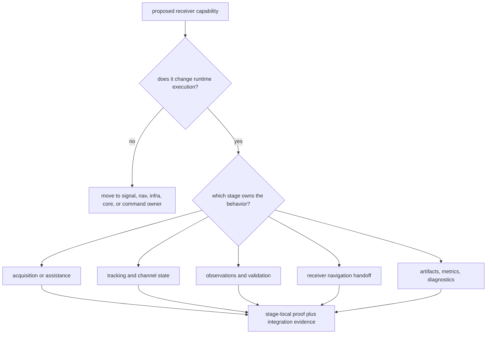

# Receiver Extension Guide

Use this guide when a change adds receiver behavior rather than only tuning an
existing threshold. The useful question is not "where can this code fit?" It is
"which runtime contract changes, and what proof will convince a reviewer that
the contract still belongs in the receiver?"

## Choose The Extension Shape

## Extension Sequence

1. implement the runtime behavior in the owning receiver area
2. keep cross-stage records in shared contract types when another crate must
   read the meaning
3. emit receiver diagnostics for failures that would change operator or
   artifact interpretation
4. update `RunArtifacts` or stage reports only when the receiver output really
   changes
5. update command wiring only if the public operator surface actually changes

## Receiver-Owned Examples

- adding a tracking-state reason that explains a lock transition
- changing how acquisition evidence is ranked before tracking receives it
- adding a runtime metric that describes receiver execution, not repository
  storage
- extending reference comparison that consumes receiver output and bounded
  truth fixtures

## Not Receiver-Owned

- reusable code-family, modulation, raw-IQ, or sample metadata rules
- orbit, clock, correction, PPP, RTK, or estimator science that can stand
  without a receiver runtime
- repository manifest naming, run-directory layout, dataset registration, or
  artifact indexing
- command UX that only selects or presents a receiver workflow

## Proof Before Commit

- Read `crates/bijux-gnss-receiver/docs/PIPELINE.md` before changing stage
  ordering or handoff.
- Read `crates/bijux-gnss-receiver/docs/PORTS.md` before changing runtime
  inputs, outputs, sinks, clocks, or injected dependencies.
- Read `crates/bijux-gnss-receiver/docs/ARTIFACTS.md` before changing emitted
  run products.
- Read `crates/bijux-gnss-receiver/docs/REFERENCE_VALIDATION.md` before
  changing truth comparison or synthetic-reference behavior.
- Read `crates/bijux-gnss-receiver/docs/BOUNDARY.md` when the capability could
  plausibly belong to signal, nav, core, infra, or the command crate.

The extension is not complete until its documentation names the affected
runtime contract and the tests prove that same contract. A broad integration
pass is useful, but it is not a substitute for a stage-level proof that
pinpoints the changed behavior.
