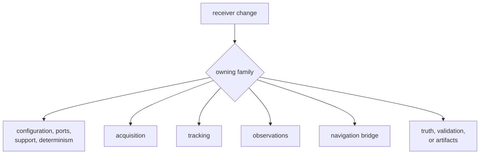
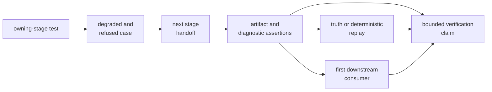

# Receiver Verification Guide

Receiver verification begins with the earliest stage whose meaning changed.
Run a focused test that can fail for that claim, cross the first affected
handoff, and inspect typed artifacts or diagnostics. A broad end-to-end pass is
useful only after the local failure mode is understood.

## Select the First Evidence



## Focused Starting Commands

Run from the repository root:

```sh
cargo test -p bijux-gnss-receiver --test integration_basic
cargo test -p bijux-gnss-receiver --test integration_receiver_support_matrix_inventory
cargo test -p bijux-gnss-receiver --test integration_pipeline_determinism
cargo test -p bijux-gnss-receiver --test integration_acquisition_smoke
cargo test -p bijux-gnss-receiver --test integration_tracking_channel_state_reports
cargo test -p bijux-gnss-receiver --test integration_observations_measurement_quality
cargo test -p bijux-gnss-receiver --test integration_navigation_pvt_accuracy_budget
```

These are routes, not a universal mandatory list.

| Change | Start with | Add before completion |
| --- | --- | --- |
| Configuration, runtime ports, or basic composition | basic runtime test | invalid configuration, effect boundary, and relevant stage test |
| Support inventory or signal boundary | support-matrix inventory | constellation-specific supported and refused cases |
| Deterministic ordering or replay | pipeline determinism | exact discrete evidence plus scenario replay |
| Acquisition | acquisition smoke or matching focused acquisition suite | uncertainty, ambiguity, rejection, truth, and tracking handoff |
| Tracking | channel-state or matching loop suite | continuity, fades, reacquisition, truth, and observation handoff |
| Observations | measurement-quality suite | lock-state, covariance, smoothing, uncertainty, and navigation input |
| Navigation bridge | matching navigation validation or accuracy suite | feature behavior, refused claims, artifacts, and nav-owned evidence |
| Simulation or budgets | matching truth-table or accuracy-budget suite | independent model review and serialized report evidence |
| Public API or package boundary | public or package guardrail | direct consumer-shaped use and semantic proof |

The [receiver test guide](../../../crates/bijux-gnss-receiver/docs/TESTS.md)
maps the full test families. Test names alone are not evidence; inspect the
scenario, assertions, thresholds, and feature requirements.

## Build the Evidence Ladder



Use only the branches required by the change, but do not skip refusal, handoff,
or artifact behavior when those contracts move.

## Account for Features

Navigation is enabled by default, but receiver builds can disable it. A change
to feature-gated behavior should prove:

- coherent compilation and runtime behavior with the feature enabled
- clear absence or refusal when disabled
- no unconditional navigation assumptions in non-navigation stages
- support and artifact reporting that matches the selected build

Precise-product, tracing, trace, allocation, and reference-check features need
evidence for the behavior they expose; a default-feature pass does not exercise
every combination.

## Respect Slow-Test Governance

Some receiver truth, long-duration, tracking, and navigation tests are governed
as slow tests. A direct Cargo command can run an expensive test binary even
when the default repository lane excludes it.

Use the [maintainer test-lane guide](../../../crates/bijux-gnss-dev/docs/TESTS.md)
to determine whether the selected test belongs to the slow roster and run it
through the appropriate lane when broad verification is required. Do not
shorten a scientific scenario or weaken assertions merely to move it into the
fast lane. Test duration is not benchmark evidence.

## Interpret Results Narrowly

- Acquisition detection does not prove sustained tracking.
- Tracking lock does not prove observation quality.
- Observation quality does not prove estimator accuracy.
- Navigation accuracy does not prove every earlier stage remained correct.
- Deterministic replay does not prove the synthetic model is physically
  representative.
- Artifact serialization does not prove infrastructure persistence.
- A full package pass proves only the scenarios and features actually run.

## Record the Verification

Report:

1. changed receiver invariant and owning stage
2. exact command and feature set
3. scenario, signal, rate, duration, and truth source
4. applied thresholds and observed worst case
5. degraded or refused behavior
6. first affected handoff and artifact evidence
7. slow or feature-gated evidence not run

Use [receiver runtime invariants](../quality/invariants.md) to name the claim and
[determinism and purity](../quality/determinism-and-purity.md) for replay
contracts.

Verification is complete when the focused failure mode, next boundary,
observable evidence, feature scope, scenario limits, and omitted expensive
proof are all visible.
