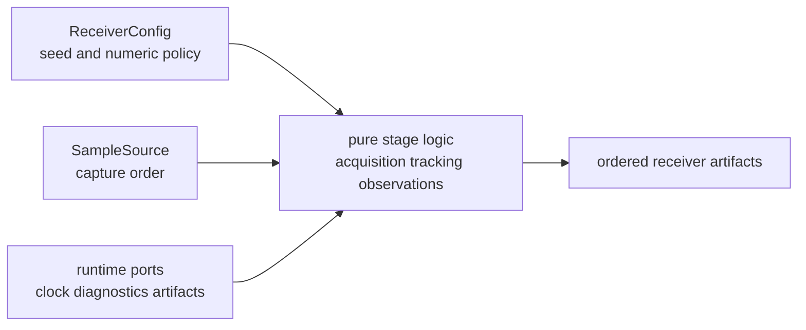

# Determinism And Purity

Receiver determinism means the same validated inputs and configuration produce
the same receiver decisions, ordered evidence, and numeric results within the
documented tolerance contract. Purity means stage logic does not reach around
its inputs for clocks, files, environment, or random state.

## Determinism Boundary

Runtime ports are allowed to touch the world. Stage logic is not. The receiver
owns that boundary because acquisition, tracking, observation construction, and
validation all depend on stable ordering and replayable evidence.

## Contracts

| surface | deterministic expectation | proof route |
| --- | --- | --- |
| `ReceiverConfig.seed` | seeded simulation and stochastic helpers reject missing or zero seed meaning | config validation and synthetic tests |
| sample input order | samples are consumed in declared capture order | sample-source tests and runtime tests |
| acquisition candidates | ranking, ambiguity, and diagnostics are stable for equivalent inputs | acquisition result-stability and explainability tests |
| tracking epochs | lock state, code phase, carrier phase, and diagnostics remain ordered by epoch | tracking channel-state and continuity tests |
| observations | measurement quality follows typed tracking evidence, not log text | observation artifact and validation tests |
| run artifacts | emitted evidence keeps receiver order before infra persists it | receiver artifact tests and runtime docs |

## Exact Versus Toleranced Proof

Use exact equality for identifiers, ordering, discrete states, severity, stage
names, and artifact membership. Use documented numeric tolerance for floating
point measurements such as code phase, carrier phase, Doppler, CN0, covariance,
and residuals. A test that hides a discrete ordering change behind a wide
numeric tolerance is not defending determinism.

## Purity Checks

- Stage code should receive time, samples, configuration, and sinks through
  typed inputs or runtime ports.
- Stage code should not read environment variables, current time, files, or
  global state directly.
- Diagnostics should be emitted as typed events or state reports, not as prose
  that tests must parse.
- Synthetic helpers should make seeds, clock drift, and noise profiles explicit.
- Receiver docs should say when a guarantee is platform-stable and when it is a
  tolerance-bounded numeric contract.

## First Proof Check

Inspect `crates/bijux-gnss-receiver/docs/RUNTIME.md`,
`crates/bijux-gnss-receiver/docs/TESTS.md`,
`crates/bijux-gnss-receiver/src/ports/clock.rs`,
`crates/bijux-gnss-receiver/src/engine/receiver_config_validation.rs`, and the
closest acquisition, tracking, observation, or synthetic test for the changed
stage.
