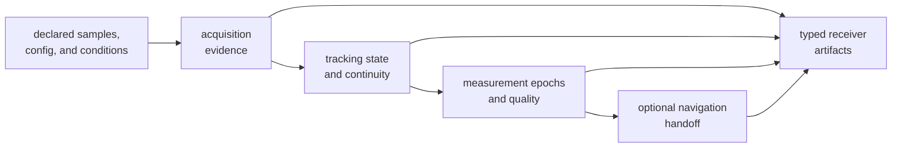
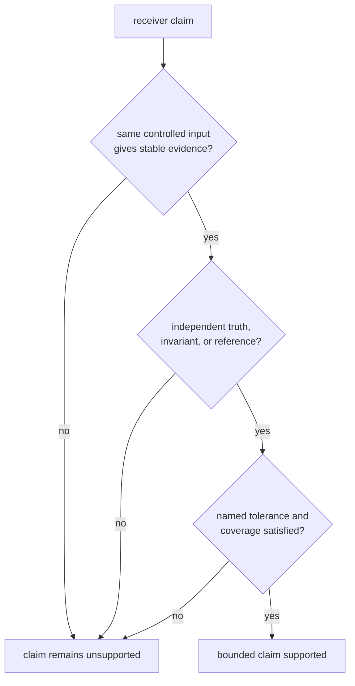

# Receiver Evidence

Receiver quality is not one end-to-end success condition. It is a chain of
claims about search, lock, continuity, measurements, handoffs, and emitted
evidence. Judge each claim at the boundary where it is created, then add only
the downstream proof needed to show that its meaning survives.

## Match the Claim to the Proof

| Claim | Primary evidence | What that evidence does not prove |
| --- | --- | --- |
| An acquisition is correct | hypothesis, code phase, Doppler, ambiguity, uncertainty, and truth comparison | sustained tracking lock |
| A channel tracks correctly | epoch errors, state transitions, continuity, fades, and reacquisition | observation or position accuracy |
| An observation is usable | measurement errors, quality decisions, residuals, covariance, and exclusions | estimator correctness |
| A receiver run is reproducible | controlled inputs, ordered outputs, exact discrete state, and bounded numeric equality | physical realism of the input |
| A navigation handoff is sound | typed observations, feature behavior, validation report, and refusal evidence | ownership or correctness of navigation science |
| A run artifact is trustworthy | field semantics, units, thresholds, observed values, and serialization checks | repository persistence or history behavior |
| A change is faster | comparable benchmark or profile evidence | unchanged receiver correctness |

The [test strategy](test-strategy.md) maps these claims to unit, stage,
integration, truth-table, golden, and feature-gated test families. The
[invariant catalog](invariants.md) describes properties that must hold across
individual scenarios.

## Build Confidence by Boundary

A later green result cannot erase an earlier unexplained failure. For example,
a position inside a broad budget does not justify an acquisition ranking
change, and a stable tracking epoch does not justify silently dropping an
observation. Use [change validation](change-validation.md) to choose the first
boundary that must be checked and the next boundary that could expose a
regression.

## Separate Repeatability from Truth

Deterministic receiver execution makes failures reproducible. It does not show
that a synthetic propagation model, noise profile, oscillator drift, or
reference value represents the intended physical case.

Read [determinism and purity](determinism-and-purity.md) for exact and
toleranced replay contracts. Read [validation budgets](validation-budgets.md)
before changing a threshold; loosening a budget because a test failed is not a
scientific explanation.

## Bound the Current Evidence

The suite contains broad synthetic, truth-table, golden, and integration
coverage, but its conclusions remain scenario-bound. It does not establish
equal coverage for every constellation, band, interference environment,
oscillator, antenna, hardware front end, or field condition. Feature-gated
navigation and RTK evidence also applies only when those paths are built and
exercised.

The [known limitations](known-limitations.md) states the practical bounds.
Use the [risk register](risk-register.md) when a change increases coupling,
widens a public contract, or depends on evidence the repository does not yet
have. Use [definition of done](definition-of-done.md) and the
[review checklist](review-checklist.md) to close the review without converting
missing proof into an implicit claim.

## Stop on These Signals

- an expected output was regenerated from the implementation it is meant to
  judge
- a broad integration pass is offered instead of evidence for the changed
  stage
- a numeric tolerance hides changed ordering, state, identity, or refusal
- performance results omit workload, build, environment, or uncertainty
- navigation output is used to claim receiver correctness without inspecting
  the receiver handoff
- synthetic success is described as universal field performance
- an artifact records a pass without the applied threshold and observed value

Quality review is complete when the claim, owning boundary, independent
evidence, tolerance, coverage, and remaining limitation can all be named
without relying on the test name alone.
