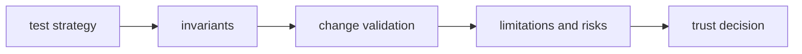

# Quality

Open this section when the question is whether `bijux-gnss-receiver` is
proving its runtime claims honestly enough: invariants, test strategy,
limitations, change validation, and risk.

## Trust Model

## Read These First

- open [Foundation](../foundation/) first if the doubt is still about what the
  crate should own
- stay in this section when the boundary is clear and the next question is
  proof, risk, or limitation honesty

## First Proof Check

- `crates/bijux-gnss-receiver/tests/`
- `crates/bijux-gnss-receiver/docs/TESTS.md`
- crate-local docs for runtime, pipeline, ports, artifacts, validation, and
  simulation
