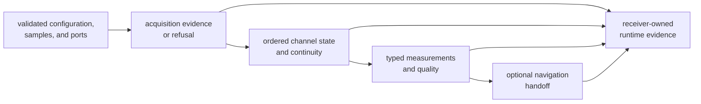
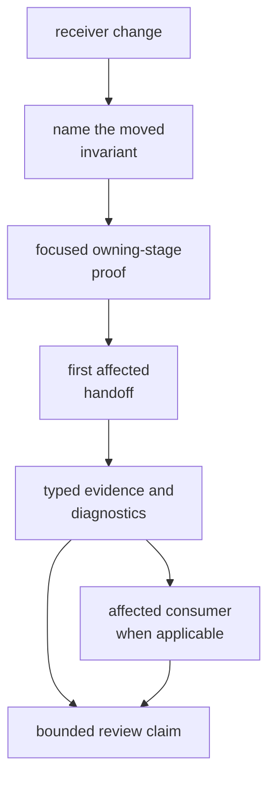

# Receiver Runtime Invariants

Receiver invariants are observable promises across configuration, stage
handoffs, channel lifecycle, measurements, diagnostics, and artifacts. They
should remain true across signal families and scenarios even when numerical
outcomes differ.

## Pipeline Invariants

The pipeline may omit optional navigation, but it must not reorder or silently
skip required evidence. Each stage receives typed input and produces typed
success, degraded, or refused meaning for the next boundary.

## Invariant Catalog

| Invariant | Failure signal | Primary evidence |
| --- | --- | --- |
| Configuration is validated before execution and omitted values resolve to explicit defaults. | A stage interprets missing or invalid configuration independently. | configuration validation and basic runtime tests |
| Samples are consumed in declared order and time is supplied through typed ports. | Stage logic reads wall time, files, environment, or global state directly. | runtime, source, clock, and determinism tests |
| Acquisition reports identity, code phase, Doppler, ambiguity, uncertainty, diagnostics, and refusal consistently. | A candidate advances without enough evidence to explain why. | acquisition explainability, uncertainty, truth, and rejection tests |
| Tracking epochs remain ordered and channel transitions preserve code/carrier continuity within declared budgets. | Lock, degraded, fade, slip, or reacquisition state changes without typed transition evidence. | tracking state, continuity, fade, and truth-table tests |
| Observations derive from typed tracking evidence and expose quality, covariance, exclusions, and discontinuities. | A measurement remains accepted after its source lock or quality state becomes invalid. | observation quality, lock-state, smoothing, and truth tests |
| Optional navigation receives explicit observation products and returns validation or refusal evidence. | Feature-disabled or insufficient-input behavior silently disappears. | feature-gated navigation, support, and refusal tests |
| Runtime artifacts preserve stage meaning before repository persistence. | Reports replace typed evidence, or paths and history semantics leak into receiver records. | artifact, diagnostic, and serialization-facing tests |
| Support reporting matches executable capability. | An unsupported signal or stage is silently attempted or skipped. | support-matrix inventory and constellation-boundary tests |
| Equivalent controlled inputs produce stable discrete decisions and bounded numeric results. | Ordering, identity, state, or artifact membership changes across replay. | pipeline determinism and scenario replay tests |
| Synthetic truth names all injected conditions and missing coverage remains visible. | Generated expectation shares the implementation or absent truth rows pass silently. | simulation, truth-table, and accuracy-budget tests |

The [runtime contract](../../../crates/bijux-gnss-receiver/docs/RUNTIME.md) and
[pipeline contract](../../../crates/bijux-gnss-receiver/docs/PIPELINE.md)
define stage and effect ownership. The
[artifact contract](../../../crates/bijux-gnss-receiver/docs/ARTIFACTS.md)
defines the in-memory evidence boundary.

## Exact and Toleranced Meaning

Assert these exactly:

- signal and satellite identity
- stage and epoch ordering
- lock, degraded, refused, recovered, and cycle-slip states
- diagnostic code and severity
- artifact kind and membership
- feature availability and support status

Apply documented tolerances to code phase, carrier phase, Doppler, CN0,
pseudorange, covariance, residuals, position, and clock estimates. A tolerance
must name its unit, truth source, scenario, and applicable stable window.
Numeric tolerance must never hide changed discrete state.

## Preserve Ownership

- Signal owns canonical codes, modulation, raw-sample meaning, and reusable
  DSP.
- Core owns shared records, units, identities, diagnostics, and serialized
  envelopes.
- Navigation owns estimators, corrections, integrity methods, PPP, and RTK
  science.
- Infrastructure owns datasets, paths, manifests, history, and persistence.
- Command owns operator selection, rendering, and exit policy.

Receiver composes these contracts into runtime behavior without silently
redefining them.

## Prove an Invariant at Its First Boundary

A later valid position does not erase unexplained acquisition ambiguity or a
tracking discontinuity. Start where meaning first changes.

## Block the Change When

- stage success has no degraded or refused counterpart
- a side effect bypasses a port or runtime sink
- support metadata disagrees with executable behavior
- expected truth is regenerated from the receiver under test
- an artifact loses units, identity, threshold, or observed value
- deterministic replay is claimed from one run
- a receiver record begins owning repository layout or navigation policy

Use the [verification guide](../operations/verification-commands.md) to select
the evidence and [validation budgets](validation-budgets.md) for numerical
claims.

An invariant change is ready when its owner, observable failure, exact or
toleranced meaning, focused proof, handoff, artifact evidence, and remaining
scenario limits are all explicit.
