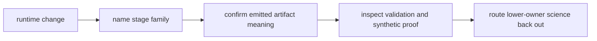

# Review Checklist

Review `bijux-gnss-receiver` as the runtime owner for staged receiver
execution. The crate may orchestrate acquisition, tracking, observation
assembly, in-memory artifacts, diagnostics, validation hooks, and simulation
support. It should not own command presentation, repository persistence,
signal truth, or navigation science.

## Review Gates

| changed surface | accept only when | inspect before accepting |
| --- | --- | --- |
| acquisition, tracking, or observation stage | The stage contract and lock/error evidence remain understandable outside one test fixture. | [Stage contracts](../interfaces/stage-contracts.md) and [pipeline guide](../../../crates/bijux-gnss-receiver/docs/PIPELINE.md) |
| runtime artifact or diagnostic output | The record describes receiver runtime meaning before infra persists it. | [Artifact Contracts](../interfaces/artifact-contracts.md), [Diagnostic Contracts](../interfaces/diagnostic-contracts.md) |
| validation or simulation helper | Synthetic proof is bounded to receiver behavior and does not become a substitute truth system. | [Validation and simulation contracts](../interfaces/validation-and-simulation-contracts.md) and [reference validation guide](../../../crates/bijux-gnss-receiver/docs/REFERENCE_VALIDATION.md) |
| public export | The export is a durable receiver boundary, not a shortcut to signal, nav, or infra internals. | [API surface](../interfaces/api-surface.md), [public API](../../../crates/bijux-gnss-receiver/docs/PUBLIC_API.md), and guardrail proof |
| deterministic or performance-sensitive path | The proof covers reproducibility, runtime budget, and artifact stability together. | [Determinism and purity](determinism-and-purity.md), [validation budgets](validation-budgets.md), and pipeline determinism proof |

## Blocking Signs

- A runtime change passes because a fixture was softened rather than because
  receiver behavior is now better explained.
- A receiver artifact carries repository-storage meaning that belongs to
  `bijux-gnss-infra`.
- A tracking or acquisition helper redefines signal facts that should come from
  `bijux-gnss-signal`.
- A validation test asserts a final navigation conclusion without checking the
  receiver evidence that made the conclusion possible.

## Evidence To Require

- Read the [receiver test guide](../../../crates/bijux-gnss-receiver/docs/TESTS.md),
  [pipeline guide](../../../crates/bijux-gnss-receiver/docs/PIPELINE.md), and
  [public API](../../../crates/bijux-gnss-receiver/docs/PUBLIC_API.md) before
  accepting broad runtime changes.
- Require the narrow stage test family for the changed behavior before relying
  on a full pipeline test.
- Update the matching stage, runtime, artifact, diagnostic, or validation
  handbook page when public receiver meaning changes.
- Route command, infra, signal, and nav concerns to their owners even when the
  receiver happens to be the caller.
