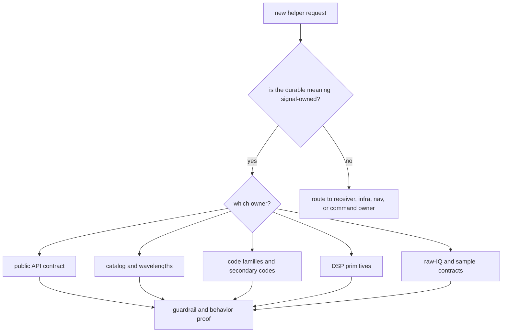

# Architecture Risks

`bijux-gnss-signal` is pulled on by every GNSS crate because signal identity,
code generation, sampling, and DSP touch almost every workflow. The main risk is
not missing helper functions; the main risk is accepting behavior that belongs
to receiver runtime, infra persistence, nav estimation, or command orchestration.

## Risk Map

## Main Risks

| pressure | failure mode | durable response |
| --- | --- | --- |
| receiver runtime asks for a helper | signal crate starts owning channel scheduling or lock policy | keep reusable DSP math here; keep runtime policy in receiver |
| many code families grow together | duplicate near-equivalent generators appear under different names | add one canonical signal-family implementation with reference proof |
| downstream crates request broad exports | the public API facade becomes a shortcut around internal boundaries | export by stable public contract only |
| raw-IQ utilities expand | sample metadata turns into repository ingestion or artifact layout policy | keep in-memory signal metadata here; route persistence to infra |
| tests pass only through a high-level workflow | signal behavior cannot be proven independently | require direct code, DSP, catalog, sample, or validation proof |

## Mitigations

- Keep runtime and persistence behavior out of the crate even when the data type
  is signal-shaped.
- Add code families by explicit signal meaning: constellation, band, channel,
  component, and code role.
- Review every public API export as a boundary change, not a convenience
  re-export.
- Use the refusal ledger in
  [This Package Does Not Own](../this-package-does-not-own.md) when pressure
  repeats from another crate.

## Proof Check

Start with the signal [boundary guide](../../../crates/bijux-gnss-signal/docs/BOUNDARY.md),
[architecture guide](../../../crates/bijux-gnss-signal/docs/ARCHITECTURE.md),
and [public API guide](../../../crates/bijux-gnss-signal/docs/PUBLIC_API.md).
Then inspect the [public API facade](../../../crates/bijux-gnss-signal/src/api.rs),
[DSP source](../../../crates/bijux-gnss-signal/src/dsp/mod.rs), and
[guardrail test](../../../crates/bijux-gnss-signal/tests/integration_guardrails.rs)
to confirm the architectural risk register still matches the enforced crate
shape.

## Reader Check

A new reader should be able to tell whether a proposed helper is signal-owned
without knowing the history of the request. If the answer depends on who asked
for it, the design is not ready.
