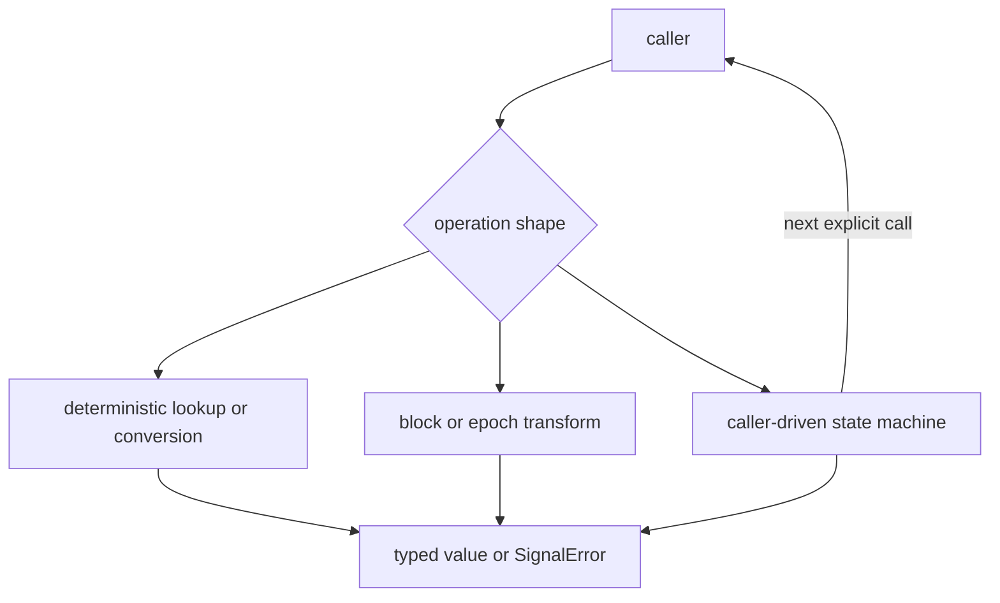
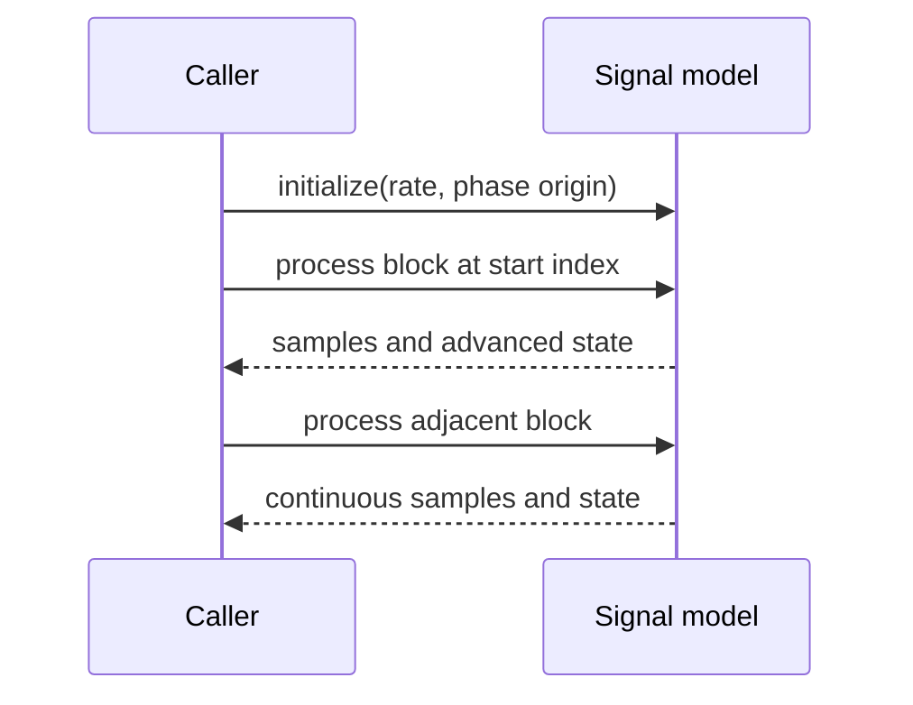
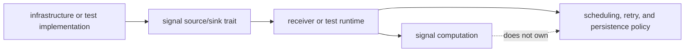
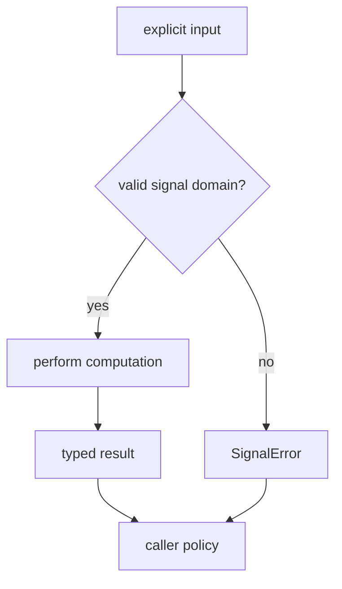

# Signal Execution Model

Signal operations run when a caller invokes them. The crate does not own a
background service, pipeline scheduler, channel registry, or artifact writer.
Its state exists only to preserve mathematical continuity across calls.

## Three Execution Shapes

### Deterministic Lookup

Catalog queries, code assignments, wavelength conversion, and many phase
helpers return the same result for the same input. They do not consult clocks,
files, environment variables, or process state.

### Block Or Epoch Transform

Sample conversion, front-end filtering, spectral analysis, correlation, replica
generation, and observation validation consume an explicit block or epoch. A
transform may allocate output or mutate a caller-provided buffer, but it does
not decide which block to process next.

### Caller-Driven State

NCOs, front-end filters, analyzers, local-code models, and tracking adaptation
carry state because signal evolution spans calls. The caller constructs the
state, chooses call order, handles errors, and decides when to reset or discard
it.

## Continuity Across Blocks

Block boundaries are implementation boundaries, not physical discontinuities.
For time-evolving operations, the caller must provide either absolute timing or
the state produced by the preceding call.

Resetting phase at each frame can create code jumps, carrier discontinuities,
or incorrect Doppler even when every frame looks locally valid. Tests for
replicas, NCOs, code timing, and tracking math should compare split and
contiguous execution over representative long offsets.

## Streaming Is Caller-Owned

The public source and sink traits do not turn this crate into an I/O runtime.
They let a higher-level owner supply frames without coupling signal algorithms
to one capture, device, or storage implementation.

The runtime decides frame length, backpressure, end-of-stream handling, retries,
and where output goes. Signal code validates its own mathematical inputs and
returns results.

## Tracking Mathematics Versus Tracking Runtime

This crate owns correlators, discriminators, loop coefficients, loop updates,
quality estimates, uncertainty calculations, and adaptation decisions. The
receiver owns the channel state machine around them.

| signal layer | receiver layer |
| --- | --- |
| compute early, prompt, and late correlations | select a channel and frame |
| derive DLL, PLL, and FLL evidence | decide acquisition-to-tracking promotion |
| advance code and carrier estimates | retain lock history and degraded state |
| estimate C/N0 and uncertainty | decide when a channel is usable or refused |
| choose an adaptation result from explicit inputs | apply session-level policy and emit artifacts |

An API crosses the boundary when it needs hidden channel history, chooses when
to run another stage, or emits receiver-owned status.

## Error And Validation Flow

`SignalError` covers signal-owned invalidity such as unsupported PRNs, missing
GLONASS frequency channels, invalid rates or phases, empty code or symbol
sequences, correlation mismatch, and invalid front-end or spectrum
configuration. The caller decides whether an error rejects input, ends a
channel, or becomes operator-facing output.

Observation compatibility is reported as typed evidence where partial or
per-pair results are useful. It does not silently promote a signal-level report
into a navigation-quality decision.

## Review Questions

- Are all time, frequency, phase, sample, chip, and distance units explicit?
- Does repeated execution depend only on explicit input and owned state?
- Does split-block execution preserve the same physical trajectory as
  contiguous execution?
- Can the operation run without a receiver session, repository layout, or
  process-global configuration?
- Is mutable state mathematically necessary, and is reset behavior visible?
- Does the caller retain scheduling, retry, persistence, and operational
  decisions?

For code ownership, continue to the [module map](module-map.md). For state
boundaries, see [state and persistence](state-and-persistence.md). For downstream
handoffs, see [integration seams](integration-seams.md).
