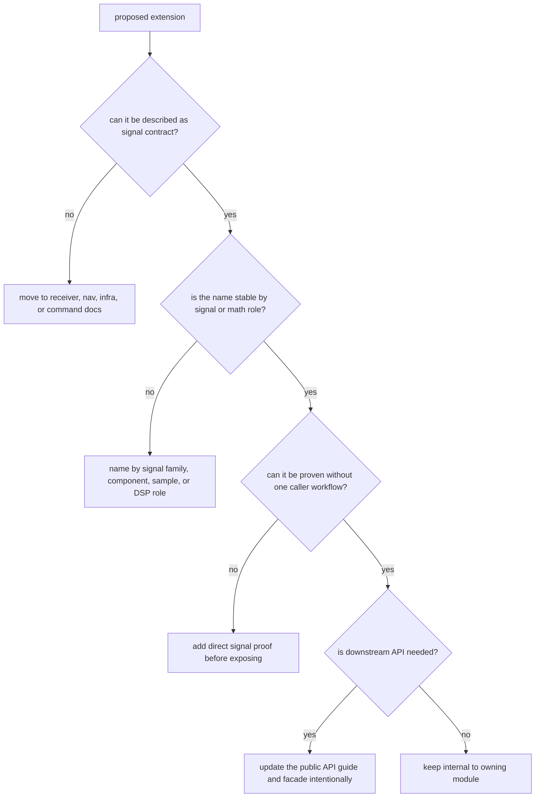

# Extensibility Model

The crate grows by adding new durable signal families or reusable DSP surfaces,
not by inserting unowned hooks for whichever downstream workflow is currently
blocked.

## Extension Decision

## Honest Extension Paths

| extension | when it belongs here | proof |
| --- | --- | --- |
| new constellation, band, component, or secondary code | the repository gains durable support for that signal family | reference code-generation or continuity test |
| reusable DSP primitive | the math is valuable outside one receiver runtime | direct DSP test plus integration only when behavior reaches a caller |
| catalog entry or wavelength helper | the supported-signal registry expands | catalog or component-registry test |
| raw-IQ or sample contract field | the field describes signal data, not repository storage | sample conversion or raw-IQ validation test |
| observation compatibility rule | the rule is signal-layer compatibility, not nav estimation policy | observation validation property or integration proof |

## Suspicious Extension Paths

- adding a helper that exists only to patch one receiver workflow
- creating a broad module instead of naming the actual signal family or DSP role
- exporting internal lookup tables that should remain implementation detail
- accepting artifact layout, dataset registry, or command-report behavior because
  it happens to mention signal metadata

## Compatibility Discipline

Every extension should answer three questions before it lands:

- is this a durable signal owner, not a temporary convenience
- is the name organized by signal meaning or mathematical role
- can the proof surface demonstrate the new behavior independently of one
  higher-level workflow

If any answer is no, stop at the owning crate boundary instead of adding a
half-owned extension.

## Proof Check

Start with the signal [code-family guide](../../../crates/bijux-gnss-signal/docs/CODE_FAMILIES.md),
[DSP guide](../../../crates/bijux-gnss-signal/docs/DSP.md), and
[public API guide](../../../crates/bijux-gnss-signal/docs/PUBLIC_API.md). Then
inspect the [code-family source](../../../crates/bijux-gnss-signal/src/codes/),
[DSP source](../../../crates/bijux-gnss-signal/src/dsp/), and the corresponding
[signal tests](../../../crates/bijux-gnss-signal/tests/) before approving any
extension as durable.
