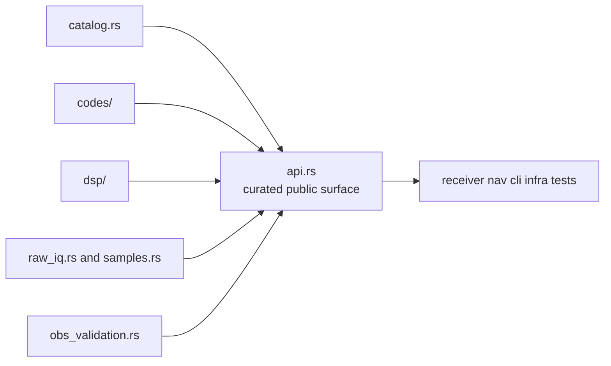

# Architecture

Open this section when the question is where signal behavior lives in code and
why the source tree is partitioned the way it is.

## Structural Shape

## Read These First

- open [Module Map](module-map.md) first when the question is simply where a
  behavior lives
- open [Execution Model](execution-model.md) when the issue is whether a helper
  is still runtime-neutral
- open [Integration Seams](integration-seams.md) when the question crosses
  catalog, codes, DSP, and validation

## Pages In This Section

- [Module Map](module-map.md)
- [Dependency Direction](dependency-direction.md)
- [Execution Model](execution-model.md)
- [State And Persistence](state-and-persistence.md)
- [Integration Seams](integration-seams.md)
- [Error Model](error-model.md)
- [Extensibility Model](extensibility-model.md)
- [Code Navigation](code-navigation.md)
- [Architecture Risks](architecture-risks.md)

## First Code Roots

- `crates/bijux-gnss-signal/src/catalog.rs`
- `crates/bijux-gnss-signal/src/codes/`
- `crates/bijux-gnss-signal/src/dsp/`
- `crates/bijux-gnss-signal/src/raw_iq.rs`
- `crates/bijux-gnss-signal/src/samples.rs`
- `crates/bijux-gnss-signal/src/obs_validation.rs`
- `crates/bijux-gnss-signal/src/error.rs`

## Leave This Section When

- leave for [Foundation](../foundation/) when the real issue is still package
  ownership rather than structure
- leave for [Interfaces](../interfaces/) when the question is what callers may
  rely on rather than how the code is partitioned
- leave for [Quality](../quality/) when the structure is clear and the next
  question is whether the proof surface is strong enough
