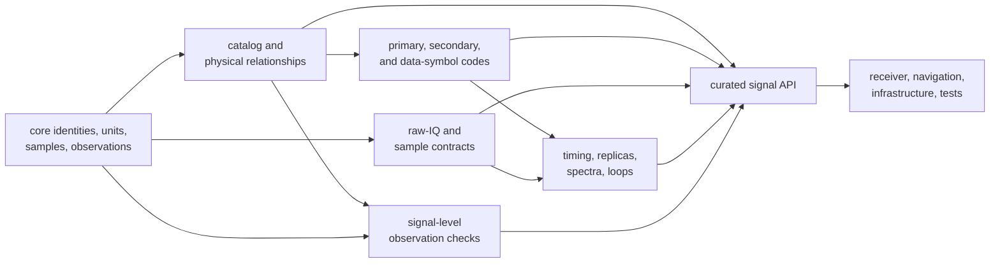
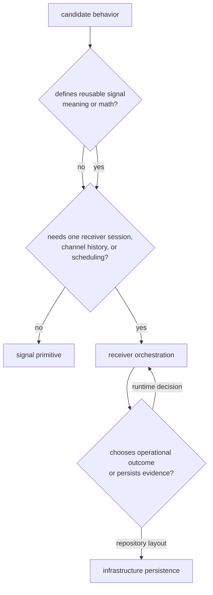

# Signal Architecture

`bijux-gnss-signal` owns reusable GNSS signal meaning and computation. It
connects foundational identities and units to receiver-ready catalogs, codes,
samples, replicas, spectra, and validation without owning a receiver session.
Use this section to decide where signal behavior belongs and which boundary a
change must preserve.

## Architectural Route

The [curated signal API](../../../crates/bijux-gnss-signal/src/api.rs) is the
supported downstream surface. Source placement helps maintainers find an
implementation; it does not grant stability to private modules.

## Find the Owning Region

| Reader question | Start here | Expected owner |
| --- | --- | --- |
| Which signals, bands, components, frequencies, or wavelengths are supported? | [Catalog architecture](../../../crates/bijux-gnss-signal/docs/CATALOG.md) | catalog |
| How is a primary, secondary, or data-symbol sequence generated and sampled? | [Code-family architecture](../../../crates/bijux-gnss-signal/docs/CODE_FAMILIES.md) | constellation code family |
| How are raw bytes described, normalized, or quantized? | [Raw-IQ contract](../../../crates/bijux-gnss-signal/docs/RAW_IQ.md) and [sample conversion](../../../crates/bijux-gnss-signal/docs/SAMPLES.md) | raw-IQ metadata and sample conversion |
| How are phase, timing, replicas, front-end response, spectra, and tracking math computed? | [DSP architecture](../../../crates/bijux-gnss-signal/docs/DSP.md) | reusable DSP primitive |
| Which observation pairs or epoch structures are signal-compatible? | [Signal validation](../../../crates/bijux-gnss-signal/docs/VALIDATION.md) | observation validation |
| Should a behavior be a trait or a free function? | [Trait contracts](../interfaces/trait-contracts.md) | public integration seam only when polymorphism is required |
| Which crate should own a cross-package behavior? | [Signal boundary](../../../crates/bijux-gnss-signal/docs/BOUNDARY.md) | lowest crate that can express it without higher-level policy |

## Computation Versus Orchestration

The boundary is not “state is forbidden.” An NCO must retain phase, a
front-end FIR filter must retain its delay line, and a tracking-adaptation
primitive can retain the values needed for its next deterministic update. Those
remain signal-owned when the caller decides when and why to advance them.

Signal owns a computation when its inputs state all physical context and its
result is reusable outside one run. Receiver owns work selection, channel
coordination, lock lifecycle, retries, and session evidence. Infrastructure
owns capture discovery, run layout, and persisted repository records.
Navigation owns orbit, correction, estimation, integrity, PPP, and RTK meaning.

## Architectural Invariants

### Explicit physical context

Sample rate, code rate, carrier frequency, signal identity, component role,
phase origin, time basis, units, and GLONASS frequency channel must be explicit
where they affect a result. A generic helper must not erase a
constellation-specific requirement.

### Chunk-independent continuity

Code and carrier generation over adjacent blocks must agree with generation
over the joined interval within the documented numerical tolerance. APIs that
evolve phase need an absolute sample/time origin or state whose update rule
preserves that invariant.

### Deterministic reference behavior

Catalog lookup, code generation, assignment tables, quantization, and DSP
helpers must produce deterministic results for the same declared inputs.
Reference tests should compare against independent data or separately expressed
models, not production output copied into a fixture.

### Curated exposure

A new public export needs durable downstream use, units and validity, error
behavior, and proof at the first affected consumer. Public exposure is not a
substitute for choosing an owner.

### Effect ownership

Signal traits describe minimal source, sink, and correlator needs. Implementing
crates own file, device, network, buffering, retry, and lifecycle effects. Add a
trait method only when every implementation should support the same durable
operation.

## Choose the Detailed Guide

| If the change concerns | Read |
| --- | --- |
| package ownership and exclusions | [Boundary and dependency direction](dependency-direction.md) |
| source organization | [Module map](module-map.md) and [code navigation](code-navigation.md) |
| stateful computational behavior | [Execution model](execution-model.md) and [state and persistence](state-and-persistence.md) |
| package handoffs | [Integration seams](integration-seams.md) |
| error categories and refusal | [Signal error model](error-model.md) |
| adding a signal family or DSP capability | [Extensibility model](extensibility-model.md) |
| known structural hazards | [Architecture risks](architecture-risks.md) |

The [full architecture guide](../../../crates/bijux-gnss-signal/docs/ARCHITECTURE.md)
defines the package-level flow, and the
[signal proof inventory](../../../crates/bijux-gnss-signal/docs/TESTS.md) maps
each region to its verification families.
