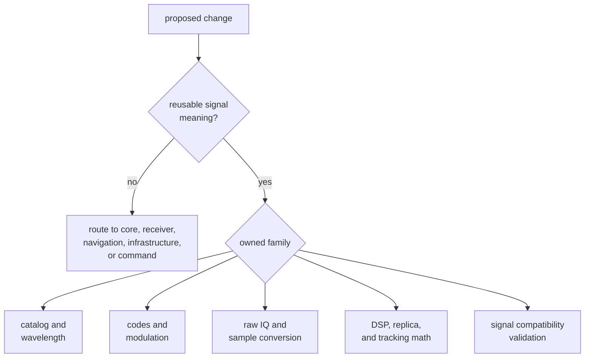
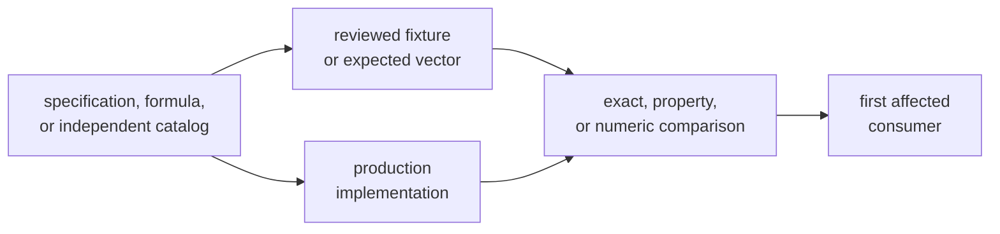

# Signal Change Principles

Signal code defines facts reused by acquisition, tracking, simulation,
navigation, infrastructure, and command workflows. Change it from the physical
or computational contract outward, not from the first failing consumer inward.

## Begin with Owned Meaning

The behavior belongs here only when it remains useful without receiver
scheduling, navigation estimation, repository layout, or operator policy.

## One Canonical Signal Fact

Carrier relationships, code assignments, component roles, rates, lengths,
secondary sequences, modulation, quantization, and compatibility rules need one
canonical implementation. Higher packages should consume that meaning rather
than copy constants or rebuild lookup tables.

Before adding a helper, determine whether it:

- introduces new signal meaning
- presents an existing fact in a reusable form
- duplicates an existing computation with different naming or units
- encodes one receiver or command use case

Prefer extending the canonical family over creating a near-match. A generic
helper is appropriate only when it preserves constellation-specific identity
and does not erase unsupported cases.

## Keep Authority Independent

Expected data must not be regenerated from the implementation under test. A
reference update should identify source revision, constellation, signal,
component, indexing, polarity, units, and any transformation applied to the
source.

Use exact comparisons for identities, assignments, chip sequences, lengths,
periods, enums, and metadata. Use justified tolerances for floating-point
phase, spectra, filter response, correlation, and converted samples.

## Preserve Continuity

Many APIs operate on chunks while modeling continuous code and carrier state.
For time-evolving behavior:

- define phase origin and units
- state wrap and boundary conventions
- compare segmented and continuous execution
- exercise representative and awkward sample-rate ratios
- include long-duration accumulation when drift is possible
- verify that reset and resumed state have deliberate semantics

A single code period or short buffer cannot defend a long-duration claim.

## Make Unsupported Meaning Explicit

Do not turn missing capability into zero, empty output, a default signal, or a
plausible sample. Unsupported satellites, components, frequency channels,
signal definitions, sequence shapes, and analysis configurations should return
typed absence or failure according to the public contract.

Preserve the distinction between:

- no registered definition
- registered signal without a usable requested component
- invalid physical input
- unsupported operation
- malformed sequence or configuration

Downstream callers need that meaning to refuse or report honestly.

## Protect Public and Serialized Boundaries

Treat these as compatibility-sensitive:

- curated API exports
- trait methods and associated error expectations
- raw-IQ metadata and schema fields
- quantization and sample-format enums
- validation report types and issue variants
- defaults and lookup behavior consumed by receiver code

An implementation-only edit can still change a public contract through output
ordering, default selection, units, error variants, serialization, or numeric
normalization.

## Keep Effects Above the Signal Layer

Signal code may transform in-memory samples and retain computational state. It
must not:

- discover or open capture files
- choose sidecars or repository paths
- schedule channels or declare receiver lock
- persist artifacts or run history
- accept or reject navigation solutions
- format operator reports

Source and sink traits define dependency-inversion seams; their implementations
own I/O, buffering, retries, and lifecycle.

## Structure the Change

One coherent signal change may contain:

- the canonical production implementation
- independent reference data or analytic expectations
- focused exact, property, and numeric proof
- public API or contract documentation when meaning moves
- first downstream integration evidence

Separate unrelated signal families, reference-generation tooling, broad
consumer policy, and private reorganization when they carry independent review
intent. Never leave an intermediate commit with an exported but unproven signal
contract.

## Reject Weak Justifications

Do not accept:

- “the receiver test passes” as sole proof of signal correctness
- “the formula is standard” without conventions and authority
- “the outputs look similar” without a metric and tolerance
- “the helper is reusable” when it embeds one runtime policy
- “the fixture changed with the implementation” without independent review
- “the diff is small” for a changed constant, default, or sign convention

Use the [signal boundary](../../../crates/bijux-gnss-signal/docs/BOUNDARY.md),
[contract guide](../../../crates/bijux-gnss-signal/docs/CONTRACTS.md), and
[validation guide](../quality/change-validation.md) to locate ownership and
proof.

A signal change is sound when one canonical implementation expresses an
independently anchored fact, unsupported meaning stays explicit, continuity
holds across relevant boundaries, and downstream evidence remains no broader
than the contract proved.
