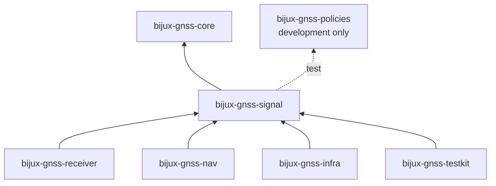
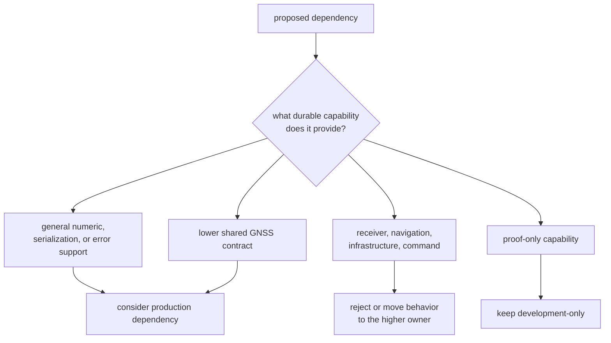

# Signal Dependencies and Adjacencies

The dependency graph protects the signal boundary only when each edge has a
clear reason. `bijux-gnss-signal` depends downward on shared contracts and
general-purpose numerical libraries. Receiver, navigation, infrastructure, and
test-support packages depend on signal; signal must not import their policy
back into reusable math.

## Current Production Dependencies

| Dependency | Owned use in signal | Boundary to preserve |
| --- | --- | --- |
| `bijux-gnss-core` | satellite and signal identity, physical units, samples, observations, tracking uncertainty | core records remain domain-neutral; signal must not duplicate them |
| `num-complex` | complex I/Q, replicas, wipeoff, spectra, filtering, and correlation | complex arithmetic only; no runtime ownership |
| `rustfft` | FFT planning for power-spectral-density estimation | spectrum computation, not acquisition scheduling |
| `serde` | raw-IQ metadata, front-end metrics/specification, and observation-validation reports | serialized meaning requires compatibility review |
| `schemars` | JSON Schema for the front-end filter specification | schema exposure is limited to configuration-bearing contracts |
| `thiserror` | structured `SignalError` variants | errors describe signal input and model failures, not command policy |

Development-only dependencies have different roles:

| Dependency | Test responsibility |
| --- | --- |
| `proptest` | generated property coverage for code, NCO, and observation behavior |
| `bijux-gnss-policies` | crate-shape and public-surface guardrails |
| `toml` | metadata serialization proof |
| `sha2` | fixture or reference identity checks |

Do not move a test dependency into production merely to reuse a test helper.
Production code must not acquire its expected values from the package that
tests it.

## Direction and Pressure

The arrows show compile-time direction, but review pressure travels both ways.
A higher-level consumer may reveal a missing reusable primitive without becoming
the owner of that primitive.

| Adjacent package | Legitimate request to signal | Request that belongs elsewhere |
| --- | --- | --- |
| receiver | reusable code, replica, timing, spectrum, loop, or sample operation | channel scheduling, lock lifecycle, acquisition policy, retries, runtime artifacts |
| navigation | signal identity, wavelength, dual-frequency compatibility, shared-path scaling | orbit, atmosphere, correction acceptance, PPP, RTK, solution integrity |
| infrastructure | typed raw-IQ meaning and serializable signal records | file discovery, sidecar precedence, dataset registry, run layout |
| testkit | deterministic public operations needed to build independent expected values | production dependency on test fixtures or copied implementation |
| policies | structural checks against declared package rules | ownership of scientific behavior |

## Dependency Decision

Before adding a production dependency, answer:

1. Which public or private signal capability requires it?
2. Why can the capability not be expressed with existing core and numerical
   contracts?
3. Does the dependency introduce filesystem, network, async-runtime, logging,
   command, or repository effects?
4. Does it enlarge serialized, feature, licensing, binary-size, unsafe-code, or
   platform obligations?
5. Can it remain optional without fragmenting signal semantics?
6. Which focused proof fails without it and proves its intended use?

A dependency justified only by “the receiver already uses it” is not a signal
justification.

## New Export Pressure

Dependency direction can remain technically correct while ownership still
drifts through public exports. Review a proposed export for:

- a complete physical contract: units, identity, range, phase/time origin, and
  error behavior
- usefulness to more than one receiver workflow
- independence from one command, profile, dataset, or run
- deterministic and chunk-stable behavior where time evolves
- proof against an independent source or invariant
- consumer evidence showing why the public surface is needed

If a helper accepts receiver channel state, repository locations, navigation
products, or command options, moving its code into signal does not make it a
signal primitive.

## Serialized Dependency Impact

`serde` and `schemars` make dependency changes visible beyond Rust callers.
Changing an enum spelling, field requiredness, default, numeric unit, or schema
shape can break sidecars, configurations, artifacts, and external tooling.
Review serialized contracts separately from internal implementation.

The [raw-IQ and sample contract](../interfaces/raw-iq-and-sample-contracts.md)
defines current sample metadata behavior. The
[public import guide](../interfaces/public-imports.md) defines the supported
Rust entrypoint.

## Review Evidence

- [Package manifest](../../../crates/bijux-gnss-signal/Cargo.toml) is the
  authority for current dependency classes and features.
- [Signal architecture](../../../crates/bijux-gnss-signal/docs/ARCHITECTURE.md)
  defines the computational boundary.
- [Signal boundary](../../../crates/bijux-gnss-signal/docs/BOUNDARY.md) defines
  allowed and excluded ownership.
- [Curated public API](../../../crates/bijux-gnss-signal/src/api.rs) shows which
  dependency-backed types reach consumers.
- [Signal guardrail](../../../crates/bijux-gnss-signal/tests/integration_guardrails.rs)
  checks package structure; it does not prove scientific correctness or
  dependency necessity.

When the disputed behavior is receiver scheduling, use the
[receiver dependency boundary](../../05-bijux-gnss-receiver/foundation/dependencies-and-adjacencies.md).
When it is estimation or correction science, use the
[navigation dependency boundary](../../04-bijux-gnss-nav/foundation/dependencies-and-adjacencies.md).
