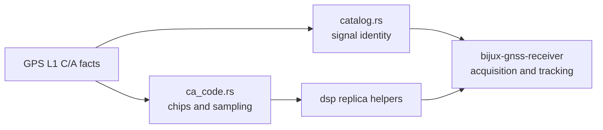

# GPS L1 C/A Reference

Use this page when the reader needs the stable GPS L1 C/A signal profile before
opening code, tests, or receiver behavior. The signal crate owns these facts;
the receiver crate owns acquisition, tracking, and lock policy built on them.

## Stable Signal Facts

| fact | value | repository meaning |
| --- | --- | --- |
| constellation | GPS | shared identity is `Constellation::Gps` |
| band | L1 | shared identity is `SignalBand::L1` |
| code | C/A | shared identity is `SignalCode::Ca` |
| carrier frequency | 1575.42 MHz | catalog and wavelength helpers derive carrier-dependent values |
| code rate | 1.023 MHz | sampling and replica helpers use this as the nominal chip rate |
| primary-code length | 1023 chips | one primary period is one complete C/A sequence |
| primary-code period | 1 ms | receiver stages should not infer longer data-bit behavior from this page |

## Ownership Route

## What This Page Proves

- The C/A sequence is a 1023-chip primary code with a 1 ms nominal period.
- Public signal identity must route through the registry instead of hard-coded
  caller assumptions.
- Replica and sampling behavior belongs in signal only while it remains reusable
  substrate.
- Receiver defaults are downstream choices and must be proven in receiver docs,
  receiver tests, or emitted receiver artifacts.

## When To Leave This Page

| reader question | better owner |
| --- | --- |
| How is the C/A sequence generated or sampled? | the [C/A code source](../../../crates/bijux-gnss-signal/src/codes/ca_code.rs) |
| How is the signal exposed to other crates? | the [signal catalog](../../../crates/bijux-gnss-signal/src/catalog.rs) and [public API surface](../../../crates/bijux-gnss-signal/src/api.rs) |
| How does an acquisition search use this signal? | the receiver [acquisition contracts](../../05-bijux-gnss-receiver/interfaces/acquisition-contracts.md) |
| How does tracking interpret phase, lock, or CN0? | the receiver [tracking contracts](../../05-bijux-gnss-receiver/interfaces/tracking-contracts.md) and [diagnostic contracts](../../05-bijux-gnss-receiver/interfaces/diagnostic-contracts.md) |
| How does navigation use decoded GPS data? | the navigation [time and model contracts](../../04-bijux-gnss-nav/interfaces/time-and-model-contracts.md) |

## First Proof Check

Start with the [C/A code source](../../../crates/bijux-gnss-signal/src/codes/ca_code.rs)
and the [signal catalog](../../../crates/bijux-gnss-signal/src/catalog.rs). Then
confirm behavior through the [reference chip test](../../../crates/bijux-gnss-signal/tests/integration_ca_code_reference.rs),
the [period-length test](../../../crates/bijux-gnss-signal/tests/integration_ca_code_period_length.rs),
and the [long-duration phase test](../../../crates/bijux-gnss-signal/tests/integration_ca_code_long_duration_phase.rs).
