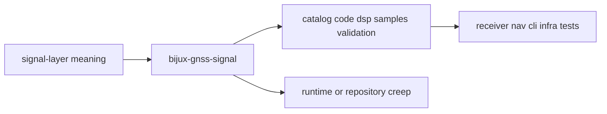

# Foundation

Open this section when the question is whether a signal-layer behavior belongs
in `bijux-gnss-signal` at all, what durable language this crate uses, and how
its scope fits inside the repository.

## Boundary Model

The signal boundary is only trustworthy when readers can see where reusable
signal meaning stops and where runtime policy, repository layout, or
navigation judgment must take over.

## Read These First

- open [Package Overview](package-overview.md) for the shortest accurate
  explanation of the crate
- open [Ownership Boundary](ownership-boundary.md) when code or documentation
  is drifting across package lines
- open [Dependencies And Adjacencies](dependencies-and-adjacencies.md) when the
  question is whether a new dependency or exported helper belongs here

## The Mistake This Section Prevents

The most common mistake here is assuming that because signal behavior is
technically deep and widely reused, it should absorb any nearby concern that
happens to touch samples, correlators, or validation. This section keeps
reusable signal ownership distinct from receiver orchestration, repository
infrastructure, and navigation-science authority.

## Pages In This Section

- [Package Overview](package-overview.md)
- [Scope And Non-Goals](scope-and-non-goals.md)
- [Ownership Boundary](ownership-boundary.md)
- [GPS L1 C/A Reference](gps-l1-ca-reference.md)
- [Repository Fit](repository-fit.md)
- [Domain Language](domain-language.md)
- [Dependencies And Adjacencies](dependencies-and-adjacencies.md)
- [Change Principles](change-principles.md)

## First Boundary Check

- this crate owns reusable signal meaning and reusable DSP, not receiver runs
- this crate may validate signal compatibility, but it does not own navigation
  trust judgments
- this crate owns raw sample contracts, but not repository storage layout or
  capture-file discovery

## First Proof Check

- `crates/bijux-gnss-signal/README.md`
- `crates/bijux-gnss-signal/docs/BOUNDARY.md`
- `crates/bijux-gnss-signal/src/catalog.rs`
- `crates/bijux-gnss-signal/src/codes/`
- `crates/bijux-gnss-signal/src/dsp/`
- `crates/bijux-gnss-signal/src/raw_iq.rs`

## Leave This Section When

- leave for [Architecture](../architecture/) when ownership is clear and the
  question becomes code layout
- leave for [Interfaces](../interfaces/) when the question is already about
  public exports, traits, or metadata contracts
- leave for [Quality](../quality/) when the boundary is clear and the question
  becomes whether the proof bar is technically honest
