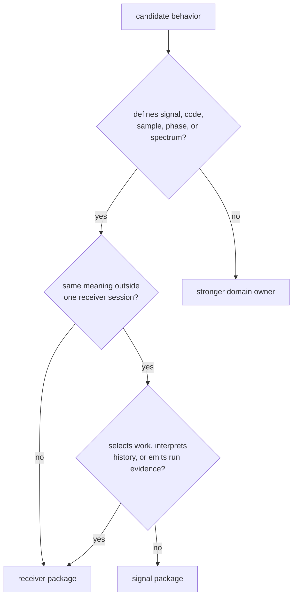
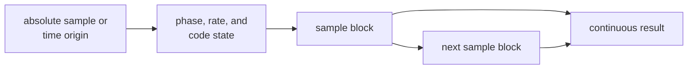

# Signal Computation Foundations

`bijux-gnss-signal` owns reusable facts and computations between shared GNSS
types and receiver execution: signal catalogs, spreading codes, raw-sample
meaning, replicas, timing, spectra, correlation, and tracking-loop primitives.
Its behavior must remain meaningful without one receiver session, repository
layout, navigation estimator, or command workflow.

## Decide By Physical Ownership

State does not by itself make a component receiver-owned. An oscillator may
preserve phase and a filter may preserve delay-line state while remaining a
reusable signal primitive. Ownership moves to receiver when behavior schedules
channels, combines session history, declares lifecycle state, or commits
operational evidence.

## Start From The Signal Question

| question | contract |
| --- | --- |
| Which carrier, code, component role, wavelength, or acquisition default applies? | [Signal model assumptions](../interfaces/signal-model-assumptions.md) |
| How is a primary, secondary, data, pilot, or multiplexed code generated? | [Code contracts](../interfaces/code-contracts.md) |
| Which timing, replica, spectrum, correlation, or loop primitive applies? | [DSP contracts](../interfaces/dsp-contracts.md) |
| What do encoded samples and capture metadata mean? | [Raw IQ and sample contracts](../interfaces/raw-iq-and-sample-contracts.md) |
| Which signal pair is compatible for an observation operation? | [Validation contracts](../interfaces/validation-contracts.md) |
| Which polymorphic source, sink, or correlator seam is stable? | [Trait contracts](../interfaces/trait-contracts.md) |
| Does the behavior belong in this package? | [Ownership boundary](ownership-boundary.md) |

## Preserve Continuity

Signal computations often process blocks while modeling continuous physical
time. The contract must expose enough origin and state to make chunking an
implementation choice rather than a change in meaning.

A continuous interval generated in adjacent blocks should agree with the same
interval generated as one block within the documented numerical tolerance.
That requires explicit sample rate, phase origin, wrapping domain, code rate,
carrier frequency, and units.

## Refuse Ambiguous Meaning

- A signal identity must not be silently remapped to another carrier,
  component, code family, or GLONASS channel.
- Raw bytes without sample format, quantization, sampling rate, and
  intermediate-frequency context are not a complete signal input.
- Generic helpers must not erase data/pilot roles, secondary-code state, or
  constellation-specific modulation.
- A DSP metric does not declare receiver lock; it provides evidence the
  receiver may use under its own lifecycle policy.
- Signal compatibility does not establish navigation validity.

Use the [package overview](package-overview.md) for the concise role,
[GPS L1 coarse-acquisition reference](gps-l1-ca-reference.md) for a worked signal family,
[scope and non-goals](scope-and-non-goals.md) for explicit refusals, and
[change principles](change-principles.md) before altering physical behavior.

Implementation evidence begins with the
[signal architecture](../../../crates/bijux-gnss-signal/docs/ARCHITECTURE.md),
[catalog guide](../../../crates/bijux-gnss-signal/docs/CATALOG.md),
[code-family guide](../../../crates/bijux-gnss-signal/docs/CODE_FAMILIES.md),
[DSP guide](../../../crates/bijux-gnss-signal/docs/DSP.md),
[raw-IQ guide](../../../crates/bijux-gnss-signal/docs/RAW_IQ.md), and
[sample guide](../../../crates/bijux-gnss-signal/docs/SAMPLES.md).
