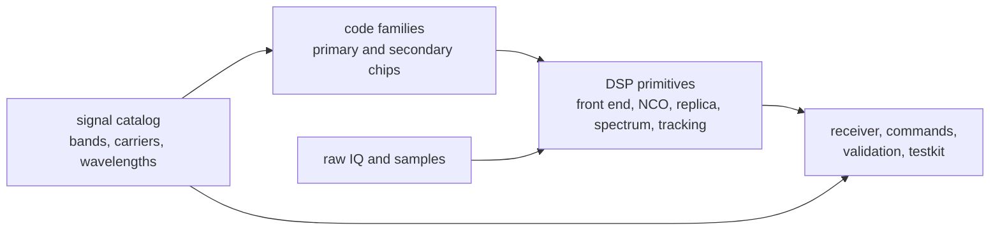

# Package Overview

`bijux-gnss-signal` owns reusable signal truth below receiver orchestration and
navigation interpretation. It is the crate readers should inspect when the
question is “what does this signal, code, sample stream, or DSP primitive mean
outside one receiver run?”

The crate is not a grab bag for math helpers. Its public surface is a contract
between signal definitions, code generation, raw-IQ/sample representation, DSP
primitives, and signal-layer validation.

## Signal Boundary

## Owned Families

| family | owns | first proof |
| --- | --- | --- |
| catalog | supported signal identities, carrier and wavelength helpers, default acquisition signal selection | catalog source and [signal catalog guide](../../../crates/bijux-gnss-signal/docs/CATALOG.md) |
| code families | GPS L1 C/A, GPS L2C, GPS L5, Galileo E1/E5, BeiDou B1I/B2I/D1 helpers, GLONASS L1 | code-family source and [code family guide](../../../crates/bijux-gnss-signal/docs/CODE_FAMILIES.md) |
| front-end quality | I/Q metrics, noise-floor estimation, DC-offset handling, front-end response measurement | front-end and quality source |
| replica and timing | local code models, sample timing, carrier trajectories, modulated replicas, wipeoff helpers | local-code and replica source |
| oscillator and spectrum | NCO state, spectrum summaries, power spectral density, spectrum nulls | NCO and spectrum source |
| tracking primitives | reusable correlators, loop coefficients, discriminators, lock thresholds, CN0 and uncertainty helpers | tracking DSP source |
| sample contracts | raw-IQ metadata, quantization, sample conversion, sample-source traits | raw-IQ, sample, and public API source |
| signal validation | dual-frequency compatibility and inter-frequency alignment checks | observation-validation source |

## Reader Rules

- Start here for reusable signal facts and runtime-neutral DSP behavior.
- Leave for `bijux-gnss-receiver` when a signal primitive is scheduled inside
  acquisition, tracking, observation construction, or receiver validation.
- Leave for `bijux-gnss-nav` when signal observations are being interpreted as
  navigation products, corrections, position solutions, PPP, or RTK.
- Leave for `bijux-gnss-infra` when raw-IQ metadata is tied to dataset
  registry entries, sidecar files, run directories, or persisted provenance.
- Leave for `bijux-gnss-core` when the question is shared units, identifiers,
  observations, diagnostics, or artifact envelopes.

## Change Risk

Signal changes often move several downstream test families at once. A code
family correction can affect acquisition, tracking, synthetic validation, and
artifact expectations. A sample timing or NCO correction can affect long-run
phase continuity. Treat that blast radius as signal ownership, not as a reason
to patch downstream crates independently.

## First Proof Check

Inspect the [signal crate README](../../../crates/bijux-gnss-signal/README.md),
[signal catalog guide](../../../crates/bijux-gnss-signal/docs/CATALOG.md),
[code family guide](../../../crates/bijux-gnss-signal/docs/CODE_FAMILIES.md),
[DSP guide](../../../crates/bijux-gnss-signal/docs/DSP.md), curated public API
source, and the integration tests named in the crate README.
