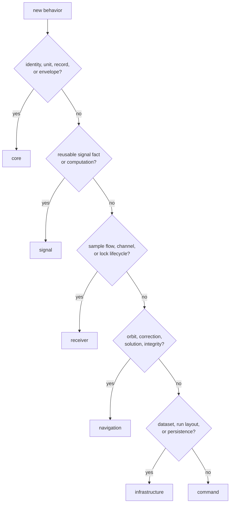

# Signal Package Placement

`bijux-gnss-signal` is the reusable signal-domain layer between foundational
GNSS records and higher-level runtime or navigation behavior. It owns physical
signal meaning and computation that remains useful without a receiver session,
repository layout, or operator workflow.

## Dependency Direction

```mermaid
flowchart BT
    core["core identities, units,<br/>observations, samples"]
    signal["signal catalogs, codes,<br/>samples, DSP, validation"]
    receiver["receiver runtime"]
    nav["navigation science"]
    infra["repository infrastructure"]
    command["operator commands"]

    signal --> core
    receiver --> signal
    nav --> signal
    infra --> signal
    command --> signal
```

The signal package directly depends on core plus general numeric,
serialization, schema, FFT, and error libraries. Receiver, navigation,
infrastructure, and command directly depend on signal. Signal must not reverse
those edges to reach consumer-specific behavior.

The [signal architecture](../../../crates/bijux-gnss-signal/docs/ARCHITECTURE.md)
describes the internal flow from core records through catalogs, codes, samples,
DSP, validation, and the curated API.

## Why This Boundary Exists

Core should remain small enough to carry identities, units, records, and
envelopes without importing code generators or FFT behavior. Receiver should
compose signal primitives without becoming the canonical source of codes,
carrier relationships, quantization, or reusable loop math.

The signal package prevents:

- duplicate code and modulation definitions across acquisition, tracking, and
  simulation
- receiver-local constants becoming accidental workspace truth
- navigation reimplementing wavelength or signal-pair relationships
- infrastructure defining raw-IQ meaning while discovering captures
- core accumulating every GNSS computation used by more than one package

## Owned and Consumed Meaning

| Signal owns | Consumers decide |
| --- | --- |
| catalog entries, carrier relationships, wavelength conversion, and default signal facts | which satellites or signals a run requests |
| primary, secondary, and data-symbol code behavior | acquisition search and channel policy |
| raw-IQ metadata, quantization, and in-memory sample conversion | capture discovery, storage location, and ingest lifecycle |
| NCO, code timing, replica, spectrum, front-end, correlation, loop, quality, and uncertainty primitives | receiver scheduling, lock transitions, and runtime artifacts |
| signal-level observation compatibility and alignment evidence | navigation acceptance, estimator policy, and operator presentation |
| minimal source, sink, and correlator traits | concrete I/O effects, retries, buffering, and ownership lifecycle |

State does not automatically imply receiver ownership. An NCO or reusable code
model can retain computational state while remaining independent of channel
scheduling and session history.

## Place New Behavior by Meaning

“Used by multiple packages” is not sufficient reason to place behavior here.
The behavior must itself describe signal meaning or reusable signal
computation.

## Public Boundary

Downstream packages consume the curated `api` module. Internal source
organization is not a compatibility promise. A public addition should:

- expose durable signal meaning rather than one consumer's convenience
- state units, ranges, time or phase origin, and unsupported cases
- remain usable without receiver or repository state
- return signal-domain failures rather than consumer workflow errors
- include direct reference or property proof
- demonstrate the first affected consumer when semantics move

The [public API guide](../../../crates/bijux-gnss-signal/docs/PUBLIC_API.md)
defines the supported families.

## Dependency Admission

A new production dependency is justified only when it implements signal-owned
behavior and does not import higher-layer policy. Review:

- why core and the standard library are insufficient
- determinism and numerical behavior
- feature, serialization, and schema impact
- compile-time and binary-cost implications
- license and release compatibility
- whether a small local implementation would be safer and clearer

Test-only references and policy checks belong in development dependencies and
must not leak into the public contract.

## Boundary Failure Signals

Stop when signal code begins to:

- open captures or discover sidecars
- select receiver channels or declare lock
- interpret session history or emit receiver artifacts
- calculate orbit, atmospheric, position, PPP, RTK, or integrity claims
- create repository run directories or manifests
- format operator reports or choose command exit status
- depend on receiver, navigation, infrastructure, command, or test support

Use the [package boundary](../../../crates/bijux-gnss-signal/docs/BOUNDARY.md)
and [contract guide](../../../crates/bijux-gnss-signal/docs/CONTRACTS.md) when
ownership is ambiguous.

The package fits the repository when its contracts remain canonical,
computational, effect-free from a product perspective, and consumable through
one deliberate API without higher-layer dependencies.
