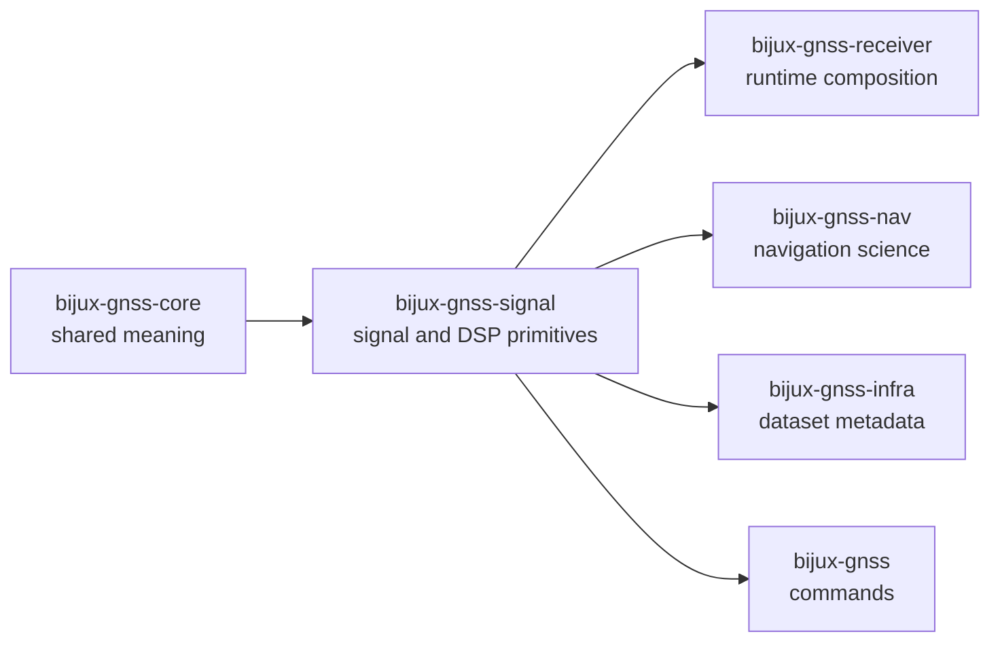

# bijux-gnss-signal

`bijux-gnss-signal` owns reusable GNSS signal definitions, code families, raw
sample contracts, and runtime-neutral DSP primitives for `bijux-telecom`. This
crate is where the repository answers signal-layer questions before receiver
orchestration, dataset persistence, or navigation science start adding their
own policy.

The crate is broad in technical depth, but narrow in ownership. It should be
the authoritative home for signal behavior that must stay reusable across
commands, validation, synthetic generation, and receiver runtime. It should not
quietly become a second receiver crate.

## Read These First

- open [Foundation](foundation/) when the question is why this crate owns the
  surface at all
- open [Interfaces](interfaces/) when the issue is already about public signal
  API, trait seams, raw-IQ contracts, or validation reports
- open [Architecture](architecture/) when the question is structural: where
  catalog, code families, DSP, samples, and validation live in code
- open [Quality](quality/) when ownership is clear and the question becomes
  whether the proof bar is technically honest

## Why This Package Exists

- code families and signal catalogs must stay canonical instead of being
  reimplemented across tests, runtime, and validation tools
- DSP helpers need one reusable owner below receiver orchestration
- raw-IQ metadata and sample conversions should remain explicit contracts
  rather than hidden adapter logic
- signal-layer observation compatibility needs a home that is stricter than
  convenience and narrower than full navigation quality judgment

## What It Owns

- signal catalogs, wavelength helpers, and default acquisition-signal
  selection
- constellation-specific code generators and secondary-code behavior
- runtime-neutral DSP primitives such as local code, NCOs, replica generation,
  front-end response, spectrum, and tracking math
- raw-IQ metadata, sample quantization, and sample conversion helpers
- signal-layer observation compatibility and epoch-shape validation

## What It Refuses

- command workflows and operator-facing vocabulary owned by `bijux-gnss`
- receiver-stage scheduling, channels, artifacts, and runtime composition owned
  by `bijux-gnss-receiver`
- repository-side dataset layout and persisted metadata owned by
  `bijux-gnss-infra`
- navigation estimation, orbit products, and solution quality judgment owned
  by `bijux-gnss-nav`
- shared identity, units, and cross-package observation types owned by
  `bijux-gnss-core`

## Strongest Proof Surfaces

- crate README:
  [Signal crate README](../../crates/bijux-gnss-signal/README.md)
- crate-local docs:
  [Signal catalog guide](../../crates/bijux-gnss-signal/docs/CATALOG.md),
  [Code-family guide](../../crates/bijux-gnss-signal/docs/CODE_FAMILIES.md),
  [DSP guide](../../crates/bijux-gnss-signal/docs/DSP.md),
  [Raw-IQ guide](../../crates/bijux-gnss-signal/docs/RAW_IQ.md),
  [Signal validation guide](../../crates/bijux-gnss-signal/docs/VALIDATION.md)
- source roots:
  [catalog source](../../crates/bijux-gnss-signal/src/catalog.rs),
  [code-family source](../../crates/bijux-gnss-signal/src/codes),
  [DSP source](../../crates/bijux-gnss-signal/src/dsp),
  [raw-IQ source](../../crates/bijux-gnss-signal/src/raw_iq.rs),
  [observation validation source](../../crates/bijux-gnss-signal/src/obs_validation.rs)
- proof tests:
  [signal registry proof](../../crates/bijux-gnss-signal/tests/integration_signal_component_registry.rs),
  [long-duration NCO proof](../../crates/bijux-gnss-signal/tests/integration_nco_long_duration_phase.rs),
  [raw-IQ metadata proof](../../crates/bijux-gnss-signal/tests/integration_raw_iq_metadata.rs),
  [observation epoch property proof](../../crates/bijux-gnss-signal/tests/prop_obs_epoch_validation.rs)

## Support Crates That Matter Here

- `bijux-gnss-policies` protects the rule that signal code stays reusable
  substrate rather than turning into receiver policy or repository glue;
  inspect it when a signal change also changes crate-shape expectations.
- `bijux-gnss-testkit` is not the owner of reusable signal APIs, but it is a
  heavy consumer of deterministic signal truth; inspect it when a signal claim
  is being defended through shared fixtures or independent validation helpers.

## Sections In This Handbook

- [Foundation](foundation/) for scope, ownership, repository fit, dependency
  direction, and signal vocabulary
- [Architecture](architecture/) for module map, execution neutrality,
  code-family layering, and integration seams
- [Interfaces](interfaces/) for the curated public API, trait seams, metadata
  contracts, and compatibility expectations
- [Operations](operations/) for safe change sequence, reference-data care,
  verification commands, and review scope
- [Quality](quality/) for invariants, proof strategy, limitations, risk, and
  change validation
- [Signal ownership boundaries](ownership-boundaries.md) for separating
  reusable physical behavior from runtime and navigation policy

## Start Here When

- the question is about how a signal is identified, sampled, or regenerated
- the issue is code-generation fidelity, long-duration continuity, or
  spectrum/front-end behavior
- the reader needs to trace raw-IQ or sample contracts before runtime consumes
  them
- a higher-level crate appears to depend on signal policy that should stay
  reusable

## Reader Questions This Package Can Answer

- where signal meaning stops and receiver orchestration begins
- how supported GNSS families are organized across catalog, code, and DSP
  surfaces
- which public traits and sample contracts downstream crates should reuse
- how signal-layer validation differs from full navigation-solution judgment

## Leave This Handbook When

- the question becomes about runtime scheduling, channel behavior, or emitted
  receiver artifacts:
  [Receiver handbook](../05-bijux-gnss-receiver/)
- the question becomes about navigation estimators, orbit products, or
  solution science:
  [Navigation handbook](../04-bijux-gnss-nav/)
- the question becomes about dataset layout, sidecars, or persisted run
  metadata:
  [Infra handbook](../03-bijux-gnss-infra/)
- the question becomes about operator commands or report wording:
  [Command handbook](../01-bijux-gnss/)
- the question becomes about shared satellite identity, time, or observation
  record meaning:
  [Core handbook](../02-bijux-gnss-core/)

## Evidence Routes

- [catalog source](../../crates/bijux-gnss-signal/src/catalog.rs)
- [GPS L1 C-A code source](../../crates/bijux-gnss-signal/src/codes/ca_code.rs)
- [Galileo E5 code source](../../crates/bijux-gnss-signal/src/codes/galileo_e5.rs)
- [NCO source](../../crates/bijux-gnss-signal/src/dsp/nco.rs)
- [replica source](../../crates/bijux-gnss-signal/src/dsp/replica.rs)
- [raw-IQ source](../../crates/bijux-gnss-signal/src/raw_iq.rs)
- [sample conversion source](../../crates/bijux-gnss-signal/src/samples.rs)
- [observation compatibility source](../../crates/bijux-gnss-signal/src/obs_validation.rs)
- [DSP guide](../../crates/bijux-gnss-signal/docs/DSP.md)

## Design Pressure

If `bijux-gnss-signal` starts carrying receiver execution policy, repository
I/O, or navigation judgment because those behaviors happen to use signal math,
the crate stops being a reusable substrate and becomes a catch-all boundary.
