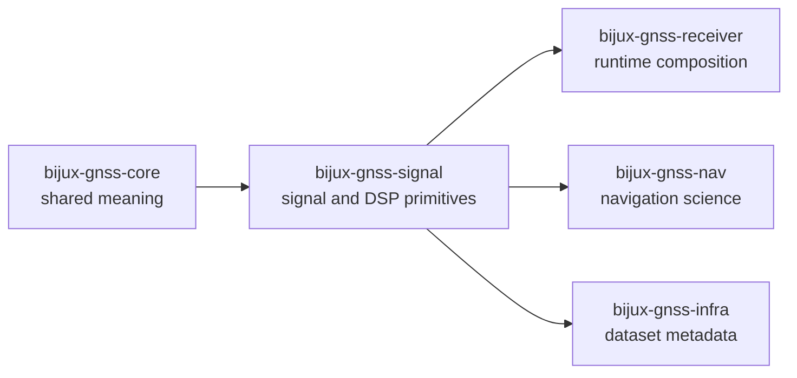

# bijux-gnss-signal

`bijux-gnss-signal` owns reusable signal definitions and DSP primitives for the
repository. This crate is where spreading codes, catalog lookups, sample
contracts, front-end filtering, timing helpers, NCOs, and tracking-loop
building blocks stay reusable instead of being welded into one receiver
implementation.

This package should be the place where signal-layer questions become precise.
If the question is still "what does this signal look like?" or "how should
this raw-IQ surface be represented?", this package should answer before the
receiver runtime starts adding policy.

## Why This Package Exists

- code generation and DSP primitives must be reusable across receiver features
  rather than hidden in one stage engine
- raw-IQ and sample representation contracts need a dedicated owner
- signal catalogs and observation-compatibility checks should stay explicit and
  package-local instead of drifting into runtime policy

## What It Owns

- signal catalogs and wavelength helpers
- constellation-specific code families and secondary-code definitions
- reusable DSP primitives such as front-end filtering, local replicas, sample
  timing, NCOs, spectrum helpers, and tracking-loop building blocks
- raw-IQ metadata, sample conversions, and signal-layer observation validation

## What It Refuses

- command workflows owned by `bijux-gnss`
- persisted run layout and repository-level dataset history owned by
  `bijux-gnss-infra`
- receiver-stage scheduling and artifact emission owned by
  `bijux-gnss-receiver`
- navigation estimators and orbit-domain models owned by `bijux-gnss-nav`
- cross-package IDs and generalized artifact contracts owned by
  `bijux-gnss-core`

## Strongest Proof Surfaces

- crate README:
  [`crates/bijux-gnss-signal/README.md`](../../crates/bijux-gnss-signal/README.md)
- package docs:
  [`crates/bijux-gnss-signal/docs/CATALOG.md`](../../crates/bijux-gnss-signal/docs/CATALOG.md),
  [`crates/bijux-gnss-signal/docs/CODE_FAMILIES.md`](../../crates/bijux-gnss-signal/docs/CODE_FAMILIES.md),
  [`crates/bijux-gnss-signal/docs/DSP.md`](../../crates/bijux-gnss-signal/docs/DSP.md),
  [`crates/bijux-gnss-signal/docs/RAW_IQ.md`](../../crates/bijux-gnss-signal/docs/RAW_IQ.md)
- source roots:
  [`crates/bijux-gnss-signal/src/catalog.rs`](../../crates/bijux-gnss-signal/src/catalog.rs),
  [`crates/bijux-gnss-signal/src/codes`](../../crates/bijux-gnss-signal/src/codes),
  [`crates/bijux-gnss-signal/src/dsp`](../../crates/bijux-gnss-signal/src/dsp),
  [`crates/bijux-gnss-signal/src/raw_iq.rs`](../../crates/bijux-gnss-signal/src/raw_iq.rs)
- proof tests:
  [`crates/bijux-gnss-signal/tests`](../../crates/bijux-gnss-signal/tests)

## Start Here When

- the question is about signal codes, chipping structure, or wavelength lookup
- the issue is front-end filtering, sample timing, NCO behavior, or replica
  generation
- the reader wants to verify raw-IQ or sample-conversion contracts
- a receiver feature seems to depend on a signal-layer rule that should remain
  reusable

## Reader Questions This Package Can Answer

- where reusable signal and DSP behavior stops and receiver policy starts
- how supported code families are organized by constellation and band
- which raw-IQ and sample contracts downstream crates should inherit instead of
  recreating
- where observation compatibility is validated at the signal layer

## Leave This Handbook When

- the question becomes about runtime tracking behavior or staged execution:
  [05-bijux-gnss-receiver](../05-bijux-gnss-receiver/)
- the question becomes about navigation estimators, orbit state, or precise
  products:
  [04-bijux-gnss-nav](../04-bijux-gnss-nav/)
- the question becomes about datasets and repository metadata persistence:
  [03-bijux-gnss-infra](../03-bijux-gnss-infra/)
- the question becomes about shared identity, units, or observation record
  meaning:
  [02-bijux-gnss-core](../02-bijux-gnss-core/)

## First Proof Check

- `crates/bijux-gnss-signal/src/codes/`
- `crates/bijux-gnss-signal/src/dsp/`
- `crates/bijux-gnss-signal/src/catalog.rs`
- `crates/bijux-gnss-signal/src/raw_iq.rs`
- `crates/bijux-gnss-signal/src/samples.rs`
- `crates/bijux-gnss-signal/docs/DSP.md`
