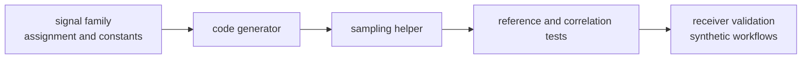

# Code Contracts

Code contracts define the canonical spreading-code behavior for supported GNSS
signal families. Acquisition, tracking, validation, and synthetic generation
must consume these implementations instead of carrying parallel code truth.

## Code Ownership Flow

## Published Guarantees

| guarantee | owned by signal | downstream limit |
| --- | --- | --- |
| canonical primary-code generation | `src/codes/` family modules | receiver does not reimplement code truth |
| family assignments and constants | assignment tables and public constants | hidden table layout stays private |
| sampling helpers | `sample_ca_code`, L2C, L5, Galileo, BeiDou, and GLONASS samplers | receiver decides search and tracking policy |
| secondary-code helpers | family-specific secondary-code modules | nav owns decoded data semantics |
| reference catalogs | test fixtures and support modules | tests consume proof without becoming production API |

## Change Gates

- Add reference or correlation proof before documenting broader signal support.
- Keep a new family grouped by constellation and code family.
- Expose through `src/api.rs` only when a downstream crate needs the public
  contract.
- Keep receiver ranking, ambiguity, lock, and reacquisition policy out of code
  contracts.

## First Proof Check

Inspect `crates/bijux-gnss-signal/docs/CODE_FAMILIES.md`,
`crates/bijux-gnss-signal/src/codes/`,
`crates/bijux-gnss-signal/src/api.rs`,
`crates/bijux-gnss-signal/tests/integration_ca_code_reference.rs`,
`crates/bijux-gnss-signal/tests/integration_gps_l2c_multiplex.rs`,
`crates/bijux-gnss-signal/tests/integration_gps_l5_reference.rs`, and
`crates/bijux-gnss-signal/tests/integration_galileo_e5_reference.rs`.
