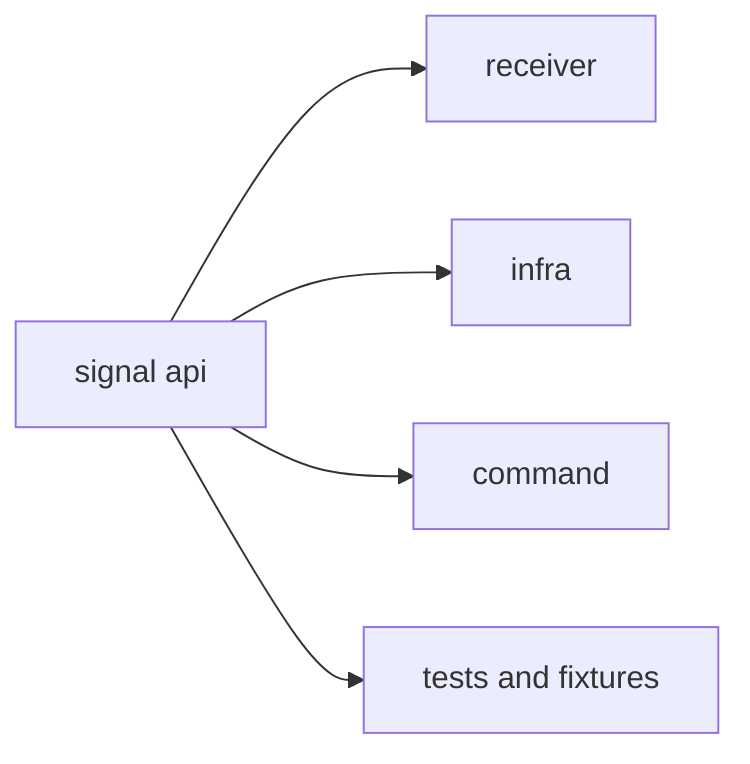

# Compatibility Commitments

`bijux-gnss-signal` is consumed by multiple crates, so interface drift must be
treated as product drift. Compatibility here protects reproducible signal
definitions, code generation, raw-sample interpretation, and validation
evidence used by receiver, infra, command, and tests.

## Compatibility Surface

## Commitments

| surface | compatibility promise | breakage risk |
| --- | --- | --- |
| signal catalog | stable meaning for signal specs, carriers, codes, and registry entries | acquisition and tracking compare different signals |
| code generators | deterministic chips, samplers, assignments, and public constants | fixtures and synthetic captures stop matching reference behavior |
| DSP helpers | reusable math keeps input and output units explicit | receiver stages silently change loop or replica assumptions |
| raw-IQ metadata | quantization, sample format, and sidecar meaning stay cross-crate | recorded captures become ambiguous |
| validation reports | compatibility and alignment findings stay interpretable by receiver and nav | validation failures lose actionable cause |
| public traits | integration seams remain narrow and owned by signal behavior | callers rebuild sample or sink abstractions privately |

## Explicit Non-Commitments

- internal file layout outside the public facade is not a caller promise
- private lookup-table modules are not caller promises
- numeric implementation detail that is not exported is not a caller promise

## Change Discipline

- Preserve the public import route through `bijux_gnss_signal::api`.
- Update public API docs when adding, removing, or renaming exported signal
  behavior.
- Pair raw-IQ metadata changes with sidecar and sample-conversion tests.
- Pair signal registry changes with component-registry and downstream
  acquisition/tracking proof.
- Document intentional incompatibility before merging it.

## First Proof Check

Inspect `crates/bijux-gnss-signal/docs/PUBLIC_API.md`,
`crates/bijux-gnss-signal/docs/CONTRACTS.md`, and
`crates/bijux-gnss-signal/src/api.rs`. Then inspect
`crates/bijux-gnss-signal/tests/integration_signal_component_registry.rs`,
`crates/bijux-gnss-signal/tests/integration_raw_iq_metadata.rs`, and
`crates/bijux-gnss-signal/tests/prop_obs_epoch_validation.rs` to confirm the
documented compatibility surface still has checked-in proof.
