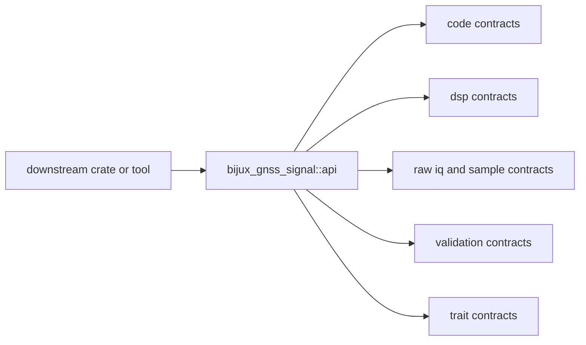

# Interfaces

Open this section when the question is what `bijux-gnss-signal` publicly
promises to downstream crates.

## Contract Surface

`bijux-gnss-signal` publishes one curated surface through
`bijux_gnss_signal::api`, but that surface carries several real contract
families: signal identity, code generation, DSP helpers, raw-sample contracts,
validation helpers, and integration traits.

## Read These First

- open [API Surface](api-surface.md) first when the question is what this
  crate exports at all
- open [Trait Contracts](trait-contracts.md) when the question is about the
  public integration seams
- open [Raw IQ And Sample Contracts](raw-iq-and-sample-contracts.md) when the
  change touches metadata or normalized samples

## Pages In This Section

- [API Surface](api-surface.md)
- [Public Imports](public-imports.md)
- [Code Contracts](code-contracts.md)
- [DSP Contracts](dsp-contracts.md)
- [Raw IQ And Sample Contracts](raw-iq-and-sample-contracts.md)
- [Signal Model Assumptions](signal-model-assumptions.md)
- [Validation Contracts](validation-contracts.md)
- [Trait Contracts](trait-contracts.md)
- [Entrypoints And Examples](entrypoints-and-examples.md)
- [Compatibility Commitments](compatibility-commitments.md)

## First Proof Check

- `crates/bijux-gnss-signal/src/api.rs`
- `crates/bijux-gnss-signal/docs/PUBLIC_API.md`
- `crates/bijux-gnss-signal/docs/CONTRACTS.md`
- `crates/bijux-gnss-signal/src/raw_iq.rs`
- `crates/bijux-gnss-signal/src/samples.rs`
- `crates/bijux-gnss-signal/src/obs_validation.rs`

## Leave This Section When

- leave for [Foundation](../foundation/) when the question is whether a public
  surface belongs in the signal crate at all
- leave for [Architecture](../architecture/) when the question is about module
  placement rather than public contract
- leave for [Operations](../operations/) or [Quality](../quality/) when the
  interface is clear and the next question is safe change or proof
