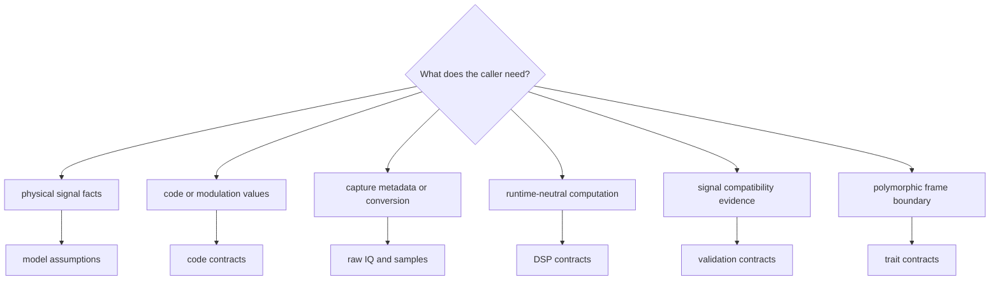
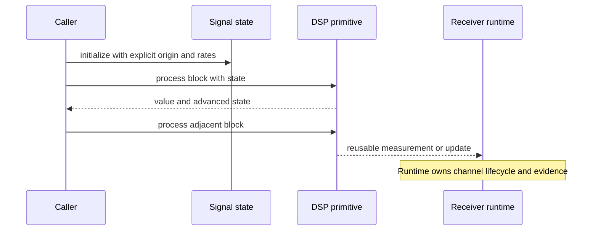

# Signal Interface Guide

All supported downstream imports pass through `bijux_gnss_signal::api`. The
facade is broad because GNSS signal work spans catalogs, code families, sample
conversion, DSP, validation, and streaming seams. Its ownership remains narrow:
every export must describe reusable signal behavior rather than receiver
lifecycle or repository effects.

## Choose The Public Contract

| need | start here | required context |
| --- | --- | --- |
| Resolve signal specifications, wavelengths, carriers, components, or shared-path scaling | [Signal model assumptions](signal-model-assumptions.md) | constellation, satellite, signal code, component, and GLONASS channel where applicable |
| Generate or sample a spreading, secondary, data, pilot, or multiplexed code | [Code contracts](code-contracts.md) | assignment, code epoch or sample origin, channel role, and wrapping behavior |
| Convert encoded IQ or describe a capture | [Raw IQ and sample contracts](raw-iq-and-sample-contracts.md) | format, quantization, sampling rate, intermediate frequency, offset, and capture time |
| Advance timing, build replicas, estimate spectra, correlate, or calculate loop updates | [DSP contracts](dsp-contracts.md) | units, normalization, phase origin, rates, integration interval, and state |
| Check dual-frequency or inter-frequency observation compatibility | [Validation contracts](validation-contracts.md) | signal identities, timing, alignment, and observation context |
| Abstract a source, sink, or correlator implementation | [Trait contracts](trait-contracts.md) | caller-owned scheduling, errors, buffering, effects, and lifecycle |

## Public Surface Rules

- Import through the [curated API](api-surface.md), not private module layout.
- Treat units, time origins, normalization, wrapping, and error behavior as part
  of the contract even when Rust types do not encode every assumption.
- Prefer a free computational function over a trait method unless callers
  genuinely need polymorphic behavior.
- Preserve constellation-specific information instead of forcing every signal
  through a lowest-common-denominator representation.
- Keep receiver policy, file discovery, run layout, navigation acceptance, and
  command wording outside the facade.

## Understand Stateful APIs

An NCO, filter, adaptation helper, or replica generator may be stateful and
still belong to signal. The interface remains reusable only when callers
control initialization and can explain how state advances across blocks.

## Interpret Validation Correctly

Signal validation reports compatibility, alignment, or malformed signal-layer
state. It does not decide whether a receiver should accept an observation or
whether a navigation estimator should trust it. Preserve the validation report
as input evidence for those higher decisions rather than converting it to a
single boolean prematurely.

## Compatibility And Proof

Use [public imports](public-imports.md) for supported import patterns,
[entrypoints and examples](entrypoints-and-examples.md) for representative
calls, and [compatibility commitments](compatibility-commitments.md) before
changing an export.

The source of truth is the
[public facade](../../../crates/bijux-gnss-signal/src/api.rs), supported by the
[public API guide](../../../crates/bijux-gnss-signal/docs/PUBLIC_API.md),
[contract guide](../../../crates/bijux-gnss-signal/docs/CONTRACTS.md),
[trait guide](../../../crates/bijux-gnss-signal/docs/TRAITS.md), and
[validation guide](../../../crates/bijux-gnss-signal/docs/VALIDATION.md).
