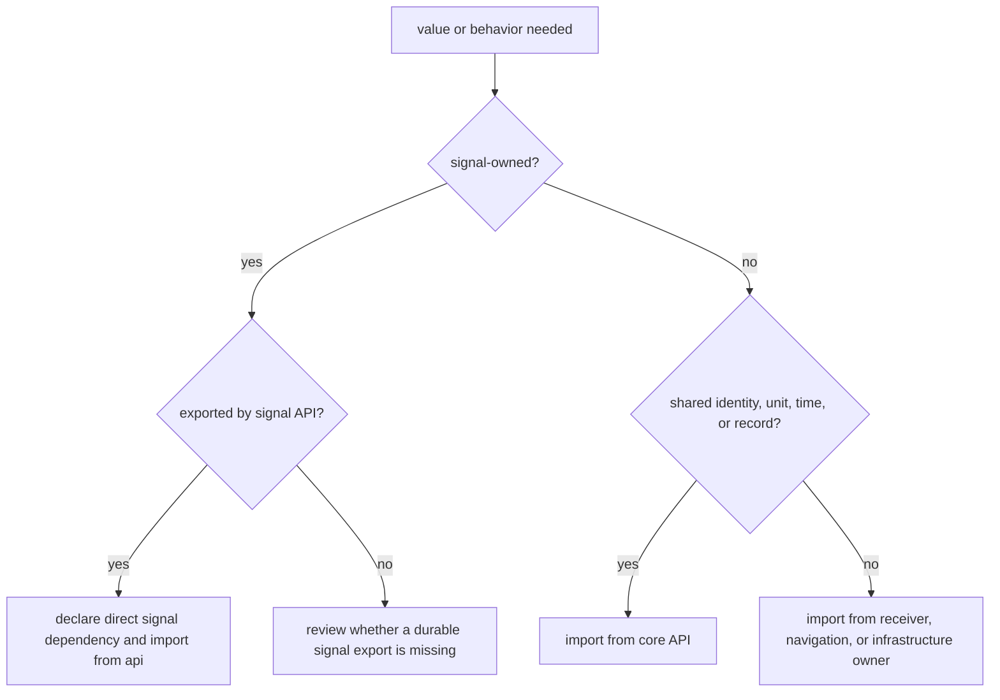
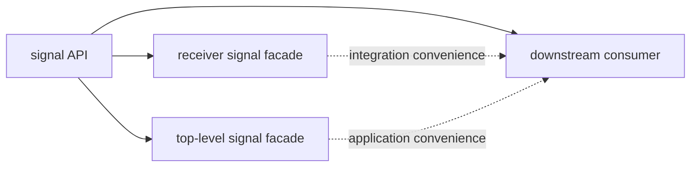
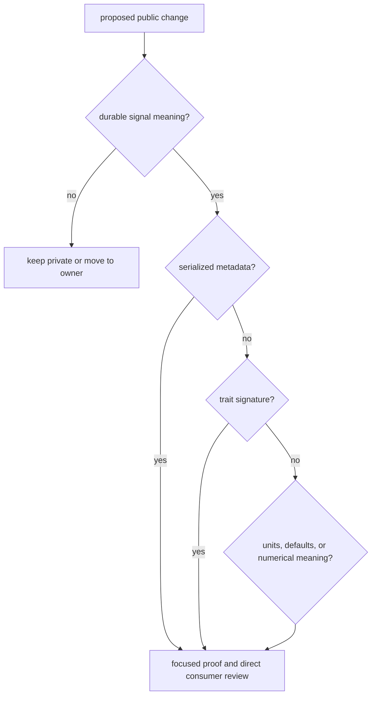

# Public Imports

Import signal-owned behavior from `bijux_gnss_signal::api`. The crate has one
public module and no feature-dependent API variants, so callers should not
depend on private module layout or use another crate’s re-export as the
canonical owner.

## Choose The Owning Import

Public signal traits use core sample records in their signatures. That does not
make core types signal-owned. A caller that names those records independently
should use the [core API boundary](../../02-bijux-gnss-core/interfaces/api-surface.md)
rather than relying on an incidental path through a higher crate.

## Public Families

| family | use it for | do not use it for |
| --- | --- | --- |
| catalog and physical helpers | registry lookup, carrier and wavelength conversion, component identity, shared-path Doppler and ionosphere scaling | receiver support policy or navigation solution claims |
| code families | constellation-specific assignments, chips, samplers, symbol timing, and stable constants | acquisition scheduling or channel lifecycle |
| DSP primitives | front-end models, NCO, phase math, replicas, spectrum, correlation, loop helpers, and uncertainty | runtime orchestration or persisted evidence |
| raw-IQ contracts | format, quantization, metadata, and numeric sample conversion | dataset discovery or run layout |
| observation compatibility | structural observation validation, dual-frequency pairing, and alignment evidence | estimator accuracy or integrity |
| traits | generic sample sources, minimal sources, correlators, and sample sinks | receiver logging, scheduling, or repository persistence |

The authoritative inventory is the
[signal public API](../../../crates/bijux-gnss-signal/src/api.rs). The
[trait contract](../../../crates/bijux-gnss-signal/docs/TRAITS.md) explains the
four implementable seams.

## Direct Dependency Or Convenience Facade

Receiver and the top-level crate expose convenience routes to signal behavior.
Use those routes when writing against the higher crate’s integrated surface.
Declare a direct signal dependency when the caller’s own logic depends on
signal semantics. This keeps ownership, version review, and API documentation
visible in the caller’s manifest.

Do not:

- import a signal helper from receiver merely to avoid declaring the owning
  dependency;
- expose a private lookup table because one caller needs a shortcut;
- create aliases that erase constellation, component, unit, or model meaning;
- route receiver policies or navigation estimators through the signal API.

## Compatibility Review

Treat these as compatibility-sensitive even when Rust still compiles:

- registry defaults, identifiers, carrier frequencies, component roles, and
  supported band pairs;
- serde field names or defaults in raw-IQ metadata;
- stable quantization identifiers used by commands and artifacts;
- trait methods, associated errors, end-of-stream semantics, and downcasting;
- units, phase conventions, sign conventions, and numerical tolerances.

The [compatibility commitments](compatibility-commitments.md) define the review
standard. The [signal completion gate](../quality/definition-of-done.md) maps
each public family to executable evidence.
