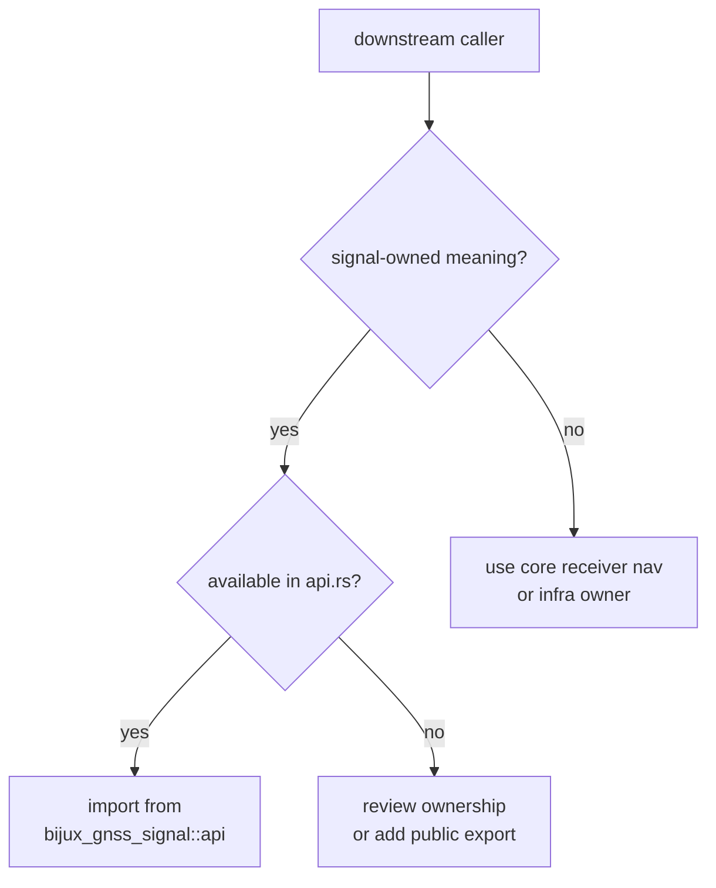

# Public Imports

Downstream crates should import signal behavior through
`bijux_gnss_signal::api`. That surface is grouped by durable signal
responsibility, not by source-file convenience.

## Import Decision Flow

## Export Groups

| group | public meaning | typical caller |
| --- | --- | --- |
| catalog | signal specs, registry lookup, wavelengths, carrier conversions, and shared-path Doppler helpers | receiver acquisition, tracking, and synthetic generation |
| code families | deterministic code generators, samplers, assignment tables, and signal constants | tests, acquisition replicas, and synthetic capture builders |
| DSP primitives | NCO, local-code models, replica models, tracking loops, front-end quality, and spectrum helpers | receiver stages and signal validation |
| raw-IQ contracts | metadata, quantization, and sample conversion helpers | infra, command, receiver, and tests |
| validation reports | dual-frequency compatibility and inter-frequency alignment evidence | receiver observation checks and navigation preconditions |
| traits | sample/source/sink/correlator seams used across tests and higher crates | integration code that should not own signal internals |

## Review Rule

Every new export should answer two questions:

- does the signal crate truly own this behavior
- is the export name stable enough to remain understandable without the source
  conversation that introduced it

## Rejection Rules

- Do not export receiver orchestration from signal.
- Do not expose private lookup-table modules directly.
- Do not add one-caller aliases that hide the signal family they belong to.
- Do not route core identity, time, or unit records through signal unless they
  are already lower-owner public imports needed by the signal API.

## First Proof Check

Inspect `crates/bijux-gnss-signal/docs/PUBLIC_API.md`,
`crates/bijux-gnss-signal/docs/TRAITS.md`, and
`crates/bijux-gnss-signal/src/api.rs`. Then inspect
`crates/bijux-gnss-signal/tests/integration_guardrails.rs`,
`crates/bijux-gnss-signal/tests/integration_signal_component_registry.rs`, and
`crates/bijux-gnss-signal/tests/integration_replica_continuity.rs` to confirm
the export groups still map to durable owned surfaces.
