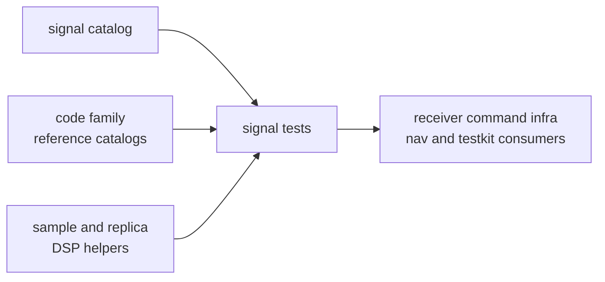

# Signal Model Assumptions

Signal assumptions are reusable only when they are backed by code, reference
catalogs, and tests in `bijux-gnss-signal`. A downstream crate may consume these
assumptions for acquisition, tracking, synthetic generation, validation, or
documentation, but it must not silently broaden them.

## Assumption Route

## Current Assumptions

| assumption | signal-owned proof | downstream limit |
| --- | --- | --- |
| GPS L1 C/A has a 1023-chip primary period for PRNs 1 through 32 | C/A reference, period, correlation, and long-duration tests | receiver lock behavior and navigation data interpretation remain downstream |
| sampled-code generation advances by code-rate to sample-rate progression | fractional sampling and long-duration continuity tests | callers cannot assume rounded samples-per-chip behavior |
| carrier helpers interpret Doppler relative to configured intermediate frequency | carrier wipeoff, NCO, acquisition, and synthetic reference tests | receiver search windows decide how much Doppler to inspect |
| deterministic GPS navigation sign modulation uses a 50 bps data rate when enabled | synthetic navigation-bit and replica tests | nav message semantics are not proven by this signal assumption |
| Galileo E1 code and component references are modeled for acquisition-oriented use | E1B, E1C, registry, spectrum, and synthetic tests | tracking policy and ambiguity resolution remain receiver decisions |
| registry component roles define reusable signal identity | component registry tests | public API users still need receiver docs for stage behavior |

## Change Rules

- Add an assumption only when a named reference test or catalog anchors it.
- Name the signal family, component, rate, or modulation detail explicitly.
- Update receiver or command docs only after the signal assumption exists.
- Do not use this page to promise full receiver support for a signal family.

## First Proof Check

Inspect `crates/bijux-gnss-signal/docs/CATALOG.md`,
`crates/bijux-gnss-signal/docs/CODE_FAMILIES.md`,
`crates/bijux-gnss-signal/docs/DSP.md`,
`crates/bijux-gnss-signal/src/catalog.rs`,
`crates/bijux-gnss-signal/tests/integration_ca_code_reference.rs`,
`crates/bijux-gnss-signal/tests/integration_ca_code_long_duration_chunks.rs`,
`crates/bijux-gnss-signal/tests/integration_galileo_e1b_reference.rs`, and
`crates/bijux-gnss-signal/tests/integration_gps_l2c_replica_model.rs`.
