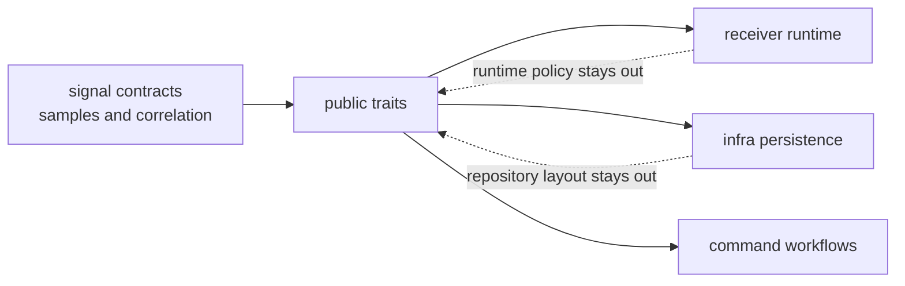

# Trait Contracts

Signal traits are narrow seams for sample and correlation flows. They let
callers exchange signal-adjacent behavior without importing receiver runtime
ownership, repository persistence, or command workflow policy.

## Trait Boundary

## Public Trait Roles

| trait | owns | does not own |
| --- | --- | --- |
| `SignalSource` | signal-adjacent frame delivery | receiver scheduling or run lifecycle |
| `SampleSource` | sample stream access at the signal boundary | dataset registry or persisted capture ownership |
| `Correlator` | prompt, early, and late correlation semantics | acquisition ranking, lock state, or tracking policy |
| `SampleSink` | writing sample frames through a signal-level seam | repository artifact layout or command report format |

## Extension Tests

- Add a method only when it is reusable by more than one downstream owner.
- Keep return types close to samples, signals, or correlations.
- Move runtime state, diagnostics, and lifecycle control to receiver docs.
- Move persisted naming, manifests, and history to infra docs.
- Keep command-only convenience out of the signal trait surface.

## First Proof Check

Inspect `crates/bijux-gnss-signal/src/api.rs`,
`crates/bijux-gnss-signal/docs/TRAITS.md`,
`crates/bijux-gnss-signal/docs/PUBLIC_API.md`, and
`crates/bijux-gnss-signal/tests/integration_guardrails.rs`.
