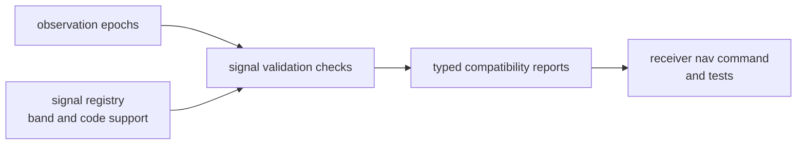

# Validation Contracts

Signal validation answers signal-compatibility questions. It can say whether
observations expose supported band pairs, coherent inter-frequency timing, and
usable signal-layer metadata. It does not decide whether a receiver run, solver
output, or operator workflow is acceptable overall.

## Validation Flow

## Published Validation Surface

| surface | reader question answered | ownership limit |
| --- | --- | --- |
| `check_dual_frequency_observations` | are observed band pairs signal-compatible? | no navigation-quality judgment |
| `supported_dual_frequency_band_pairs` | which band pairs are valid in the signal layer? | no receiver visibility promise |
| `supported_dual_frequency_band_pairs_for_constellation` | which pairs are valid per constellation? | no estimator policy |
| `check_inter_frequency_alignment` | are epoch-level band timings aligned enough to report? | no runtime scheduling decision |
| `validate_obs_epochs` | are observation epochs shaped coherently for signal validation? | no full artifact validation |

## Published Data Shapes

| shape | contract role |
| --- | --- |
| `DualFrequencyObservationReport` | summary of signal-layer dual-frequency readiness |
| `DualFrequencyObservationPair` | paired observation evidence for one satellite or signal family |
| `DualFrequencyPairStatus` | accepted or problematic pair status |
| `DualFrequencyPairIssue` | typed reason a pair is incomplete or invalid |
| `InterFrequencyAlignmentReport` | timing alignment evidence across frequencies |
| `BandLagEvent` | event-level evidence for band timing lag |

## First Proof Check

Inspect `crates/bijux-gnss-signal/docs/VALIDATION.md`,
`crates/bijux-gnss-signal/src/obs_validation.rs`,
`crates/bijux-gnss-signal/tests/prop_obs_epoch_validation.rs`, and the receiver
or nav tests that consume signal compatibility reports.
