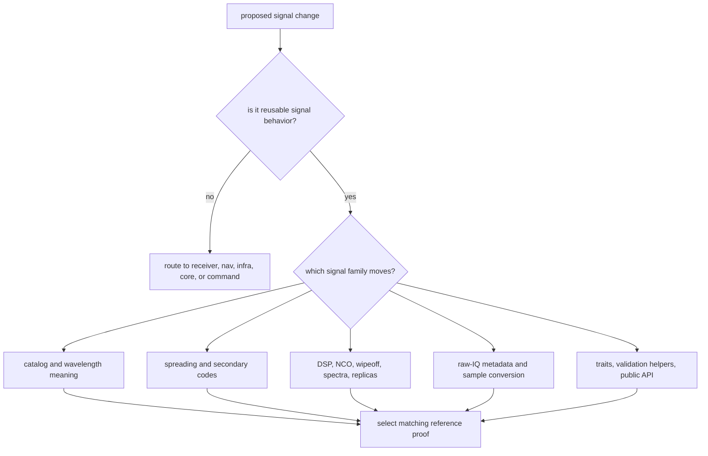

# Change Sequence

Use this sequence when a change touches reusable GNSS signal facts, generated
codes, DSP primitives, raw-IQ/sample contracts, public traits, or validation
helpers. The order matters because downstream receiver and navigation behavior
can look broken when the real problem is an unproven signal-layer claim.

## Decision Flow

## Change Sequence

1. Name the signal family that owns the changed claim.
2. Read the matching crate-local page before editing behavior.
3. Inspect the focused integration or property test that already defends the
   claim.
4. Change the owning module and only the tightly coupled docs or tests.
5. Run the narrowest proof that would fail if the claim regressed.
6. Update `src/api.rs`, `PUBLIC_API.md`, or contract docs only when the public
   boundary really moved.

## Why This Order Matters

The wrong order usually causes one of two failures: a local signal edit quietly
breaks a downstream contract, or a broad receiver test passes while the signal
claim itself was never exercised.

## Proof Selection

| changed family | first proof |
| --- | --- |
| catalog and wavelengths | `integration_signal_component_registry.rs` and `integration_signal_wavelengths.rs` |
| code-family references | the constellation-specific reference test under `crates/bijux-gnss-signal/tests/` |
| long-duration sampling, NCO, wipeoff, or replicas | `integration_local_code_continuity.rs`, `integration_nco_long_duration_phase.rs`, or `integration_replica_continuity.rs` |
| spectra and front-end models | `integration_signal_spectrum_cboc.rs` or the relevant front-end spectrum test |
| raw-IQ and sample conversion | `integration_raw_iq_metadata.rs` and `integration_iq_sample_conversion.rs` |
| public API and trait shape | `integration_guardrails.rs` plus `crates/bijux-gnss-signal/docs/PUBLIC_API.md` |

Start from `crates/bijux-gnss-signal/docs/BOUNDARY.md` and `TESTS.md`. If the
claim needs receiver lock, navigation accuracy, repository persistence, or
operator UX to be meaningful, the signal change is not the whole change.
