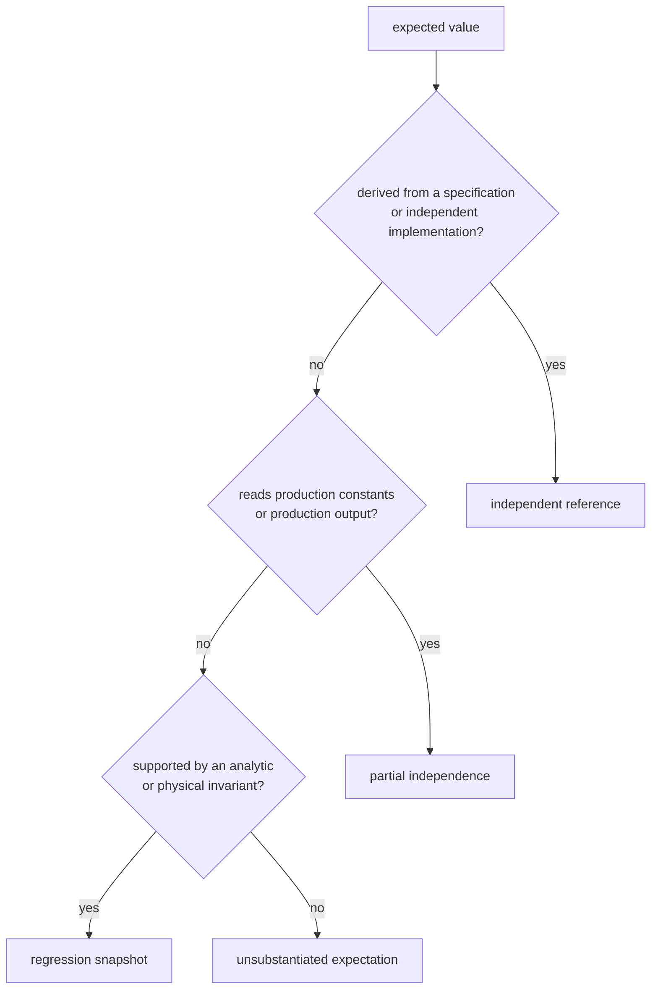
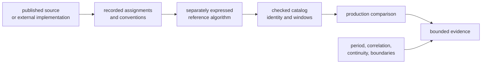

# Signal Reference and Fixture Care

A checked expected value can provide independent scientific evidence, protect a
known-good result from drift, or merely preserve the output of the code under
test. Those are different strengths. Reviewers need to know which one they are
looking at before trusting a green reference test.

## Evidence Classes

| Class | What it can establish | What it cannot establish alone |
| --- | --- | --- |
| independent reference | agreement with a separately sourced or implemented definition | all operating conditions or downstream behavior |
| partial independence | one layer, such as recurrence logic, independently agrees while sharing assignments or tables | correctness of the shared source |
| analytic property | period, correlation, continuity, symmetry, conservation, or another model invariant | exact agreement with a published assignment |
| regression snapshot | known bytes or numbers did not change | that the original bytes or numbers were correct |
| generated self-comparison | only implementation consistency | scientific correctness |

A SHA-256 digest is a compact exact comparison. It strengthens drift detection,
not provenance.

## Current Reference Inventory

The signal crate has seven checked TOML catalogs consumed by active integration
tests. Their current evidence strength is not uniform.

| Reference family | Catalog and generator | Current strength | Reproducibility limit |
| --- | --- | --- | --- |
| GPS L1 C/A | [C/A catalog](../../../crates/bijux-gnss-signal/tests/data/ca_reference_catalog.toml) and [independent generator](../../../crates/bijux-gnss-signal/tests/support/ca_reference_catalog.py) | published assignments transcribed into a separate Python generator, with exact windows, digest, and first-chip checks | catalog records a generic published origin rather than an exact specification revision |
| BeiDou B1I | [B1I catalog](../../../crates/bijux-gnss-signal/tests/data/beidou_b1i_reference_catalog.toml) and [independent generator](../../../crates/bijux-gnss-signal/tests/support/beidou_b1i_reference_catalog.py) | published phase assignments transcribed into a separate Python Gold-code generator | catalog does not identify an exact source revision or table |
| Galileo E1 | [E1 catalog](../../../crates/bijux-gnss-signal/tests/data/galileo_e1_reference_catalog.toml) and [cross-check generator](../../../crates/bijux-gnss-signal/tests/support/galileo_e1_reference_catalog.py) | two external implementations must agree before catalog generation | both recorded external source trees are absent from the current checkout, so regeneration is not locally reproducible |
| Galileo E5 | [E5 catalog](../../../crates/bijux-gnss-signal/tests/data/galileo_e5_reference_catalog.toml) and [separate recurrence generator](../../../crates/bijux-gnss-signal/tests/support/galileo_e5_reference_catalog.py) | Python independently generates sequences and secondary-code expansion | assignments and initial sequences are read from the production table, so table transcription is not independently proved |
| GPS L2C CM | [CM catalog](../../../crates/bijux-gnss-signal/tests/data/gps_l2c_cm_reference_catalog.toml) and [specification generator](../../../crates/bijux-gnss-signal/tests/support/gps_l2c_cm_reference_catalog.py) | assignments extracted from IS-GPS-200L and generated separately | the recorded PDF and required extraction environment are absent from the current checkout |
| GPS L2C CL | [CL catalog](../../../crates/bijux-gnss-signal/tests/data/gps_l2c_cl_reference_catalog.toml) and [specification generator](../../../crates/bijux-gnss-signal/tests/support/gps_l2c_cl_reference_catalog.py) | published start/end states plus independently generated ranges and digest | the recorded PDF and required extraction environment are absent from the current checkout |
| GPS L5 | [L5 catalog](../../../crates/bijux-gnss-signal/tests/data/gps_l5_reference_catalog.toml) and [specification generator](../../../crates/bijux-gnss-signal/tests/support/gps_l5_reference_catalog.py) | assignments extracted from IS-GPS-705J and generated with separate XA/XB logic | the recorded PDF and required extraction environment are absent from the current checkout |

The active Rust tests can read all checked catalogs without those external
files. That proves the repository can consume the snapshots; it does not prove
the snapshots can be reconstructed today.

No normal Make or GitHub Actions target currently invokes these catalog
generators in check mode. Drift between a generator and its checked catalog is
therefore not part of routine verification. Treat this as a known governance
gap when changing catalogs or generators.

## Reference Construction

Preserve each layer:

1. Identify the authority by title, revision, table/section, retrieval source,
   and licensing or redistribution constraints.
2. Record polarity, bit/chip mapping, register orientation, indexing origin,
   component, PRN range, and any transformed table fields.
3. Keep the reference algorithm structurally independent of production code.
4. Store enough catalog context to diagnose a mismatch: assignments, selected
   windows, full digest, lengths, and schema.
5. Pair exact catalog comparison with analytic properties and boundary cases.

Two implementations copied from the same erroneous transcription are not two
independent authorities.

## Decide Why the Fixture Changes

Classify the change before editing expected data:

| Reason | Correct action |
| --- | --- |
| authoritative definition changed | cite the new revision, explain affected signals, update independent generation, and record compatibility impact |
| previous transcription was wrong | preserve evidence of the correction, identify old and new source values, and add a regression around the mistake |
| reference generator was wrong | fix the generator first, prove it against source examples or a second implementation, then regenerate |
| production implementation was wrong | keep the reference stable and fix production |
| only serialization or formatting changed | prove semantic equality and separate generated output from handwritten analysis |
| test was flaky or inconvenient | diagnose nondeterminism; do not rewrite truth to obtain a pass |

If the reason is unknown, do not update the catalog.

## Regeneration Review

A catalog regeneration is reviewable only when it records:

- exact authority and whether source inputs are available to reviewers
- generator identity and prerequisites
- command or reproducible procedure used
- generated diff summary by signal, component, PRN, and field
- unchanged and changed digests
- independent spot checks at beginning, middle, end, and wrap boundary
- analytic property results
- downstream behavior expected to move
- limitations that remain, including shared production inputs

Keep generated catalog changes separate from handwritten production changes
when they can be reviewed independently. Do not hide a broad expected-value
rewrite inside a behavioral commit.

## Support Helper Rules

Rust support helpers may parse catalogs, convert bit conventions, calculate
digests, and produce clear assertions. They must not silently source expected
values from production functions. Python generators may provide a separate
implementation, but independence depends on their inputs as well as their
language.

Shared helpers for chunking and spectrum validation encode reusable test
methods, not scientific authority. Their assumptions and tolerance choices
need the same review as the tests that call them.

## When Evidence Is Sufficient

Reference evidence is credible when a reviewer can answer:

- Where did the authoritative assignments and constants come from?
- Can the checked catalog be regenerated from preserved inputs?
- Which parts are independent from production, and which are shared?
- Which conventions transform source data into catalog bits?
- What exact and analytic checks would catch the likely mistakes?
- Which signal ranges are covered and omitted?
- What downstream claim depends on the reference?

Use the [signal verification guide](verification-commands.md) to select focused
tests and the [signal change review](review-scope.md) to follow changed meaning
to the first consumer.
