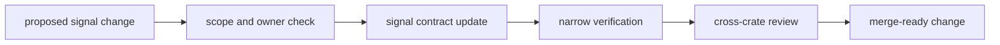

# Operations

Open this section when the question is how to change `bijux-gnss-signal`
without damaging reference behavior, boundary clarity, or downstream trust.

## Operational Model

## Read These First

- open [Change Sequence](change-sequence.md) first when the question is how to
  stage a safe modification
- open [Verification Commands](verification-commands.md) when the question is
  what proof to run
- open [Fixture And Reference Care](fixture-and-reference-care.md) when tests or
  reference catalogs are touched
- open [Review Scope](review-scope.md) when a change seems to affect both
  reusable signal code and a higher-level consumer at once

## Pages In This Section

- [Common Workflows](common-workflows.md)
- [Local Development](local-development.md)
- [Change Sequence](change-sequence.md)
- [Signal Extension Guide](signal-extension-guide.md)
- [Verification Commands](verification-commands.md)
- [Fixture And Reference Care](fixture-and-reference-care.md)
- [Review Scope](review-scope.md)
- [Release And Versioning](release-and-versioning.md)

## First Operational Surfaces

- signal integration and property tests
- signal test data
- signal test support helpers
- [signal test guide](../../../crates/bijux-gnss-signal/docs/TESTS.md)
- testkit support crate when independent truth or fixtures are reused

## First Proof Check

Inspect the [signal test guide](../../../crates/bijux-gnss-signal/docs/TESTS.md),
[public API](../../../crates/bijux-gnss-signal/docs/PUBLIC_API.md),
[boundary guide](../../../crates/bijux-gnss-signal/docs/BOUNDARY.md), and the
operational surfaces above. That route shows whether a proposed change has
been mapped to the right signal owner and the right proof family before
execution starts.

## Leave This Section When

- leave for [Quality](../quality/) when the workflow is clear and the next
  question is whether the proof bar itself is strong enough
- leave for [Interfaces](../interfaces/) when the real issue is public contract
  design rather than safe change procedure
- leave for [Foundation](../foundation/) when the operational question is
  actually a boundary dispute
