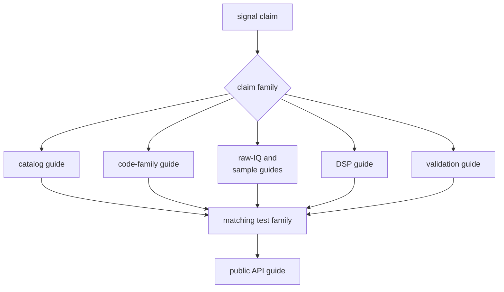
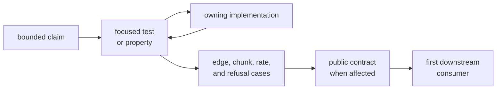

# Developing Signal Behavior Locally

Start local work with one signal claim and the proof capable of disproving it.
The shortest path is rarely “edit, run the whole workspace, and inspect the
last failure”; broad receiver behavior can hide a local sign, phase, indexing,
or metadata defect.

## Locate the Owner



| Question | Reader destination |
| --- | --- |
| Does this package own the behavior? | [signal boundary](../../../crates/bijux-gnss-signal/docs/BOUNDARY.md) |
| Which contract family changes? | [signal architecture](../../../crates/bijux-gnss-signal/docs/ARCHITECTURE.md) |
| Which codes and references apply? | [code-family guide](../../../crates/bijux-gnss-signal/docs/CODE_FAMILIES.md) |
| How are raw captures described? | [raw-IQ contract](../../../crates/bijux-gnss-signal/docs/RAW_IQ.md) |
| How are numeric samples converted? | [sample contract](../../../crates/bijux-gnss-signal/docs/SAMPLES.md) |
| Which reusable computations apply? | [DSP guide](../../../crates/bijux-gnss-signal/docs/DSP.md) |
| Is downstream use supported? | [public API guide](../../../crates/bijux-gnss-signal/docs/PUBLIC_API.md) |
| Which proof family exists? | [signal test guide](../../../crates/bijux-gnss-signal/docs/TESTS.md) |

## Write the Claim Before Editing

Record:

- constellation, signal, component, and satellite range
- physical quantity and units
- indexing, phase, polarity, sign, endian, and normalization conventions
- valid and unsupported inputs
- state or continuity behavior
- independent authority or analytic property
- first downstream consumer

For example, “sampling remains chunk-stable” is incomplete without the code
family, sample rate, phase origin, chunk pattern, duration, expected comparison,
and tolerance.

## Inspect Existing Proof

Read the focused test before changing production code. Determine:

- whether expected data is independent
- which exact and numeric properties are asserted
- which rates, durations, satellites, and components are covered
- whether invalid and unsupported cases exist
- whether downstream behavior is part of the test or belongs elsewhere

If the test cannot fail for the intended change, improve the proof rather than
relying on a broad package pass.

## Use a Narrow Local Loop



Typical focused entry points:

```sh
cargo test -p bijux-gnss-signal --test integration_signal_component_registry
cargo test -p bijux-gnss-signal --test integration_ca_code_reference
cargo test -p bijux-gnss-signal --test integration_replica_continuity
cargo test -p bijux-gnss-signal --test integration_raw_iq_metadata
cargo test -p bijux-gnss-signal --test prop_obs_epoch_validation
```

Choose the test matching the actual family. A GPS C/A reference does not prove
Galileo, BeiDou, GLONASS, L2C, or L5 behavior.

## Handle Reference Data Carefully

When expected vectors or catalogs move:

1. identify the external authority and revision
2. document transformation and indexing conventions
3. review the generator separately from production code
4. compare the new and previous reference directly
5. explain why truth changed
6. keep checksums or deterministic regeneration where the repository governs
   them

Do not overwrite expected output merely because production output changed.

## Cross the Boundary Only When Needed

Add receiver evidence for catalog defaults, acquisition models, replicas,
tracking math, code phase, or observation compatibility consumed by receiver
runtime. Add navigation evidence when wavelength, signal pairing, or observable
meaning changes estimator input. Add infrastructure or command evidence when
raw-IQ metadata, formats, schemas, or public reporting change.

The signal proof remains primary. A downstream test demonstrates integration,
not canonical signal correctness.

## Keep the Work Reviewable

- Limit a change to one physical claim or tightly coupled family.
- Keep unrelated constellation additions separate.
- Do not combine reference regeneration with broad source reorganization.
- Update public exports only when downstream callers need a durable contract.
- State untested rates, durations, components, and consumers.
- Preserve exact failure variants and unsupported behavior.

## Finish with a Bounded Record

Report the claim, authority, commands, exact properties, numeric metric and
tolerance, boundary cases, invalid behavior, public impact, downstream evidence,
and remaining coverage gaps.

Use [signal change principles](../foundation/change-principles.md) for design
decisions and [validating signal changes](../quality/change-validation.md) for
the evidence matrix.

Local development is complete when the focused proof fails for the right
reason before the edit, passes for the independently anchored reason after it,
and no consumer is used to conceal an unproven signal assumption.
