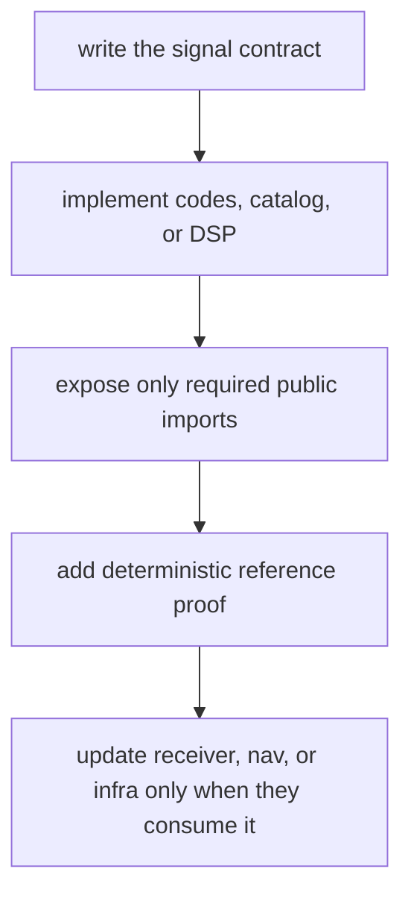
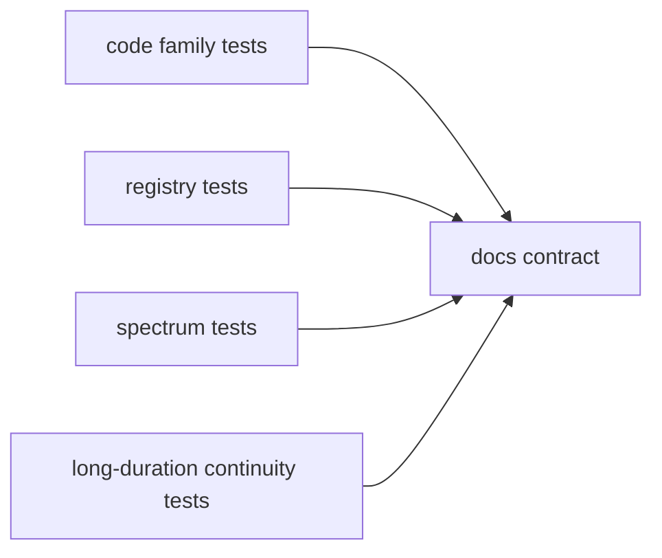

# Signal Extension Guide

Use this guide when adding reusable signal substrate: a code family, signal
identity, modulation model, spectrum expectation, front-end primitive, or public
import that another crate can depend on. If the change only tunes receiver
search, tracking state, or navigation interpretation, it belongs outside
`bijux-gnss-signal`.

## Extension Route

## Ownership Gates

| change type | signal-owned work | proof expected before handoff |
| --- | --- | --- |
| new spreading code | generator, assignment table, sampling helper | reference vectors, period checks, correlation checks |
| new signal identity | catalog entry, component roles, wavelength metadata | registry and public import tests |
| new modulation model | reusable DSP helper or spectrum expectation | spectrum, continuity, and component-power tests |
| new raw-IQ assumption | reusable metadata validation or sample conversion | raw-IQ metadata and sample conversion tests |
| receiver search behavior | no signal-owned policy unless reusable substrate is missing | receiver acquisition or tracking tests |
| navigation message behavior | no signal-owned decode semantics | nav parser, solver, or correction tests |

## Public API Rule

Expose a symbol from `src/api.rs` only when a downstream crate has a durable
reason to import it. Private helpers can stay inside `codes/`, `catalog`, or
`dsp/` until there is a real cross-crate contract.

## Proof Route

## Maintainer Checklist

- Name the signal by constellation, band, code, and component role before
  adding receiver behavior.
- Keep scientific signal facts in signal docs and runtime search policy in
  receiver docs.
- Add the narrowest reference tests first; broad receiver tests should consume
  already-proven signal primitives.
- Update `../interfaces/signal-model-assumptions.md` when a caller-visible
  model assumption changes.
- Update `../interfaces/public-imports.md` when the curated public API changes.

## First Proof Check

Inspect `crates/bijux-gnss-signal/docs/CODE_FAMILIES.md`,
`crates/bijux-gnss-signal/docs/CATALOG.md`,
`crates/bijux-gnss-signal/docs/DSP.md`,
`crates/bijux-gnss-signal/docs/PUBLIC_API.md`, and the closest integration test
under `crates/bijux-gnss-signal/tests/`.
