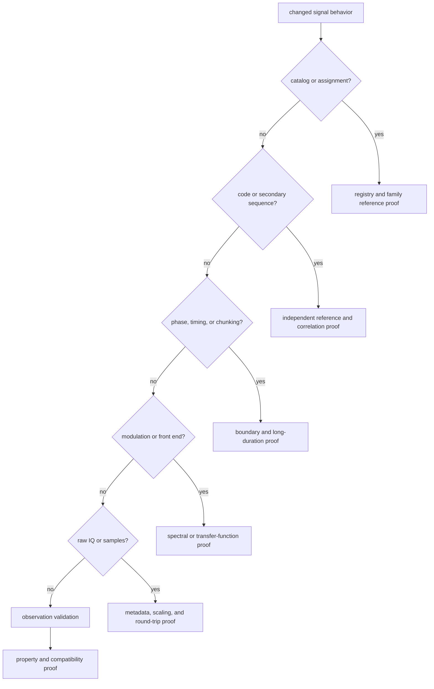
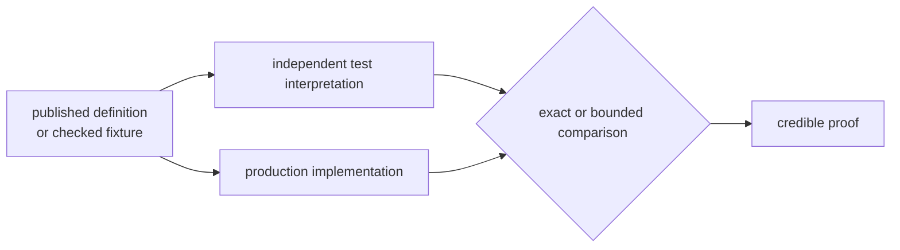
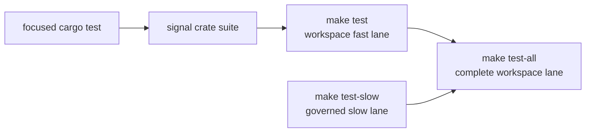

# Verifying Signal Changes

Signal defects often survive a generic smoke test. A code sequence can have the
right length but the wrong chips; a replica can be correct for one epoch but
lose phase across chunk boundaries; a spectrum can look plausible while using
the wrong modulation. Choose proof from the physical claim that changed, then
add consumer proof when the public contract crossed a crate boundary.

## Choose Proof by Claim



The table gives a minimum starting point, not permission to ignore another
contract touched by the same edit.

| Changed claim | Focused proof | What it establishes |
| --- | --- | --- |
| signal/component catalog | `integration_signal_component_registry` plus the constellation registry test | identifiers, frequencies, chip rates, component roles, and supported assignments remain coherent |
| GPS L1 C/A generation | `integration_ca_code_reference`, period, autocorrelation, and cross-correlation tests | chips match reference vectors and retain usable correlation behavior |
| GPS L2C or L5 generation | the matching CM, CL, multiplex, L5 reference, registry, and secondary-continuity tests | component assignment, primary sequence, multiplexing, and secondary timing agree |
| Galileo E1 or E5 generation | the matching code, B/C reference, E5 reference, registry, and secondary-continuity tests | primary and secondary components preserve their defined polarity and timing |
| BeiDou or GLONASS generation | the matching code-reference, registry, signal-model, or waveform tests | family assignments and waveform behavior remain reference-aligned |
| local code, NCO, carrier, or replica timing | long-duration phase plus local-code and replica continuity tests | results remain continuous across epochs, chunks, and large sample indices |
| modulation or front-end response | the matching BPSK, CBOC, low-pass, or band-pass spectrum test | spectral shape and filtering behavior satisfy the intended physical model |
| raw-IQ metadata or sample conversion | `integration_raw_iq_metadata` and `integration_iq_sample_conversion` | serialized widths, normalization, quantization identity, and output size remain stable |
| observation validation | `prop_obs_epoch_validation` | structural rejection and accepted observation properties hold over generated inputs |
| public surface or dependency boundary | `integration_guardrails` plus the affected downstream test | package ownership and consumer behavior remain intact |

## Focused Commands

Run focused tests from the repository root. These examples name real test
targets rather than broad keyword filters, so a misspelled target cannot pass by
running zero tests.

Catalog and family assignment:

```sh
cargo test -p bijux-gnss-signal --test integration_signal_component_registry
cargo test -p bijux-gnss-signal --test integration_gps_l5_registry
cargo test -p bijux-gnss-signal --test integration_galileo_e5_registry
```

Reference sequences and correlation:

```sh
cargo test -p bijux-gnss-signal --test integration_ca_code_reference
cargo test -p bijux-gnss-signal --test integration_ca_code_autocorrelation_peak
cargo test -p bijux-gnss-signal --test integration_ca_code_cross_correlation_bound
cargo test -p bijux-gnss-signal --test integration_galileo_e5_reference
```

Continuity and long-duration behavior:

```sh
cargo test -p bijux-gnss-signal --test integration_local_code_continuity
cargo test -p bijux-gnss-signal --test integration_nco_long_duration_phase
cargo test -p bijux-gnss-signal --test integration_replica_continuity
cargo test -p bijux-gnss-signal --test integration_replica_secondary_continuity
```

Spectrum and front-end behavior:

```sh
cargo test -p bijux-gnss-signal --test integration_signal_spectrum_cboc
cargo test -p bijux-gnss-signal --test integration_signal_spectrum_front_end_low_pass
cargo test -p bijux-gnss-signal --test integration_signal_spectrum_front_end_band_pass
```

Raw samples and observations:

```sh
cargo test -p bijux-gnss-signal --test integration_raw_iq_metadata
cargo test -p bijux-gnss-signal --test integration_iq_sample_conversion
cargo test -p bijux-gnss-signal --test prop_obs_epoch_validation
```

When an edit spans several families, run the crate suite after the focused
tests:

```sh
cargo test -p bijux-gnss-signal
```

## Reference Proof Is Not Self-Comparison

A production generator and a test helper built from the same constants can
agree while both are wrong. Strong sequence proof compares against at least one
independent source: a checked reference vector, a separately expressed
recurrence, a published assignment, or a physical invariant such as period and
correlation.



Use exact equality for discrete chips, identifiers, and serialized widths. Use
an explicit tolerance for floating-point phase, spectrum, or correlation
results, and make the tolerance correspond to a physical or numerical bound.
Do not widen it merely until a regression passes.

## Boundaries Need Their Own Evidence

The signal crate can prove its reusable contract without proving that a receiver
still acquires or tracks it. Add downstream tests when a change affects:

- public type shape, enum identity, serialization, or re-exports
- component polarity, secondary-code timing, replica phase, or sample scaling
- a receiver search assumption or synthetic capture format
- observation labels, units, validity bounds, or covariance meaning

For example, raw-IQ conversion tests establish scaling and encoding, while
receiver capture-source and acquisition-parity tests establish byte decoding
and operational use. Both are needed when the serialized capture contract
changes.

## Repository Test Lanes



`make test` intentionally excludes tests named by the governed slow roster and
the legacy slow-test namespace. `make test-slow` runs that excluded proof.
`make test-all` runs the complete workspace suite, including ignored tests,
without retries. A green fast lane therefore does not imply that slow or ignored
signal consumers passed.

Use the repository lanes when a change crosses packages, changes test
selection, or is being prepared for release. For a narrow signal edit, focused
proof should fail early and explain more than waiting for the whole workspace.

## Read the Failure

Do not respond to a failing numerical test by changing a threshold first.
Capture the failed claim:

1. Confirm whether the mismatch is exact data, phase continuity, a bounded
   metric, serialization, or test selection.
2. Check the independent reference and units before changing production code.
3. Reproduce with the smallest named test target.
4. Change the owner of the defect, not a downstream expectation that merely
   exposed it.
5. Run adjacent family and consumer proof after the focused test passes.

## Verification Map

- [Signal proof inventory](../../../crates/bijux-gnss-signal/docs/TESTS.md)
  summarizes the crate's test families and fixture roles.
- [Code family ownership](../../../crates/bijux-gnss-signal/docs/CODE_FAMILIES.md)
  identifies the generators and assignments protected by reference tests.
- [DSP ownership](../../../crates/bijux-gnss-signal/docs/DSP.md) separates
  reusable math from receiver lifecycle.
- [Observation validation](../../../crates/bijux-gnss-signal/docs/VALIDATION.md)
  defines the accepted and rejected observation contract.
- [Raw IQ and sample contracts](../interfaces/raw-iq-and-sample-contracts.md)
  explains the scaling and storage behavior behind the sample tests.
- [Repository test policy](../../07-bijux-gnss-dev/quality/repository-test-policy.md)
  defines the fast, slow, and complete lanes.
