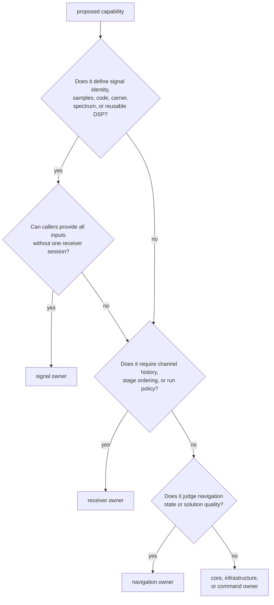
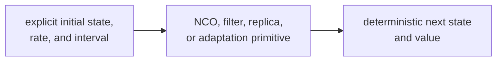
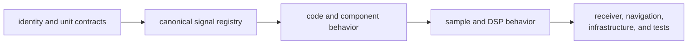
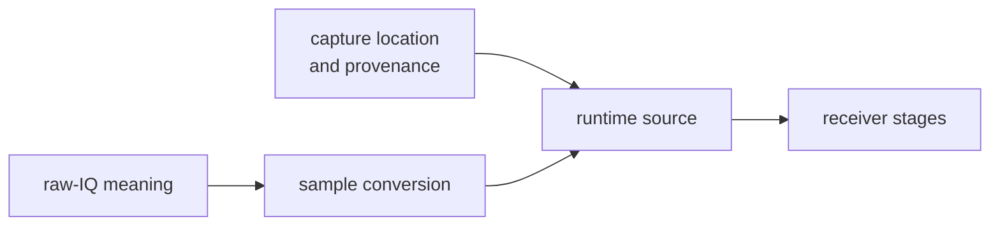

# Signal Ownership Boundaries

`bijux-gnss-signal` owns reusable physical signal facts and computations:
catalog relationships, code families, raw-sample meaning, replicas, timing,
spectra, front-end analysis, correlation, tracking math, and signal-level
observation compatibility.

The package remains below receiver orchestration. A primitive may preserve
mathematical state and still belong here; the boundary is operational policy,
not whether a type is stateful.

## Decide By Reusability

Signal is the right owner for:

- canonical registry contents and wavelength or carrier relationships;
- primary, secondary, data, pilot, and combined code behavior;
- code-phase, sample-index, carrier-phase, and wrapping math;
- NCOs, local-code models, replicas, modulation, and wipeoff;
- front-end response, IQ quality, and spectral analysis;
- correlators, discriminators, loop coefficients, lock metrics, and
  uncertainty calculations with explicit inputs;
- raw-IQ metadata, quantization, and sample conversion;
- signal-pair compatibility and inter-frequency alignment reports;
- minimal source, sink, and correlator traits used for dependency inversion.

## Mathematical State Versus Runtime State

State belongs in signal when:

- it represents mathematical continuity such as phase, filter delay, or loop
  accumulator state;
- every update is determined by explicit inputs;
- behavior is independent of one channel scheduler or run artifact;
- chunked and continuous execution can be compared directly.

State belongs in [receiver execution](../05-bijux-gnss-receiver/) when:

- it records channel acquisition, lock, degradation, loss, or reacquisition;
- history from multiple epochs changes operational policy;
- scheduling, source exhaustion, buffering, or run budgets affect the outcome;
- the transition must be emitted as receiver evidence.

A lock metric or threshold calculation can be signal-owned. Declaring a
channel locked and deciding what to do next are receiver-owned.

## Core And Catalog Boundary

[Shared GNSS contracts](../02-bijux-gnss-core/) own signal identity types,
component metadata structures, physical units, shared carrier constants, and
portable observation records. Signal uses those contracts to provide canonical
registry entries and physical behavior.

Add a field to core when every package must interpret it identically. Add a
registry value or physical relationship here when it defines a supported
signal. Do not duplicate satellite or signal identity types in the catalog.

## Raw-IQ Boundary

Signal owns what raw samples mean:

- encoded sample format and quantization;
- sample rate and intermediate-frequency metadata;
- conversion between supported IQ representations and core samples;
- deterministic quantization for storage representations.

[Repository infrastructure](../03-bijux-gnss-infra/) owns where a capture is
registered, how a sidecar is discovered, and how capture provenance is
persisted. Receiver owns operational sample consumption and source failures.

Do not put file discovery into sample conversion. Do not put quantization or
normalization rules into a dataset registry or receiver source.

## Tracking Primitive Boundary

The [signal public facade](../../crates/bijux-gnss-signal/src/api.rs) exposes
early/prompt/late correlation, discriminators, loop coefficients, carrier and
code updates, lock-detector calibration, C/N0 estimation, uncertainty, and
tracking adaptation.

These APIs should take enough explicit input to be testable without a receiver
session. They may recommend a mathematical profile or return a classification;
receiver remains responsible for:

- selecting a profile for a channel;
- combining metrics with lifecycle history;
- applying hold, degradation, loss, or reacquisition policy;
- recording state transitions and artifacts.

If a tracking helper starts requiring a channel object, run clock, artifact
sink, or scheduler, move the policy upward rather than widening the signal
boundary.

## Observation Compatibility Boundary

Signal-level validation can answer whether a constellation supports a band
pair, whether required observations are present, and whether two frequencies
are aligned within an explicit tolerance.

[Navigation science](../04-bijux-gnss-nav/) owns whether those observations
support a correction, estimator update, ambiguity decision, integrity claim,
or final solution. Signal compatibility is necessary evidence, not navigation
acceptance.

## Trait And Effect Boundary

Source, sink, and correlator traits describe the minimal operation a consumer
needs. Implementations own their effects:

- receiver owns runtime polling, scheduling, and source lifecycle;
- infrastructure owns repository discovery and persisted capture provenance;
- device or network owners would own their transport and retry policy;
- signal owns only the trait contract when it is broadly reusable.

Adding a trait method burdens every implementation. Prefer a free
computational function unless polymorphic I/O behavior is required.

## Reject Boundary Drift

Reject a signal change that:

- requires receiver stage or channel lifecycle state;
- chooses repository locations or opens registered datasets;
- interprets estimator residuals or accepts navigation solutions;
- embeds operator defaults or maintainer policy;
- creates a second identity or unit type already shared through core;
- uses a self-generated waveform as the only reference for a new code family;
- hides phase origin, units, normalization, or chunk-boundary assumptions.

Review catalog changes with the
[catalog contract](../../crates/bijux-gnss-signal/docs/CATALOG.md), code changes
with the [code-family contract](../../crates/bijux-gnss-signal/docs/CODE_FAMILIES.md),
DSP changes with the [DSP contract](../../crates/bijux-gnss-signal/docs/DSP.md),
sample changes with the
[raw-IQ contract](../../crates/bijux-gnss-signal/docs/RAW_IQ.md), and all
physical claims with the
[signal test guide](../../crates/bijux-gnss-signal/docs/TESTS.md).
