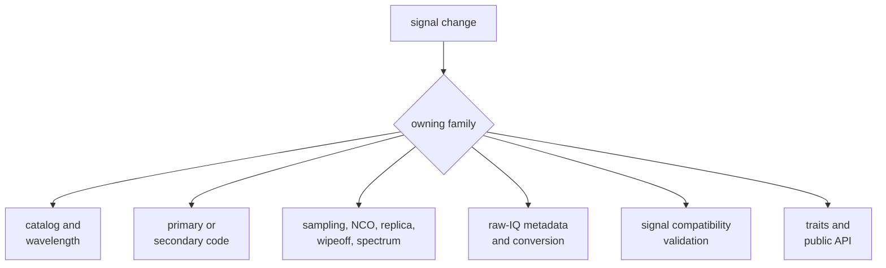
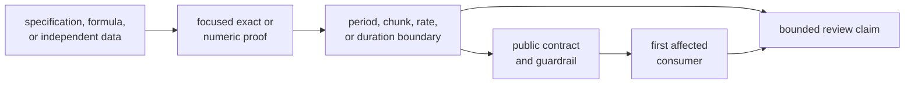

# Validating Signal Changes

Choose proof from the signal claim that changed, not from the test that is
quickest to run. Start with the narrow test that can fail for the right reason,
then cross the first affected public or downstream boundary.

## Locate the Changed Property

If none of these families owns the behavior, stop and route it to receiver,
navigation, infrastructure, core, or command. Do not add runtime policy to make
a receiver test pass.

## Evidence Matrix

| Changed claim | Narrow proof | Add when applicable |
| --- | --- | --- |
| Signal identity, component metadata, or wavelength | [Component registry](../../../crates/bijux-gnss-signal/tests/integration_signal_component_registry.rs) and [wavelength contracts](../../../crates/bijux-gnss-signal/tests/integration_signal_wavelengths.rs) | constellation-specific registry and first consuming receiver behavior |
| Primary or secondary sequence | matching constellation [reference suite](../../../crates/bijux-gnss-signal/tests/) | period, repetition, cross-correlation, secondary continuity, and consumer integration |
| Local-code sampling or code phase | [local-code continuity](../../../crates/bijux-gnss-signal/tests/integration_local_code_continuity.rs) | arbitrary-rate, chunk, and long-duration cases |
| NCO, carrier, replica, or wipeoff | [NCO properties](../../../crates/bijux-gnss-signal/tests/prop_nco.rs) and relevant continuity suite | segmented-versus-continuous execution and long-duration phase |
| Modulation spectrum or front-end response | relevant [spectrum suite](../../../crates/bijux-gnss-signal/tests/integration_signal_spectrum_cboc.rs) | low-rate, wideband, low-pass, or band-pass case matching the assumption |
| Raw-IQ metadata or sample conversion | [metadata contract](../../../crates/bijux-gnss-signal/tests/integration_raw_iq_metadata.rs) and [numeric conversion](../../../crates/bijux-gnss-signal/tests/integration_iq_sample_conversion.rs) | extrema, signedness, endian, quantization, and serialization cases |
| Observation compatibility validation | [validation properties](../../../crates/bijux-gnss-signal/tests/prop_obs_epoch_validation.rs) | receiver observation integration for changed consumer behavior |
| Public export or trait | [package guardrail](../../../crates/bijux-gnss-signal/tests/integration_guardrails.rs) | direct consumer-shaped use plus the domain proof above |

A directory link in the table points to a family of constellation-specific
reference tests. Select the test for the actual signal; do not substitute a GPS
reference for Galileo, BeiDou, or GLONASS behavior.

## Stack Proof in the Right Order

Not every change needs every node. A private correction with no advancing
state may stop after focused proof. A public code generator change needs the
authority, focused sequence evidence, boundary behavior, public review, and the
first affected consumer.

## Validate Exact and Numeric Meaning Separately

Assert these exactly:

- constellation, band, code, component role, and frequency-channel identity
- chip and secondary-code sequence
- period, length, ordering, sign convention, sample container, and issue kind
- public enum variants and serialized metadata fields

Use a documented tolerance for phase, correlation, spectrum, and converted
numeric samples. State the unit, scale, expected value, and reason for the
tolerance. If segmented and continuous execution should agree, compare the two
directly rather than only checking each output looks plausible.

## Treat References as Reviewed Inputs

When reference data changes:

1. identify the specification, formula, or independently generated source
2. state the constellation, component, chip order, and indexing convention
3. explain why the previous expectation was wrong or why the contract changed
4. review the generator separately from the implementation under test
5. keep the reference change visible in the same review as the affected proof

Do not regenerate catalogs or expected sequences from the changed production
helper and call the result verification.

## Stop on Misleading Proof

- only an unrelated or broad integration test was run
- receiver lock is the sole evidence for changed code or DSP behavior
- a short example is used for a long-duration claim
- catalog proof omits the consuming component or constellation
- a spectral test uses different bandwidth or modulation assumptions
- raw-IQ conversion skips boundary values or container semantics
- the guardrail is cited without domain-specific evidence

Use the [signal test guide](../../../crates/bijux-gnss-signal/docs/TESTS.md)
for package-wide context and [signal evidence risks](risk-register.md) to
record any uncovered family, rate, duration, or consumer.

A change is validated when the selected proof would fail for the changed
property, independent meaning anchors the expectation, relevant boundaries are
exercised, and downstream evidence is no broader than the signal claim.
