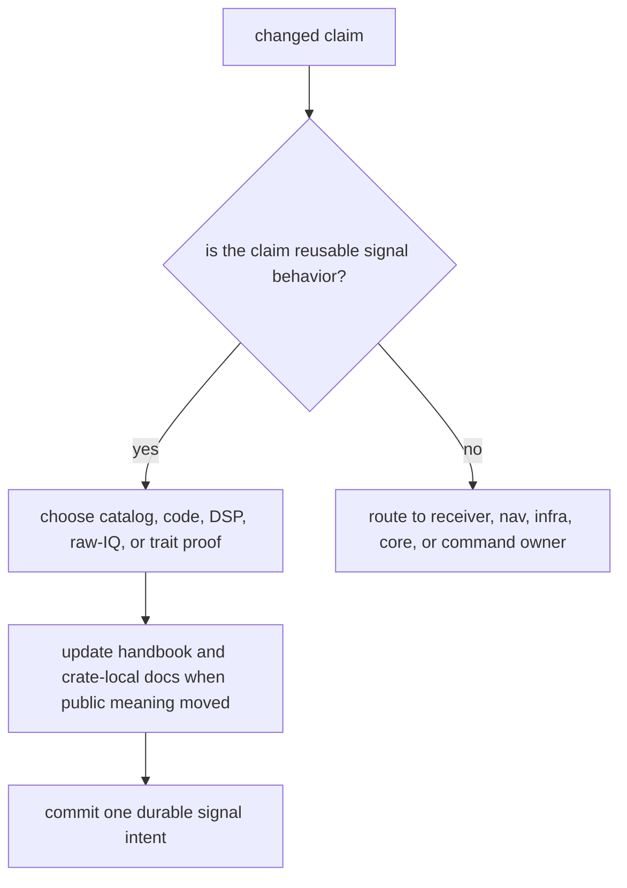

# Definition Of Done

A signal change is done when the physical claim, computational behavior, and
downstream contract are all visible to a reviewer. This crate sits below
receiver and navigation code, so an undocumented signal change can create
silent failures far away from the file that changed.

## Completion Gate

| changed surface | done means | proof to start from |
| --- | --- | --- |
| signal catalog or wavelengths | Supported constellation, band, component, and wavelength meaning remains canonical. | `crates/bijux-gnss-signal/tests/integration_signal_component_registry.rs` and `integration_signal_wavelengths.rs` |
| spreading or secondary code generation | Code chips, period, secondary sequence, and continuity match the reference source for that signal. | signal-family reference tests such as `integration_galileo_e1c_reference.rs`, `integration_gps_l5_reference.rs`, or `integration_beidou_code_reference.rs` |
| sampling, NCO, carrier wipeoff, or replicas | Long-duration phase and chunk boundaries remain stable. | `integration_local_code_continuity.rs`, `integration_nco_long_duration_phase.rs`, and `integration_replica_continuity.rs` |
| spectrum or front-end behavior | BPSK, CBOC, and filter assumptions remain physically coherent. | `integration_signal_spectrum_cboc.rs` plus the relevant front-end spectrum test |
| raw-IQ or sample conversion | Metadata and numeric conversion stay explicit and receiver-neutral. | `integration_raw_iq_metadata.rs` and `integration_iq_sample_conversion.rs` |
| public traits or exports | The API exposes reusable signal behavior without leaking receiver policy. | `crates/bijux-gnss-signal/docs/PUBLIC_API.md` and `integration_guardrails.rs` |

## Ownership Check

Read `crates/bijux-gnss-signal/docs/BOUNDARY.md`,
`crates/bijux-gnss-signal/docs/PUBLIC_API.md`, and
`crates/bijux-gnss-signal/docs/TESTS.md` before calling the change done. If the
proof only shows receiver success, it is not enough for a signal-layer claim.
