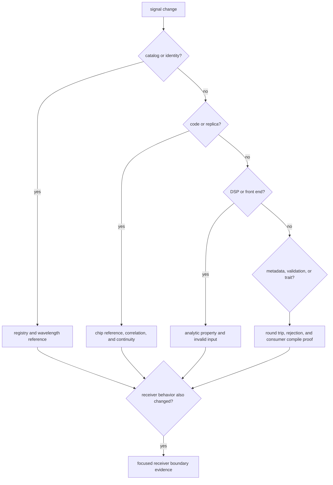

# Definition Of Done

A signal change is complete when its physical meaning, numerical behavior,
failure behavior, and downstream compatibility are all reviewable. Receiver
success alone is not sufficient: a receiver can compensate for, bypass, or
simply fail to exercise a changed signal primitive.

## Completion Chain

```mermaid
flowchart LR
    claim["physical or data-contract claim"]
    reference["independent specification or reference"]
    implementation["catalog, code, DSP, metadata, or trait"]
    negative["invalid and unsupported behavior"]
    compatibility["direct consumer review"]
    evidence["focused executable evidence"]
    complete["bounded documented result"]

    claim --> reference
    reference --> implementation
    implementation --> negative
    negative --> compatibility
    compatibility --> evidence
    evidence --> complete
```

## Required Evidence By Surface

| changed surface | positive evidence | required boundary evidence | compatibility concern |
| --- | --- | --- | --- |
| signal catalog, identity, or wavelength | registered constellation, band, code, components, carrier, and derived wavelength match a named source | absent definition, unsupported component, and GLONASS channel requirements remain explicit | receiver support discovery and navigation corrections consume these facts |
| spreading or secondary code | chips, period, assignment, correlation, and secondary timing match independent references | unsupported PRNs and transitions at period, chunk, symbol, and long-duration boundaries | acquisition and synthetic generation may use different sampling entrypoints |
| sample timing, NCO, carrier, or replica | absolute-index and chunked execution preserve phase and frequency at stated tolerance | non-finite rates, phases, empty sequences, and duration limits return documented errors | receiver tracking and truth generators depend on continuity |
| spectrum or front-end model | configured numerical result agrees with analytic or independently computed expectations | invalid grids, filters, sample rates, and bandwidths are rejected | callers must not reinterpret modeled response as measured hardware behavior |
| raw-IQ metadata or conversion | every encoding, byte width, quantization profile, and numeric conversion is exercised | clipping, scale, endianness, offset, and invalid metadata remain visible | serialized metadata has no embedded schema version, so field/default changes require coordinated reader review |
| observation validation | accepted records and each rejected structural condition are represented | string rejection reasons are not promoted to an undocumented stable protocol | navigation consumes validity but owns solution accuracy |
| public trait or export | direct callers compile through the public API and behavior remains signal-owned | associated error and end-of-stream behavior remain implementable | trait method changes affect external implementations even without serialized data |

The [known limitations](known-limitations.md) defines where signal proof stops.
The [public import guide](../interfaces/public-imports.md) identifies direct
consumer expectations.

## Match Evidence To The Claim

Representative starting points are the
[component registry evidence](../../../crates/bijux-gnss-signal/tests/integration_signal_component_registry.rs),
[wavelength evidence](../../../crates/bijux-gnss-signal/tests/integration_signal_wavelengths.rs),
[long-duration NCO evidence](../../../crates/bijux-gnss-signal/tests/integration_nco_long_duration_phase.rs),
[IQ conversion evidence](../../../crates/bijux-gnss-signal/tests/integration_iq_sample_conversion.rs),
and [public guardrail](../../../crates/bijux-gnss-signal/tests/integration_guardrails.rs).
Choose constellation-specific references when code or component meaning changes.

## Review Direct Consumers

Receiver, navigation, infrastructure, and the command facade all declare direct
signal dependencies. Review only the consumers affected by the semantic change:

- receiver for acquisition, tracking, sample sources, front-end behavior, and
  observation construction;
- navigation for wavelength, band-pair, ionosphere, combination, and signal
  identity changes;
- infrastructure for raw-IQ metadata and ingest contracts;
- command for public reports, synthetic IQ, and facade exposure.

A convenience re-export does not remove the need to review the original signal
contract.

## Completion Record

Record the specification or reference, supported identifiers, units, numerical
tolerance, invalid cases, direct consumers, and any downstream runtime proof.
If evidence uses generated catalogs, identify how the generator is independent
of the implementation under test.

Do not call a change complete by regenerating expected values from the same
logic that produced the new implementation.
