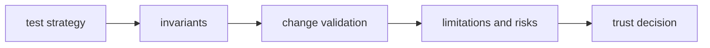

# Quality

Open this section when the question is whether `bijux-gnss-signal` is proving
its reusable signal claims honestly enough.

## Trust Model

Quality matters here because downstream crates can reuse signal helpers far
away from the original author intent. Weak proof at this layer becomes
amplified coupling elsewhere.

## Read These First

- open [Test Strategy](test-strategy.md) first when the question is how proof
  is distributed across this crate
- open [Invariants](invariants.md) when the question is what must remain true
  even as supported signals grow
- open [Change Validation](change-validation.md) when the question is the
  minimum honest proof for a change

## Pages In This Section

- [Test Strategy](test-strategy.md)
- [Invariants](invariants.md)
- [Change Validation](change-validation.md)
- [Review Checklist](review-checklist.md)
- [Definition Of Done](definition-of-done.md)
- [Known Limitations](known-limitations.md)
- [Risk Register](risk-register.md)

## First Proof Surfaces

- the [signal test suite](../../../crates/bijux-gnss-signal/tests/)
- the [signal test guide](../../../crates/bijux-gnss-signal/docs/TESTS.md)
- the [validation guide](../../../crates/bijux-gnss-signal/docs/VALIDATION.md)
- the [testkit crate](../../../crates/bijux-gnss-testkit/)

## First Proof Check

Start with the [signal test guide](../../../crates/bijux-gnss-signal/docs/TESTS.md),
[validation guide](../../../crates/bijux-gnss-signal/docs/VALIDATION.md), and
[public API guide](../../../crates/bijux-gnss-signal/docs/PUBLIC_API.md). Then
inspect the proof surfaces above to confirm quality claims are backed by the
right signal test layers rather than broad crate confidence.

## Leave This Section When

- leave for [Operations](../operations/) when the quality bar is clear and the
  next question is execution sequence
- leave for [Foundation](../foundation/) when the doubt is still about whether
  the crate should own the behavior at all
- leave for [Interfaces](../interfaces/) when the real question is what the
  public promise is rather than how well it is defended
