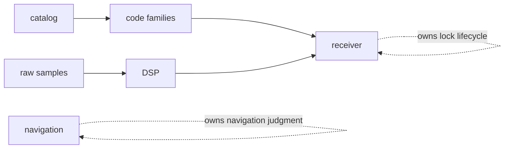

# Invariants

These expectations should remain true as the signal crate grows. They are the
rules that keep reusable signal math from turning into receiver orchestration
or navigation judgment.

## Boundary Invariants

- signal truth stays separate from receiver orchestration
- raw-IQ contract meaning stays separate from repository ingestion policy
- signal compatibility checks stay separate from navigation-quality judgment

## Behavioral Invariants

- supported code families have one canonical implementation
- reusable DSP helpers remain runtime-neutral
- long-duration sampling and phase helpers stay stable across chunk boundaries
- public exports stay grouped by signal meaning rather than convenience
- observation compatibility checks name signal constraints without deciding
  navigation solution quality
- raw-sample conversions preserve units and quantization meaning across APIs

## Review Invariant

If a change moves public signal behavior, the matching proof family and
handbook page should move with it.

## Invariant Table

| invariant | first proof |
| --- | --- |
| canonical code generation | code-family docs and sequence-reference tests |
| runtime-neutral DSP | DSP docs and numeric primitive tests |
| stable chunk boundaries | long-duration NCO and phase-continuity tests |
| public export ownership | public API docs and guardrail tests |
| signal-level validation | observation compatibility property tests |

## Proof Path

Use the [signal test guide](../../../crates/bijux-gnss-signal/docs/TESTS.md),
[public API](../../../crates/bijux-gnss-signal/docs/PUBLIC_API.md), and focused
signal tests for the family that moved. A receiver tracking test can support
the change, but it must not replace signal-owned proof.
