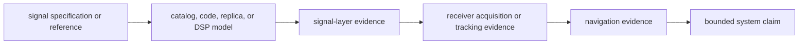
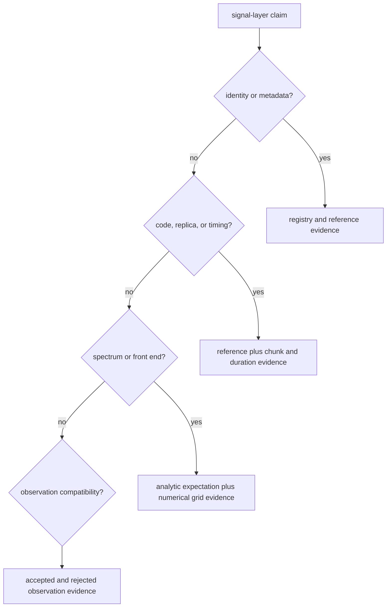

# Known Limitations

`bijux-gnss-signal` provides deterministic signal definitions and reusable DSP
computations. Its results describe the modeled signal layer; they do not include
receiver scheduling, propagation, navigation estimation, file ingestion, or
artifact persistence.

## From Signal Proof To System Claim

Each arrow adds assumptions. A reference-aligned code generator can be correct
while a receiver uses the wrong component, search window, sample clock, or
tracking policy. A receiver can track correctly while navigation rejects the
observations. Cite only the stages actually proved.

## Current Boundaries

| limitation | observable consequence | safe interpretation |
| --- | --- | --- |
| Registry coverage is not receiver support. | Metadata or a local replica may exist for a signal that is not enabled through every acquisition, tracking, observation, or navigation route. | Use the registry for signal facts and the receiver support matrix for operational support. |
| Some model lookups are intentionally optional. | A missing default component or unsupported signal definition may return `None` or a typed error rather than a replica. | Handle absence explicitly; do not substitute another component or infer support from constellation alone. |
| GLONASS frequency is satellite-channel dependent. | Carrier and replica calculations cannot resolve a GLONASS signal from PRN and band alone. | Supply a validated frequency channel and preserve it in downstream identity and evidence. |
| Spectrum and front-end helpers are bounded models. | Their output reflects the supplied sample rate, grid, taps, bandwidth, and idealized component description, not a measured RF chain. | State numerical configuration and compare with measured evidence before making hardware claims. |
| Reference fixtures cover selected identifiers and assumptions. | A passing vector may not cover every PRN, component, chip order, sample rate, or long-duration boundary. | Name the reference family and add a vector or property test for newly claimed coverage. |
| Observation validation is structural signal-layer validation. | It checks timing, uniqueness, finite values, variance, C/N0, Doppler model, and lock-state labels; it does not establish estimator accuracy. | Route solution and integrity claims to navigation evidence. |
| Error representation is not uniform across all helpers. | Core signal utilities use `SignalError`, while observation validation currently returns string reasons. | Do not expose display strings as a durable machine protocol; preserve typed context at higher boundaries. |
| The crate has no product persistence or scheduling policy. | Successful computation says nothing about sample-source reliability, run completeness, or artifact durability. | Verify those claims in receiver and infrastructure layers. |

The typed utility failures are defined in the
[signal error model](../../../crates/bijux-gnss-signal/src/error.rs). Optional
replica and component behavior is visible in the
[acquisition model](../../../crates/bijux-gnss-signal/src/dsp/replica/acquisition_model.rs).

## Evidence By Claim

Use the [signal test strategy](test-strategy.md) to choose a proof family. Useful
entrypoints include the
[signal component registry evidence](../../../crates/bijux-gnss-signal/tests/integration_signal_component_registry.rs),
[CBOC spectrum evidence](../../../crates/bijux-gnss-signal/tests/integration_signal_spectrum_cboc.rs),
and [IQ conversion evidence](../../../crates/bijux-gnss-signal/tests/integration_iq_sample_conversion.rs).
Constellation-specific code claims need their corresponding independent
reference, not just another implementation of the same generator.

## When To Leave This Crate

Use the [receiver limitation guide](../../05-bijux-gnss-receiver/quality/known-limitations.md)
for lock, handoff, and runtime claims. Use the
[navigation test strategy](../../04-bijux-gnss-nav/quality/test-strategy.md) for
solution, correction, and integrity claims. Use the
[infrastructure artifact contract](../../03-bijux-gnss-infra/interfaces/persisted-artifact-contracts.md)
for durability and history.

If available evidence does not cover the requested physical condition, narrow
the claim and state the missing measurement. Do not make the signal crate sound
like a field receiver by omission.
