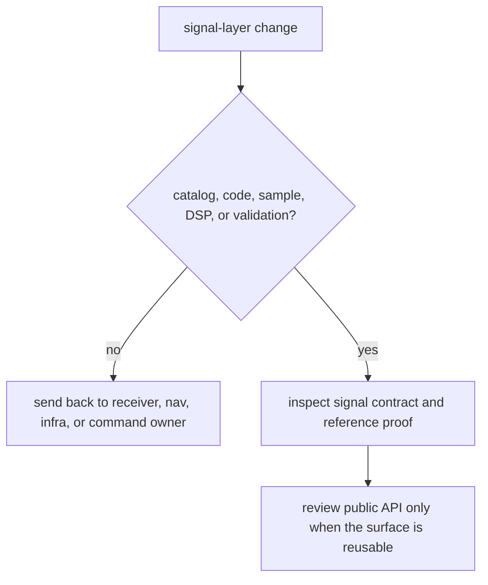

# Review Checklist

Review `bijux-gnss-signal` as reusable signal truth and DSP substrate. The
crate may own signal catalogs, code generation, raw-IQ and sample contracts,
runtime-neutral DSP primitives, and validation helpers. It should not own
receiver scheduling, persisted dataset policy, or navigation decisions.

## Review Gates

| changed surface | accept only when | inspect before accepting |
| --- | --- | --- |
| signal catalog or component metadata | The catalog remains canonical and does not duplicate receiver-local assumptions. | [Signal model assumptions](../interfaces/signal-model-assumptions.md) and component registry proof |
| spreading code or code-family behavior | The reference proof still explains the public signal fact being claimed. | [Code Contracts](../interfaces/code-contracts.md), [GPS L1 C/A Reference](../foundation/gps-l1-ca-reference.md) |
| raw-IQ or sample representation | Sample semantics stay runtime-neutral and do not encode ingestion policy. | [Raw IQ and sample contracts](../interfaces/raw-iq-and-sample-contracts.md) and [signal boundary guide](../../../crates/bijux-gnss-signal/docs/BOUNDARY.md) |
| DSP primitive | Continuity, normalization, and signal meaning are proven without assuming one receiver loop. | [DSP contracts](../interfaces/dsp-contracts.md) and CBOC spectrum proof |
| public export or trait | The surface is reusable across product owners and does not expose internal tables as API. | [API surface](../interfaces/api-surface.md), [trait contracts](../interfaces/trait-contracts.md), and guardrail proof |

## Blocking Signs

- A receiver failure is fixed by adding receiver policy to the signal crate.
- A new public export only saves one caller an import or exposes a lookup table
  that should remain internal.
- Reference data changes without a clear signal-model reason.
- A DSP test proves numerical convenience but not the signal contract readers
  will rely on.

## Evidence To Require

- Read the [public API](../../../crates/bijux-gnss-signal/docs/PUBLIC_API.md),
  [signal boundary guide](../../../crates/bijux-gnss-signal/docs/BOUNDARY.md),
  and [signal test guide](../../../crates/bijux-gnss-signal/docs/TESTS.md)
  before accepting public or broad signal changes.
- Require the narrow proof family for the changed surface: catalog, code, raw
  samples, DSP, trait, or validation.
- Update interface or foundation docs when public signal meaning changes.
- Route runtime state, repository layout, and navigation judgment to their
  owners instead of broadening signal to host them.
