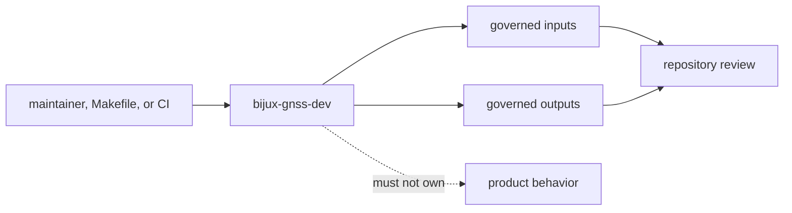

# Architecture Risks

`bijux-gnss-dev` is intentionally a binary boundary for repository-maintenance
workflows. Its architecture risk is not code size by itself; its risk is
unreviewed authority. A small command can validate or mutate governed files, run
benchmarks, and emit evidence that maintainers may later treat as policy.

## Risk Map

## Highest-Risk Changes

- unrelated automation enters because the binary already has repository access
- governed-file validation grows hidden policy that is not documented in
  workflow or output docs
- benchmark evidence writes outside governed locations or implies broader
  performance proof than the owned benchmark set
- command success is treated as product correctness
- binary-only organization hides separate workflow families behind one file

## Review Triage

| change shape | risk to inspect | safer outcome |
| --- | --- | --- |
| new command | command has no governed input, output, or repository-maintenance owner | reject or route reusable behavior to the product/policy owner |
| new file read | the file becomes policy without docs | document it in governed inputs before depending on it |
| new file write | evidence lands outside `artifacts/`, `benchmarks/`, or another governed location | move the output or document the durable location |
| new validation rule | implementation enforces a rule not named in docs | update command, workflow, and contract docs in the same change |
| benchmark change | benchmark output is used as proof for unmeasured runtime/nav paths | narrow the claim or add the missing benchmark |

## Proof To Request

- `crates/bijux-gnss-dev/docs/BOUNDARY.md` for maintainer-only ownership.
- `crates/bijux-gnss-dev/docs/COMMANDS.md` for command inventory.
- `crates/bijux-gnss-dev/docs/WORKFLOWS.md` and `OUTPUTS.md` for governed
  inputs and outputs.
- `crates/bijux-gnss-dev/docs/BENCHMARKS.md` for benchmark evidence.
- `crates/bijux-gnss-dev/tests/integration_guardrails.rs` for binary boundary
  guardrails.

If one-file binary organization stops making ownership readable, split by
durable workflow family rather than by delivery order.
