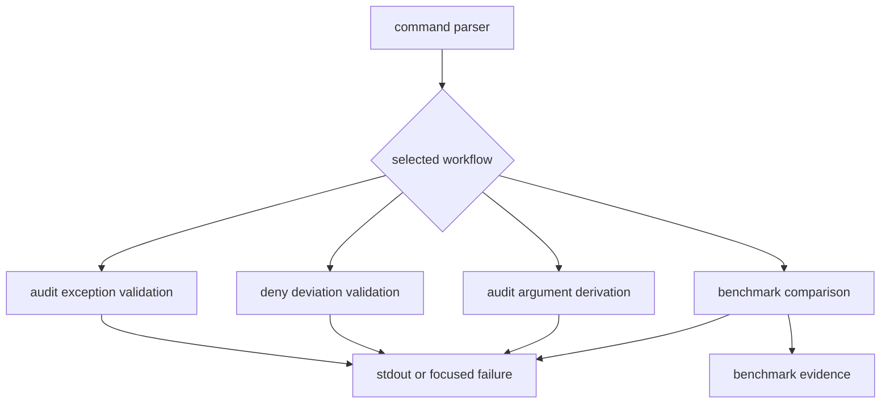
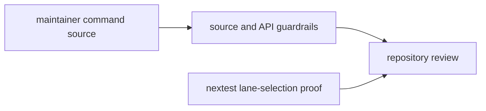

# Maintainer Command Ownership

`bijux-gnss-dev` is one binary because its four commands share a narrow
repository-maintenance boundary. The architecture is organized by workflow and
effect, even though the implementation currently fits in one
[command source](../../../crates/bijux-gnss-dev/src/main.rs).

## Dispatch And Effects

The first three workflows read governed inputs and emit validation or derived
arguments. Benchmark comparison is the only workflow that creates directories,
runs child processes, and writes repository evidence.

## Workflow Ownership

| command | owned input | owned decision | effect |
| --- | --- | --- | --- |
| `audit-allowlist` | reviewed advisory exceptions | every exception has a valid advisory ID, reason, owner, review link, and unexpired date | read-only validation |
| `deny-policy-deviations` | reviewed downstream policy deviations | every deviation has an identity, owner, reason, upstream review, and unexpired date | read-only validation |
| `audit-ignore-args` | reviewed advisory exceptions and compatible Cargo audit ignores | emit one sorted, deduplicated argument list from the governed source | stdout only |
| `bench-compare` | curated benchmark set, checked-in baseline, threshold, and strictness | normalize current measurements and identify regressions above the threshold | child processes and governed evidence writes |

The [command contract guide](../interfaces/command-entry-contracts.md) documents
arguments and failure behavior. The [governed input guide](../interfaces/governed-input-contracts.md)
and [output contract](../interfaces/output-contracts.md) define the data
boundaries.

## Internal Responsibilities

The implementation has five conceptual regions:

| responsibility | current owner | reason to remain distinct |
| --- | --- | --- |
| parsing and dispatch | `Cli`, `Commands`, and `main` | Defines the complete binary surface and routes each invocation once. |
| governance validation | `run_audit_allowlist_check` and `run_deny_policy_deviations_check` | Evaluates reviewed exception records without changing them. |
| derived audit arguments | `run_audit_ignore_args` | Converts governed records into deterministic command input; it is not a second allowlist. |
| benchmark execution and comparison | `run_bench_compare`, `run_bench`, `write_current_snapshot`, and `compare_baseline` | Owns process execution, normalization, persistence, and regression policy. |
| shared shape validation | date and advisory-ID predicates | Keeps common record rules identical across command paths. |

These are ownership regions, not a request to create one module per row.
Splitting a compact function merely to mirror this table would add navigation
cost without clarifying responsibility.

## Test Ownership

The [maintainer guardrail test](../../../crates/bijux-gnss-dev/tests/integration_guardrails.rs)
proves that the crate follows shared structural policy. The
[suite-selection test](../../../crates/bijux-gnss-dev/tests/integration_nextest_suite_selection.rs)
proves that slow-test entries resolve to real tests and feed the intended
nextest expressions. Test-lane policy is maintained here because it governs
repository execution, even though it is not a subcommand.

Neither test proves the semantic correctness of an exception record or
benchmark threshold. Those decisions are exercised by the command and reviewed
through their governed inputs and outputs.

## When To Split The Binary

Keep one command source while the file remains reviewable and each workflow can
be understood without hidden shared state. Split by durable workflow ownership
when one of these conditions becomes true:

- governance parsing gains reusable typed records with independent tests;
- benchmark execution acquires multiple runners, formats, or persistence
  policies;
- command families need different dependencies or effect permissions;
- changes to one workflow repeatedly create merge conflicts in unrelated
  workflows;
- a reusable library API has a real consumer beyond this binary.

A sound split would use owners such as `governance` and `benchmarks`, with
parsing and dispatch remaining at the binary boundary. Do not split by delivery
sequence, file size alone, or arbitrary helper count.

## Navigation By Question

| question | read |
| --- | --- |
| What can a command read or write? | [Execution model](execution-model.md) |
| Which repository effects are forbidden? | [Repository boundary rules](repository-boundary-rules.md) |
| How are errors presented? | [Error model](error-model.md) |
| Where does persistent evidence belong? | [State and persistence](state-and-persistence.md) |
| How should a new command be integrated? | [Extensibility model](extensibility-model.md) |

This map should change when workflow ownership or effects change, not whenever a
helper function moves.
