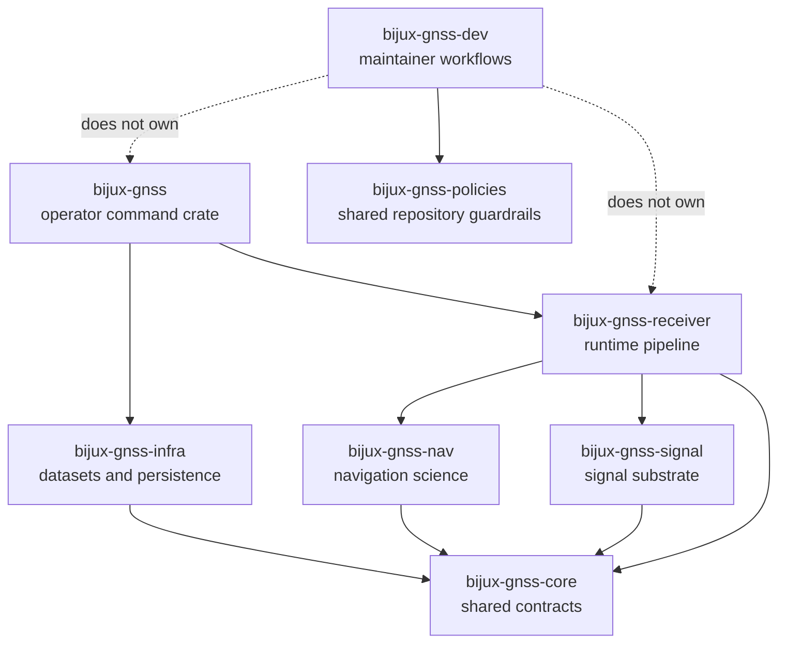

# Repository Boundary Rules

`bijux-gnss-dev` owns maintainer workflows. It may validate governed repository
inputs, derive maintenance commands, compare benchmarks, and emit maintenance
evidence. It must not become product runtime, GNSS science, operator workflow,
or a general scripting crate.

## Dependency Direction

Product crates may share GNSS contracts through lower owners. Maintainer tooling
may inspect repository inputs and emit evidence, but it should not define
product behavior that belongs to command, receiver, infra, nav, signal, or core.

## Boundary Decisions

| proposed work | belongs in `bijux-gnss-dev` when | belongs elsewhere when |
| --- | --- | --- |
| audit allowlist handling | it validates reviewed repository exceptions or derives audit arguments | it changes dependency policy shared across repositories |
| deny deviation handling | it validates this repository's governed input file | it changes the shared standard itself |
| benchmark comparison | it executes or compares maintainer-approved benchmark suites | it changes product algorithm behavior being benchmarked |
| command workflow guardrail | it protects repository maintenance commands | it adds operator-facing GNSS behavior |
| artifact or output handling | it writes maintainer evidence into governed locations | it defines receiver runtime artifacts or infra persistence layout |

## Public Boundary Rule

- Expose a curated command surface, not the whole source tree.
- Keep internal modules private until another crate has a durable contract to
  import.
- Remove forwarding modules that do not own behavior, validation, or a public
  compatibility seam.
- Keep product semantics out of maintainer commands even when a maintenance
  workflow inspects product artifacts.

## Structure Discipline

- Let path names reveal ownership before implementation detail.
- Group modules by durable responsibility: validation, policy, benchmark,
  output, command execution, or governed input.
- Keep repository effects explicit so reviewers can see what a maintainer
  command reads and writes.
- If a module name needs a long explanation, the boundary probably needs a
  clearer owner.

## First Proof Check

Inspect `crates/bijux-gnss-dev/docs/BOUNDARY.md`,
`crates/bijux-gnss-dev/docs/PUBLIC_API.md`,
`crates/bijux-gnss-dev/docs/WORKFLOWS.md`,
`crates/bijux-gnss-dev/src/main.rs`, and
`crates/bijux-gnss-dev/tests/integration_guardrails.rs`.
