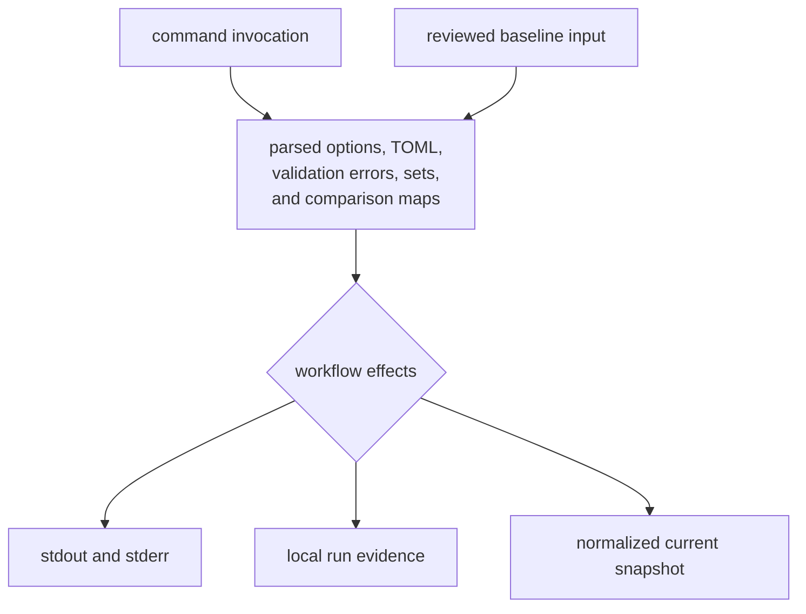
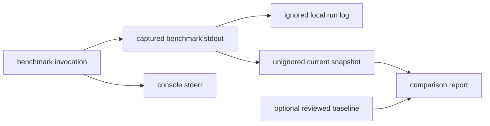
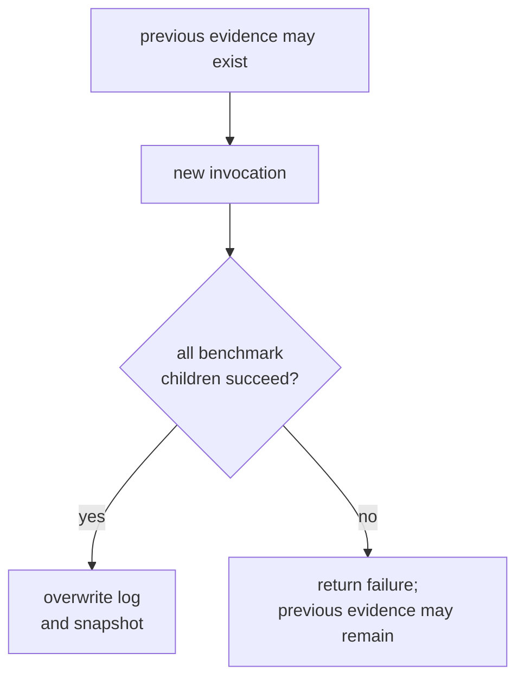

# Maintainer State And Evidence

Most maintainer commands inspect repository policy and terminate without
persisting state. Benchmark comparison is the exception: it starts product
benchmarks and writes local evidence plus a normalized snapshot.

Treat command exit status, console output, local run evidence, current
snapshots, and reviewed baselines as different evidence classes. One cannot
stand in for another.

## State Lifecycle

In-memory state lasts for one process:

- parsed command options and workspace root;
- parsed TOML values;
- collected validation errors;
- sorted advisory identifiers;
- captured benchmark stdout;
- normalized benchmark rows;
- baseline and current comparison maps;
- reported regression messages.

No command maintains a database, daemon state, cache protocol, or cross-process
lock.

## Effect Matrix

| workflow | reads | writes | external dependency |
| --- | --- | --- | --- |
| audit exception validation | reviewed exception register | stdout or stderr through command failure | platform date command |
| dependency-deviation validation | reviewed deviation register | stdout or stderr through command failure | platform date command |
| audit argument derivation | exception register when present | derived arguments on stdout | none |
| benchmark comparison | benchmark declarations and optional baseline | console output, local stdout log, normalized current snapshot | Cargo and product benchmark binaries |

The validators and argument derivation do not modify their governed inputs.
Adding a repair or rewrite mode would be a new contract with substantially
different risk.

## Benchmark Evidence Classes

| evidence | authority | persistence behavior |
| --- | --- | --- |
| console stdout and stderr | immediate process diagnostics; stderr includes Cargo and benchmark diagnostics not retained in the log | terminal or caller capture only |
| local benchmark log | captured benchmark stdout from the most recent successful write | generated under the ignored artifact area |
| normalized current snapshot | parsed benchmark names and nanoseconds from matching stdout lines | written in a repository location that is not currently ignored |
| maintained baseline | reviewer-approved comparison input with external provenance requirements | absent from the repository at this review |
| comparison diagnostics | names whose current-to-baseline ratio exceeds the selected threshold | console output only |

The local benchmark log may not exist before the command runs. Its location is
an output contract, not checked-in evidence.

## Current Snapshot Working-Tree Effect

The benchmark command creates the benchmark evidence directory and writes the
current snapshot there. That location is not ignored by the repository's
current ignore rules. Running the command in a clean checkout can therefore
create an untracked file or modify a tracked snapshot if one is later added.

This is an intentional fact of the current implementation, not a claim that
every generated snapshot should be committed. Before committing:

- inspect whether the snapshot belongs to the requested change;
- do not stage it as incidental command output;
- compare it only with a compatible, reviewed baseline;
- remove or retain it according to the benchmark workflow, never to hide a
  dirty worktree.

Repository-wide generated run output belongs under the ignored artifact area
by default. Moving or redesigning the current snapshot requires a deliberate
output-contract change, not an undocumented ignore-rule workaround.

## Baseline Authority

No maintained baseline exists at this review. When absent, benchmark comparison
prints a skip message and returns successfully after writing current evidence.
Strict mode does not change that branch.

A future baseline should record enough provenance to establish:

- source commit and clean-worktree state;
- compiler and build profile;
- enabled features;
- machine, operating system, and power conditions;
- benchmark inventory and output format;
- measurement protocol and review decision.

The command currently stores only benchmark name and nanoseconds in the
baseline format. Provenance must therefore live in the reviewed change and
supporting documentation unless the format is expanded.

## Failed And Partial Runs

Evidence files are written only after all curated benchmark child processes
complete successfully. The command creates output directories before running
the benchmarks, so a failed run can still leave empty directories.

More importantly, existing evidence files are not cleared before a new run. If
a child process fails, files from an earlier successful invocation can remain.
Consumers must use the current command exit status and file freshness; the
mere presence of a log or snapshot does not prove that the latest invocation
produced it.

The writers use direct file creation and overwrite rather than a temporary file
plus atomic rename. An interrupted write can therefore leave incomplete
evidence. Treat atomicity as an implementation gap if another workflow begins
consuming these files automatically.

## Validation Output Authority

A successful validator exit status means the implemented shape and expiry
rules passed for the input read by that process. It does not mean:

- a vulnerability exception is a sound risk decision;
- shared dependency policy approved the local deviation;
- the underlying Cargo audit or dependency-policy tool passed;
- another process did not change the input afterward.

Failure diagnostics identify record positions and violated fields. They are
process output, not a persisted review record.

## Derived Argument Authority

Audit argument derivation writes one sorted, deduplicated command fragment to
stdout. It does not persist an allowlist and does not prove that richer record
quality was validated. A missing exception register produces empty successful
output by design.

Automation should consume stdout from the same invocation after running the
validator, rather than caching derived arguments as independent policy.

## Product Artifact Boundary

Maintainer evidence must not be mixed with receiver runs, navigation products,
captures, or persisted experiment data. Product artifacts belong to their
runtime and infrastructure owners. This package may benchmark product code but
does not become the owner of product evidence.

Use the [output contract](../interfaces/output-contracts.md),
[benchmark guide](../../../crates/bijux-gnss-dev/docs/BENCHMARKS.md), and
[workflow guide](../../../crates/bijux-gnss-dev/docs/WORKFLOWS.md) when changing
an output location or authority claim.

## Adding Persistence

Before a maintainer workflow writes a new file, define:

1. the reviewed contract that requires persistence;
2. the writer and every consumer;
3. whether the file is generated, ignored, reviewed, or checked in;
4. overwrite, atomicity, concurrency, and stale-evidence behavior;
5. provenance and schema requirements;
6. cleanup and retention policy;
7. failure diagnostics and recovery.

If those answers are unclear, keep the result on stdout or under local
artifacts until a durable evidence contract exists.
