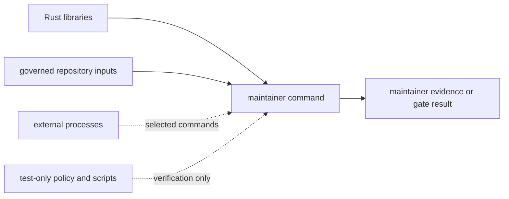
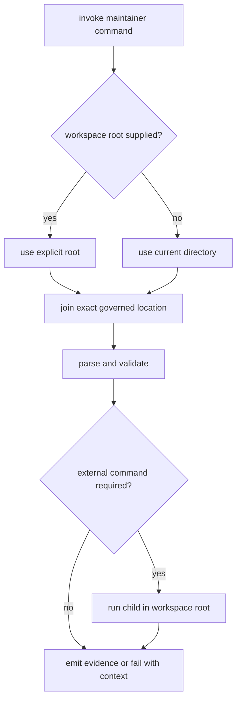
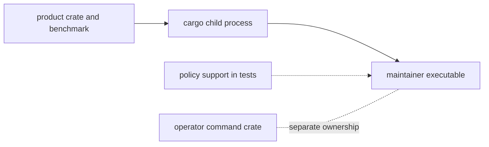

# Dependencies And Adjacencies

`bijux-gnss-dev` is a repository maintenance executable. Its Rust dependency
graph is intentionally small, but successful execution also depends on named
repository files, the working directory or an explicit workspace root, and
external processes for selected commands.

## Four Dependency Classes

| class | current dependency | purpose | failure ownership |
| --- | --- | --- | --- |
| Rust runtime | `clap` | command syntax and typed arguments | maintainer command contract |
| Rust runtime | `anyhow` | contextual failures for repository workflows | maintainer command contract |
| Rust runtime | `regex` | controlled parsing of benchmark output | benchmark evidence workflow |
| Rust runtime | `toml` | reviewed governance input parsing | governed-file contract |
| process | `cargo` | execute package benchmarks for comparison | local toolchain plus benchmark owner |
| process | `date` | resolve the current review date for expiring deviations | host environment |
| repository input | audit exceptions, deny deviations, benchmark baseline | source-controlled policy and evidence | repository governance owner |
| test-only | policy crate, nextest expression script, slow roster | prove guardrails and lane selection | repository test policy |

The exact compile dependency list is the
[package manifest](../../../crates/bijux-gnss-dev/Cargo.toml). Process spawning
is visible in the
[maintainer executable](../../../crates/bijux-gnss-dev/src/main.rs).

## Runtime Resolution

The executable does not search ancestor directories for a repository root. It
uses an explicitly supplied root where the command offers one; otherwise it
uses the current directory and joins the governed location. Running from an
arbitrary subdirectory can therefore produce a legitimate “file not found”
rather than discovering the repository automatically.

Benchmark comparison starts `cargo bench` in the resolved workspace root and
parses its output. This is a process boundary, not a Rust dependency on product
crates. A benchmark failure belongs first to the invoked package or local
toolchain; a successful process with unparseable output belongs to the
maintainer evidence parser.

## Product Crates Are Adjacent, Not Linked

The executable does not compile against receiver, navigation, signal, command,
or testkit crates. It may inspect their benchmark output or repository evidence
without acquiring product behavior. The policy crate is currently a
development-only dependency used by guardrail tests, not production command
logic.

This distinction prevents two common mistakes:

- adding a product crate dependency to call internal behavior from a repository
  gate;
- moving operator commands into maintainer tooling because both happen to use a
  command-line parser.

Product runtime behavior belongs to the
[command boundary](../../01-bijux-gnss/foundation/ownership-boundary.md).
Reusable repository rules belong to the policy support crate; command
orchestration and maintainer-facing evidence remain here.

## Review A New Dependency

Before adding a library, file, or process dependency, answer:

1. Which maintainer workflow owns it, and what evidence becomes more reliable?
2. Can the behavior be implemented through an existing governed input or
   standard-library facility without obscuring intent?
3. Is the dependency deterministic enough for local and CI use?
4. Does its failure message identify the missing tool, file, policy record, or
   product command?
5. Does it preserve the boundary between repository maintenance and GNSS
   product execution?
6. Does the [governance file contract](../../../crates/bijux-gnss-dev/docs/GOVERNANCE_FILES.md)
   need a matching update?

The [dependency direction guide](../architecture/dependency-direction.md)
defines compile and process direction. The [integration seams guide](../architecture/integration-seams.md)
explains how new governed inputs and child-process behavior should be tested.
