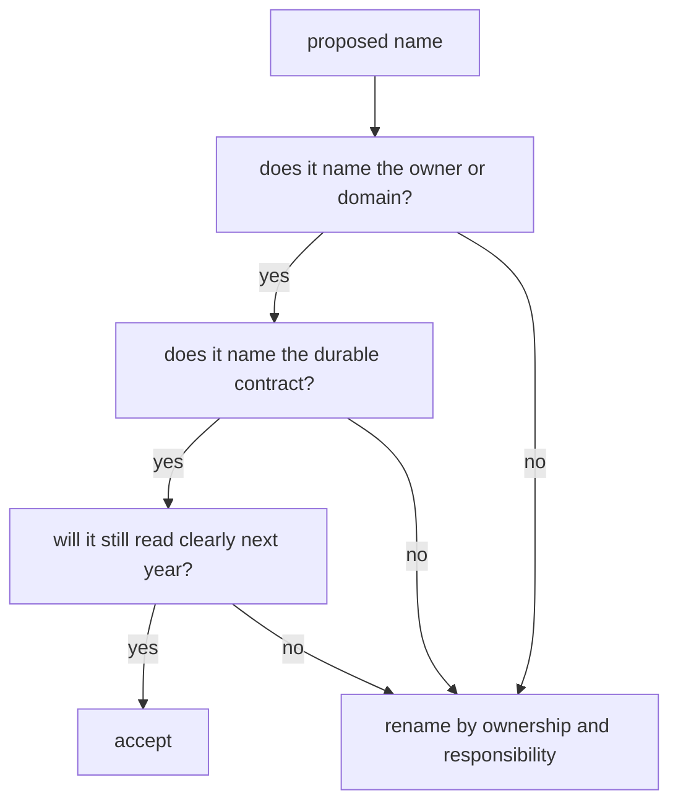

# Durable Naming

Names in maintainer tooling must explain enduring repository ownership. A reader
should understand why a command, file, module, output, or guardrail exists
without knowing the delivery story that created it.

## Naming Decision Route

## Preferred Public Language

| concept | use | avoid |
| --- | --- | --- |
| observation records | `observations` | abbreviation that hides the public contract |
| ephemeris records | `ephemeris` | abbreviation in reader-facing names |
| broad external inputs | `products` | overloading a narrow internal type name |
| repository policy files | `governed inputs` | generic file buckets |
| validation evidence | `artifacts` or a more specific evidence name | delivery-order labels |
| GNSS domain facts | `constellation`, `signal band`, `carrier phase`, `pseudorange` | generic math or helper labels |

## Rejection Tests

Reject a name when it only answers one of these questions:

- When was it introduced?
- Which delivery sequence produced it?
- Where was there room to put it?
- Which short label was convenient for the author?
- Which internal helper happened to call it first?

Accept a name when it answers these questions:

- Which domain owns it?
- Which reader-facing contract does it defend?
- Which adjacent crate may depend on it?
- Which proof would fail if the name lied?

## Maintainer Examples

| weak name shape | durable direction |
| --- | --- |
| sequence-coded benchmark files | benchmark names by suite, workload, and baseline meaning |
| generic command helpers | command modules by governed input, evidence output, or workflow |
| broad support buckets | modules by validation, policy, benchmark, output, or execution boundary |
| compressed public GNSS terms | full domain language in public APIs and docs |

## First Proof Check

Inspect `crates/bijux-gnss-dev/docs/COMMANDS.md`,
`crates/bijux-gnss-dev/docs/GOVERNANCE_FILES.md`,
`crates/bijux-gnss-dev/src/main.rs`, and
`crates/bijux-gnss-dev/tests/integration_guardrails.rs`. A naming rule is only
credible if the command surface, governed files, and guardrail tests all tell
the same repository story.
